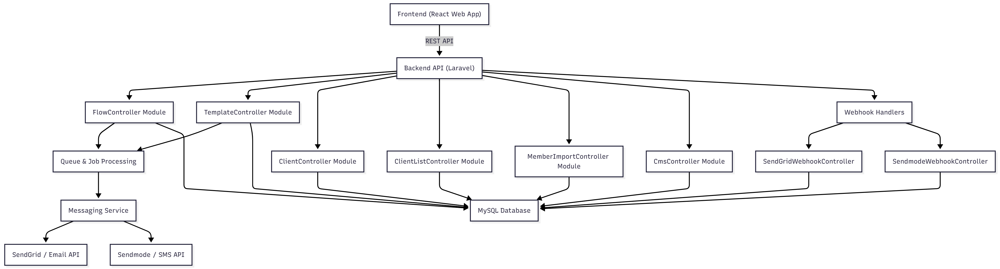

# Architecture

This is the system architecture of our client communication and marketing automation platform.

This is a full-stack client communication platform with the following technology stack:

### 2. Backend API (Laravel)

All requests are routed through Laravel's API routes (`routes/api.php`).

#### Main Controller Modules

| Module                        | Purpose                                | Key Features                          |
| ----------------------------- | -------------------------------------- | ------------------------------------- |
| **FlowController**            | Orchestrates communication campaigns   | Triggers jobs, manages flow logic     |
| **TemplateController**        | Manage email & SMS templates           | CRUD + preview                        |
| **ClientController**          | Individual client CRUD operations      | Profile, tags, custom fields          |
| **ClientListController**      | Segmented client lists & filters       | Dynamic segments, export              |
| **MemberImportController**    | Bulk import from CSV/Excel             | Validation, mapping, queue processing |
| **CmsController**             | Static content & landing pages         | Pages, assets, SEO                    |
| **SendGridWebhookController** | Receive SendGrid event webhooks        | Bounce, click, open, spam handling    |
| **SendmodeWebhookController** | Receive Sendmode SMS delivery webhooks | Delivered, failed, replies            |

### 3. Database (MySQL)

The application uses **MySQL** as its primary relational database. All business-critical data is stored in well-structured, version-controlled tables created via Laravel migrations with prefix `ics_automation`.

You can change prefix form `config\database.php`

#### Core Tables (as of latest migration state)

| Table             | Purpose                                                            |
| ----------------- | ------------------------------------------------------------------ |
| `clients`         | Individual client records with personal data & custom fields       |
| `client_lists`    | Client segmentation lists (static & dynamic)                       |
| `templates`       | Email and SMS templates (subject, HTML/text content, variables)    |
| `flows`           | Marketing/communication campaigns and automation workflows         |
| `flow_executions` | Individual campaign runs with status, stats, and scheduling        |
| `stats`           | Aggregated per-campaign statistics (sent, delivered, opened, etc.) |
| `sendmode_stats`  | SMS-specific delivery statistics from Sendmode                     |
| `jobs`            | Laravel queue jobs (for async email/SMS sending)                   |
| `failed_jobs`     | Failed queue jobs for monitoring and retry                         |
| `unsubscribed`    | Global and per-flow unsubscribe tracking                           |
| `cache`           | Laravel cache table (optional, when using database driver)         |
| `migrations`      | Tracks applied database migrations (shown in your screenshot)      |

### 4. Queue & Job Processing (Critical for Scale)

All message sending is **asynchronous**:
Flow Execution
↓
Dispatch Laravel Jobs → Queue Worker
↓
Messaging Service
↓
├── SendGrid API (Email)
└── Sendmode API (SMS)
textBenefits:

- Prevents timeout on large campaigns
- Retry logic on failure
- Rate limiting compliance
- Real-time progress tracking

### 5. Third-Party Integrations

| Provider | Integration Type | Endpoint Example                             |
| -------- | ---------------- | -------------------------------------------- |
| SendGrid | Email            | `POST https://api.sendgrid.com/v3/mail/send` |
| Sendmode | SMS              | `POST https://api.sendmode.com/v1/messages`  |

Webhook routes are protected with signature verification.

## Data Flow Example: Sending a Campaign

1. User creates campaign in React frontend
2. Frontend → `POST /api/flows/{id}/send`
3. `FlowController@send()` validates & dispatches job
4. Job picked up by queue worker
5. `SendEmailJob` or `SendSmsJob` executed
6. API call to SendGrid / Sendmode
7. Provider sends message → returns tracking ID
8. Events (open, click, bounce) → webhook → stored in DB
9. Frontend polls or uses WebSocket for live stats

## Security & Best Practices

- API protected by Sanctum + middleware
- Rate limiting on all endpoints
- Webhook signature verification
- Queue failed jobs stored & retried
- All external API keys in `.env`
- Database migrations & seeders versioned

## Next Steps

- [API Reference](/docs/api/introduction)
- [Queue Configuration](/docs/deployment/queue)
- [Webhook Setup Guide](/docs/integrations/webhooks)

---

_Last updated: November 2025_
How to use:

Place your diagram at static/img/architecture-diagram.png
Copy the markdown above into docs/architecture.md
Run npm run start — it will render beautifully in Docusaurus
