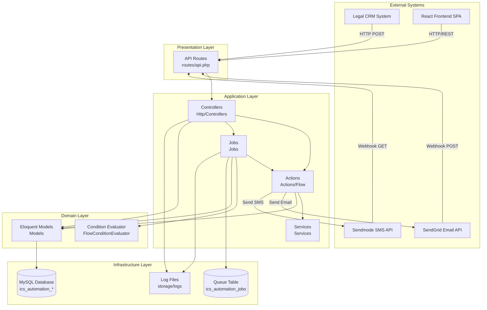
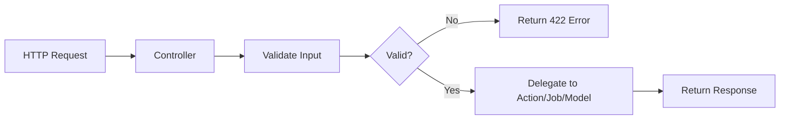
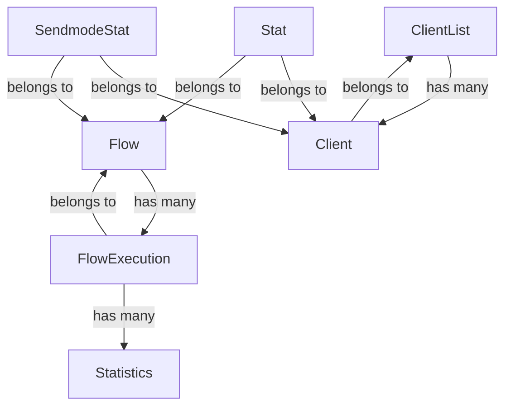
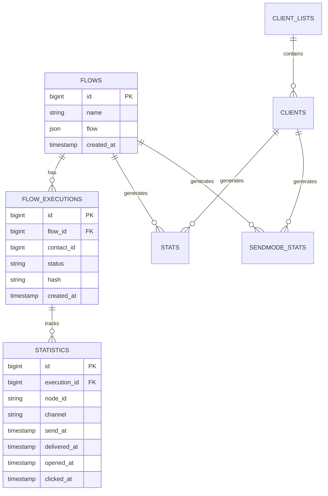
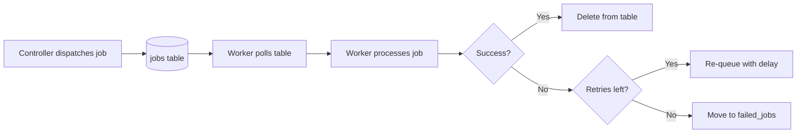
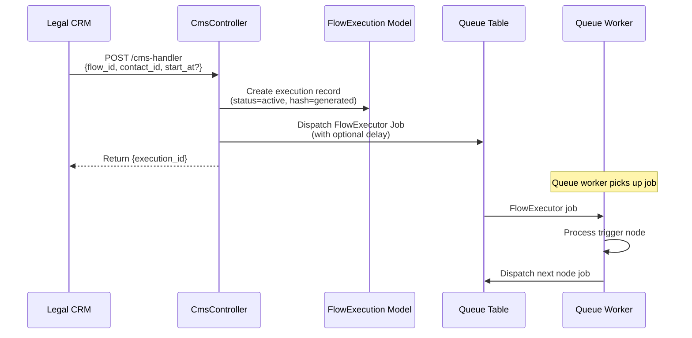
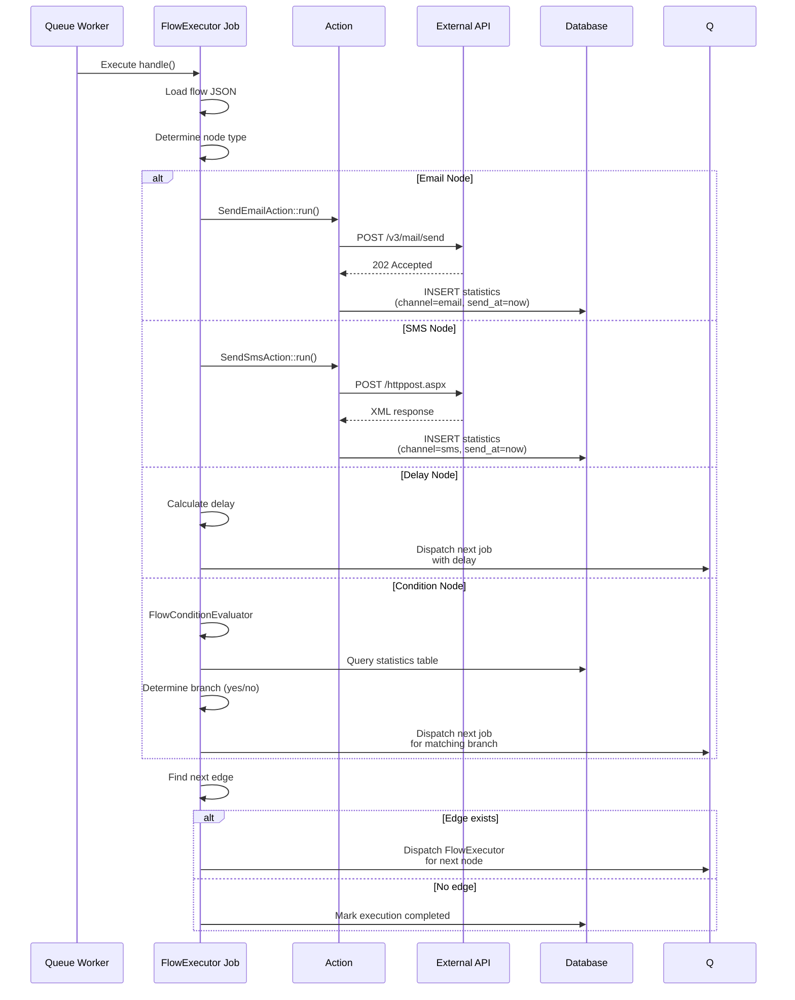
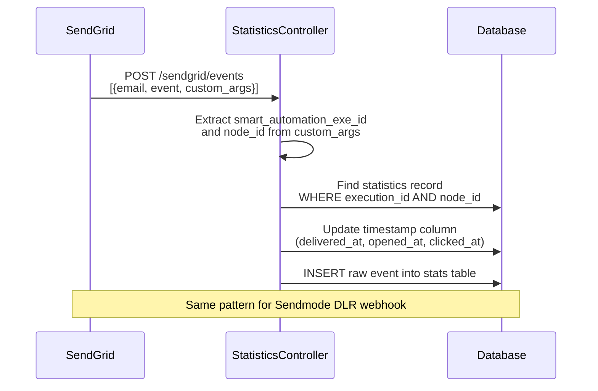
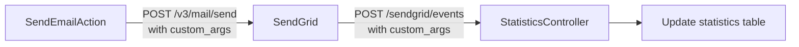
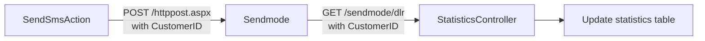

# Architecture

This document describes the system architecture of the ICS Automation backend. It covers the component design, data flow patterns, integration points, and the architectural decisions that make the system reliable and scalable.

---

## System Architecture Overview

The ICS Automation backend follows a **layered architecture** built on Laravel's MVC pattern, extended with a service-oriented design for the automation engine. The system is divided into distinct layers, each with a specific responsibility.


```mermaid
graph TB
    subgraph "External Systems"
        CRM[Legal CRM System]
        React[React Frontend SPA]
        SendGrid[SendGrid Email API]
        Sendmode[Sendmode SMS API]
    end

    subgraph "Presentation Layer"
        Routes[API Routes<br/>routes/api.php]
    end

    subgraph "Application Layer"
        Controllers[Controllers<br/>Http/Controllers]
        Actions[Actions<br/>Actions/Flow]
        Services[Services<br/>Services]
        Jobs[Jobs<br/>Jobs]
    end

    subgraph "Domain Layer"
        Models[Eloquent Models<br/>Models]
        Evaluators[Condition Evaluator<br/>FlowConditionEvaluator]
    end

    subgraph "Infrastructure Layer"
        MySQL[(MySQL Database<br/>ics_automation_*)]
        Queue[(Queue Table<br/>ics_automation_jobs)]
        Logs[Log Files<br/>storage/logs]
    end

    React -->|HTTP/REST| Routes
    CRM -->|HTTP POST| Routes
    SendGrid -->|Webhook POST| Routes
    Sendmode -->|Webhook GET| Routes

    Routes --> Controllers
    Controllers --> Actions
    Controllers --> Jobs
    Controllers --> Models
    Actions --> Services
    Actions --> Models
    Jobs --> Actions
    Jobs --> Evaluators
    Jobs --> Models

    Models --> MySQL
    Jobs --> Queue
    Controllers --> Logs
    Jobs --> Logs

    Actions -->|Send Email| SendGrid
    Actions -->|Send SMS| Sendmode
```

---

## Layer Breakdown

### 1. Presentation Layer (Routes)

All API endpoints are defined in `routes/api.php`. This layer is responsible for:

- Defining URL patterns and HTTP methods
- Mapping requests to controller actions
- Applying middleware (CORS, rate limiting)

```php
// routes/api.php

// Authentication
Route::post('/login', [AuthController::class, 'login']);

// Flow CRUD
Route::get('/flows', [FlowController::class, 'index']);
Route::post('/flows', [FlowController::class, 'store']);
Route::get('/flows/{flow}', [FlowController::class, 'show']);
Route::put('/flows/{flow}', [FlowController::class, 'update']);
Route::delete('/flows/{flow}', [FlowController::class, 'destroy']);

// CRM Trigger
Route::post('/cms-handler', [CmsController::class, 'import']);

// Webhooks
Route::post('/sendgrid/events', [StatisticsController::class, 'update']);
Route::get('/sendmode/dlr', [StatisticsController::class, 'sendModeDeliveryCallback']);

// ... more routes
```

**Key Design Decision:** All routes are currently **unprotected** (no authentication middleware). The frontend handles authentication via localStorage, but the API itself does not validate tokens. This is a known limitation documented in the [Security](./security) section.

---

### 2. Application Layer (Controllers, Actions, Jobs)

This layer contains the business logic and orchestration code.

#### Controllers

Controllers receive HTTP requests, validate input, and delegate to the appropriate service or job. They should be **thin** — containing minimal logic beyond request handling.


```mermaid
graph LR
    A[HTTP Request] --> B[Controller]
    B --> C[Validate Input]
    C --> D{Valid?}
    D -->|No| E[Return 422 Error]
    D -->|Yes| F[Delegate to Action/Job/Model]
    F --> G[Return Response]
```

**Controller Responsibilities:**

| Controller | Responsibility |
|-----------|---------------|
| `FlowController` | CRUD operations for automation flows |
| `TemplateController` | CRUD operations for email templates |
| `SmsTemplateController` | CRUD operations for SMS templates |
| `ClientController` | Contact management with pagination |
| `ClientListController` | Segment/list management |
| `MemberImportController` | Import contacts from CMS members table |
| `CmsController` | CRM-triggered flow execution |
| `StatisticsController` | Webhook handlers for SendGrid and Sendmode |
| `FlowExecutionController` | Flow execution management (cancel, list, status) |
| `UnsubscribeController` | Handle subscribe/unsubscribe actions |
| `CreditController` | Fetch Sendmode credit balance |
| `SendModeCreditCalculator` | Calculate required credits per flow |

#### Actions

Actions are single-responsibility classes that encapsulate specific business operations. They live in `app/Actions/Flow/`:

| Action | Purpose |
|--------|---------|
| `SendEmailAction` | Sends an email via SendGrid, creates statistics record |
| `SendSmsAction` | Sends an SMS via Sendmode, creates statistics record |

Actions are called by the `FlowExecutor` job when processing Email or SMS nodes.

#### Jobs

Jobs are queued units of work processed asynchronously. The core job is:

| Job | Purpose |
|-----|---------|
| `FlowExecutor` | Processes one node of an automation flow, then dispatches the next node's job |

The job system is the heart of the automation engine. See the [Jobs & Queues](./jobs-queues) document for a deep dive.

---

### 3. Domain Layer (Models, Evaluators)

This layer contains the data models and business rules.

#### Eloquent Models

Models represent database tables and define relationships:


```mermaid
graph TD
    Flow[Flow] -->|has many| FE[FlowExecution]
    FE -->|has many| Stats[Statistics]
    FE -->|belongs to| Flow
    CL[ClientList] -->|has many| Client[Client]
    Client -->|belongs to| CL
    Stat[Stat] -->|belongs to| Client
    Stat -->|belongs to| Flow
    SMStat[SendmodeStat] -->|belongs to| Client
    SMStat -->|belongs to| Flow
```

**Model Responsibilities:**

| Model | Table | Key Responsibilities |
|-------|-------|---------------------|
| `Flow` | `ics_automation_flows` | Store flow JSON definition |
| `FlowExecution` | `ics_automation_flow_executions` | Track execution status, generate unsubscribe hash |
| `Template` | `ics_automation_templates` | Store email template design and HTML |
| `SmsTemplate` | `ics_automation_sms_templates` | Store SMS template content |
| `Client` | `ics_automation_clients` | Store contact information |
| `ClientList` | `ics_automation_client_lists` | Store contact lists/segments |
| `Statistics` | `ics_automation_statistics` | Track per-node delivery and engagement |
| `Stat` | `ics_automation_stats` | Store raw SendGrid events |
| `SendmodeStat` | `ics_automation_sendmode_stats` | Store SMS delivery receipts |
| `History` | `ics_automation_histories` | Track automation history entries |

#### FlowConditionEvaluator

A service class that evaluates condition node criteria by querying the `statistics` table. It determines whether a contact has performed a specific action (opened email, clicked link, etc.) and returns a boolean result for branching.

---

### 4. Infrastructure Layer (Database, Queue, Logs)

This layer handles data persistence, job queuing, and logging.

#### Database

MySQL stores all application data with the `ics_automation_` prefix. The database is shared with the Legal CMS but tables are isolated by prefix.


```mermaid
erDiagram
    FLOWS ||--o{ FLOW_EXECUTIONS : "has"
    FLOW_EXECUTIONS ||--o{ STATISTICS : "tracks"
    CLIENT_LISTS ||--o{ CLIENTS : "contains"
    CLIENTS ||--o{ STATS : "generates"
    FLOWS ||--o{ STATS : "generates"
    CLIENTS ||--o{ SENDMODE_STATS : "generates"
    FLOWS ||--o{ SENDMODE_STATS : "generates"

    FLOWS {
        bigint id PK
        string name
        json flow
        timestamp created_at
    }

    FLOW_EXECUTIONS {
        bigint id PK
        bigint flow_id FK
        bigint contact_id
        string status
        string hash
        timestamp created_at
    }

    STATISTICS {
        bigint id PK
        bigint execution_id FK
        string node_id
        string channel
        timestamp send_at
        timestamp delivered_at
        timestamp opened_at
        timestamp clicked_at
    }
```

#### Queue System

Laravel's database queue driver stores jobs in the `ics_automation_jobs` table. Workers poll this table, pick up jobs, and execute them.


```mermaid
graph LR
    A[Controller dispatches job] --> B[(jobs table)]
    B --> C[Worker polls table]
    C --> D[Worker processes job]
    D --> E{Success?}
    E -->|Yes| F[Delete from table]
    E -->|No| G{Retries left?}
    G -->|Yes| H[Re-queue with delay]
    G -->|No| I[Move to failed_jobs]
```

#### Logging

Laravel's logging system writes to `storage/logs/laravel.log`. The queue worker writes to its own log file in production. Logs include:

- Job processing events
- Email/SMS send results
- Webhook event processing
- Errors and exceptions

---

## Data Flow Patterns

### Pattern 1: Flow Trigger (CRM → Backend → Queue)

This is the primary entry point for automation execution.


```mermaid
sequenceDiagram
    participant CRM as Legal CRM
    participant C as CmsController
    participant FE as FlowExecution Model
    participant Q as Queue Table
    participant W as Queue Worker

    CRM->>C: POST /cms-handler<br/>{flow_id, contact_id, start_at?}
    C->>FE: Create execution record<br/>(status=active, hash=generated)
    C->>Q: Dispatch FlowExecutor Job<br/>(with optional delay)
    C-->>CRM: Return {execution_id}

    Note over W: Queue worker picks up job
    Q->>W: FlowExecutor job
    W->>W: Process trigger node
    W->>Q: Dispatch next node job
```

### Pattern 2: Node Execution (Job → Action → External API → Database)

This pattern repeats for every node in a flow.


```mermaid
sequenceDiagram
    participant W as Queue Worker
    participant FE as FlowExecutor Job
    participant Act as Action
    participant API as External API
    participant DB as Database

    W->>FE: Execute handle()
    FE->>FE: Load flow JSON
    FE->>FE: Determine node type

    alt Email Node
        FE->>Act: SendEmailAction::run()
        Act->>API: POST /v3/mail/send
        API-->>Act: 202 Accepted
        Act->>DB: INSERT statistics<br/>(channel=email, send_at=now)
    else SMS Node
        FE->>Act: SendSmsAction::run()
        Act->>API: POST /httppost.aspx
        API-->>Act: XML response
        Act->>DB: INSERT statistics<br/>(channel=sms, send_at=now)
    else Delay Node
        FE->>FE: Calculate delay
        FE->>Q: Dispatch next job<br/>with delay
    else Condition Node
        FE->>FE: FlowConditionEvaluator
        FE->>DB: Query statistics table
        FE->>FE: Determine branch (yes/no)
        FE->>Q: Dispatch next job<br/>for matching branch
    end

    FE->>FE: Find next edge
    alt Edge exists
        FE->>Q: Dispatch FlowExecutor<br/>for next node
    else No edge
        FE->>DB: Mark execution completed
    end
```

### Pattern 3: Webhook Event Processing (External API → Backend → Database)

This pattern updates engagement statistics in real-time.


```mermaid
sequenceDiagram
    participant SG as SendGrid
    participant C as StatisticsController
    participant DB as Database

    SG->>C: POST /sendgrid/events<br/>[{email, event, custom_args}]
    C->>C: Extract smart_automation_exe_id<br/>and node_id from custom_args
    C->>DB: Find statistics record<br/>WHERE execution_id AND node_id
    C->>DB: Update timestamp column<br/>(delivered_at, opened_at, clicked_at)
    C->>DB: INSERT raw event into stats table

    Note over SG,DB: Same pattern for Sendmode DLR webhook
```

---

## Integration Architecture

### SendGrid Integration


```mermaid
graph LR
    A[SendEmailAction] -->|POST /v3/mail/send<br/>with custom_args| B[SendGrid]
    B -->|POST /sendgrid/events<br/>with custom_args| C[StatisticsController]
    C --> D[Update statistics table]
```

**Key Design:** The `custom_args` field in the SendGrid API request carries the `smart_automation_exe_id` and `node_id`. When SendGrid sends back webhook events, these values are included in the payload, allowing the backend to correlate events with the correct execution and node.

### Sendmode Integration


```mermaid
graph LR
    A[SendSmsAction] -->|POST /httppost.aspx<br/>with CustomerID| B[Sendmode]
    B -->|GET /sendmode/dlr<br/>with CustomerID| C[StatisticsController]
    C --> D[Update statistics table]
```

**Key Design:** The `CustomerID` parameter encodes the execution ID and node ID in the format `{executionId}-{nodeId}`. When Sendmode sends delivery receipts, this value is parsed to find the correct statistics record.

### CRM Integration

```mermaid
graph LR
    A[Legal CRM] -->|POST /cms-handler<br/>{flow_id, contact_id}| B[CmsController]
    B --> C[Create FlowExecution]
    C --> D[Dispatch FlowExecutor]
    D --> E[Automation runs]
```

**Key Design:** The CRM does not need to know about the automation engine. It simply tells the backend "run this flow for this contact." The backend handles everything else asynchronously.

---

## Architectural Decisions

### Why Queued Jobs Instead of Synchronous Processing?

| Factor | Synchronous | Queued Jobs |
|--------|------------|-------------|
| **Response Time** | User waits for entire flow to complete | Returns immediately |
| **Reliability** | If request fails, entire flow is lost | Jobs can be retried individually |
| **Scalability** | Limited by PHP request timeout | Workers can be scaled horizontally |
| **Delays** | Cannot pause execution | Native delay support via queue |
| **Debugging** | Hard to trace partial failures | Each job has its own log entry |

### Why One Job Per Node?

Processing one node per job (rather than one job per flow) provides:

1. **Independent retry** — If an email fails, only that node's job is retried
2. **Natural delay support** — Delay nodes simply dispatch the next job with a queue delay
3. **Stateless execution** — Each job carries all the data it needs
4. **Parallel processing** — Multiple flows can execute simultaneously across workers
5. **Clear audit trail** — Each job execution is a discrete event in the logs

### Why Database Queue Driver?

| Driver | Pros | Cons |
|--------|------|------|
| **Database** | Simple setup, no external dependencies, works on shared hosting | Slower than Redis, database load increases with job volume |
| **Redis** | Fast, supports advanced features | Requires Redis server, additional infrastructure |
| **SQS** | Fully managed, highly scalable | AWS dependency, cost |

The database driver was chosen for simplicity and because the current job volume does not require the performance of Redis.

---

## Next Steps

| Document | What You'll Learn |
|----------|------------------|
| [Configuration](./configuration) | All environment variables and service settings |
| [Database](./database) | Complete database schema with all tables |
| [API Reference](./api-documentation) | All API endpoints with request/response examples |
| [Jobs & Queues](./jobs-queues) | Deep dive into the FlowExecutor job system |
