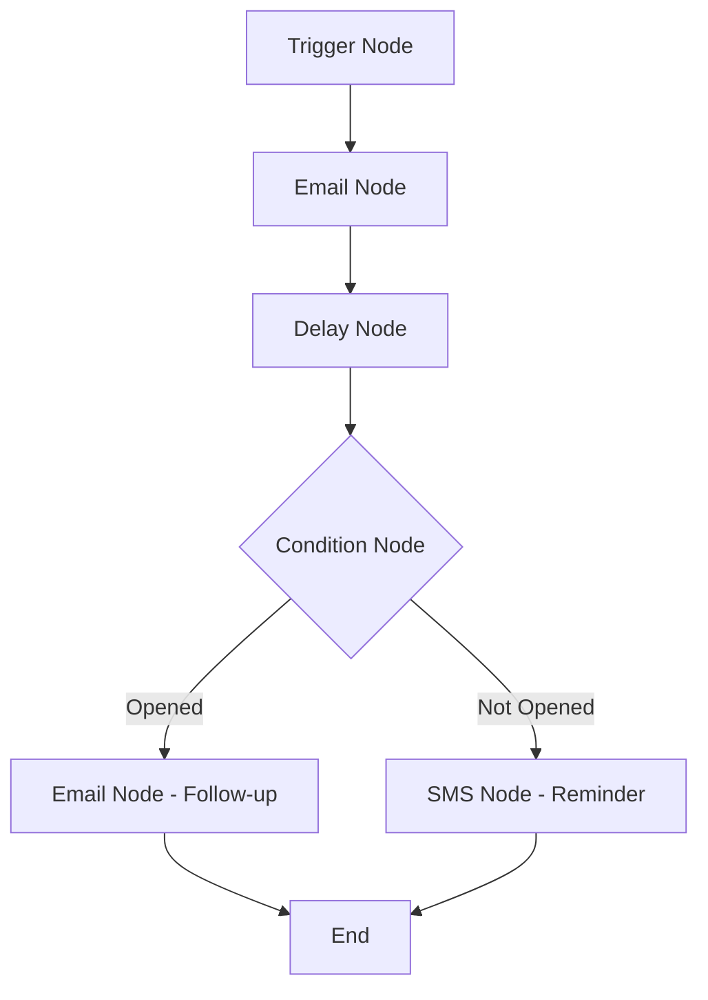
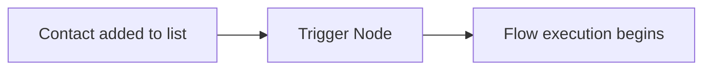
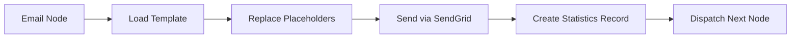
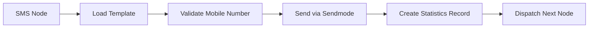
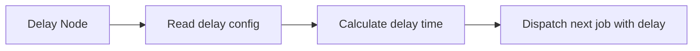
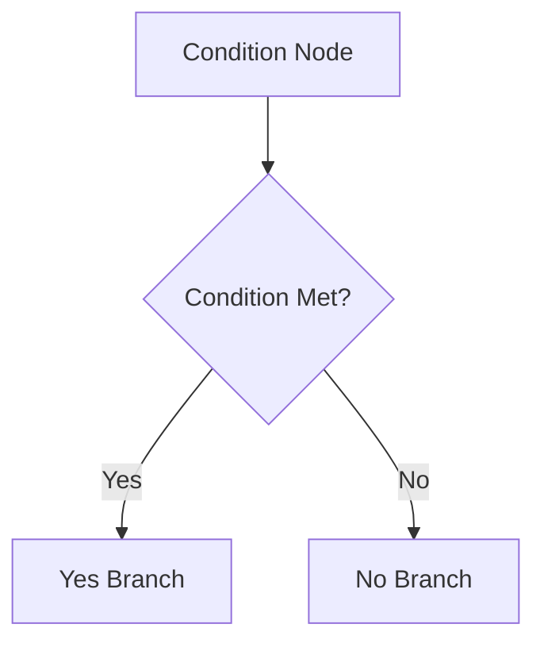
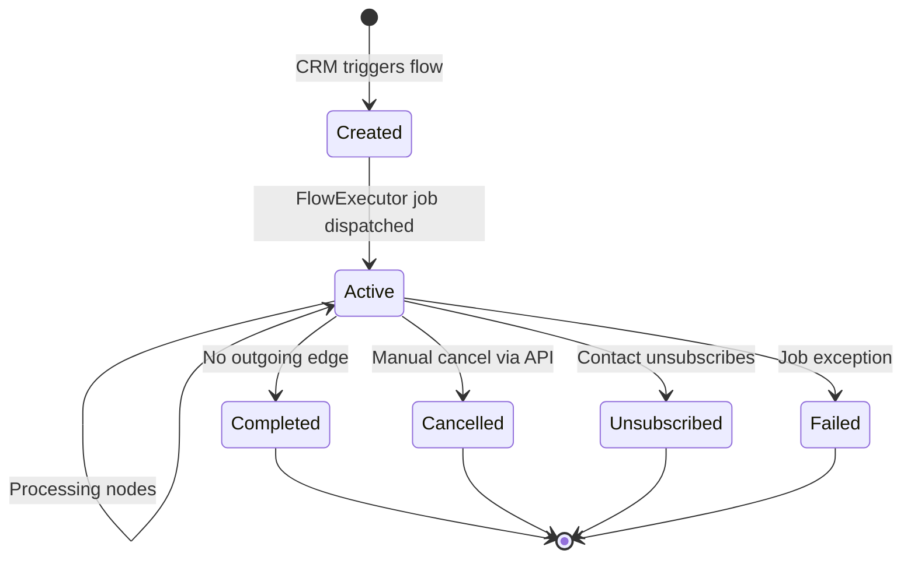
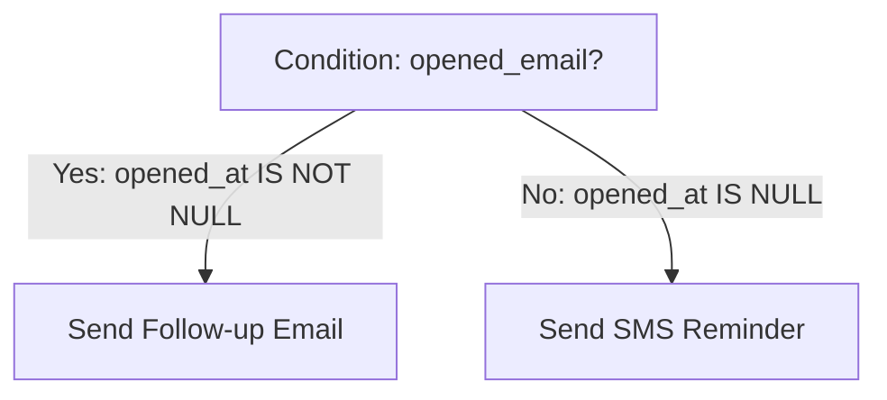

# Automation Workflow

This document explains how automation workflows (called **Flows**) are designed, structured, and executed in the ICS Automation platform. It covers the flow data model, node types, branching logic, and the complete lifecycle from creation to completion.

---

## What is a Flow?

A **Flow** is a visual automation workflow represented as a directed graph. It defines a sequence of actions (nodes) and the connections between them (edges). When a contact enters a flow, the system processes each node in order, sending emails, SMS messages, evaluating conditions, and applying delays until the flow completes.



---

## Flow Data Model

### Storage

Every flow is stored as a single record in the `ics_automation_flows` table:

| Column | Description |
|--------|-------------|
| `id` | Unique flow identifier |
| `name` | Human-readable name |
| `flow` | JSON containing the complete graph definition |

### Flow JSON Structure

The `flow` column stores a JSON object with two arrays: `nodes` and `edges`.

```json
{
  "nodes": [
    {
      "id": "trigger-node-1",
      "type": "triggerNode",
      "position": { "x": 250, "y": 50 },
      "data": {
        "triggerType": "add-to-list",
        "listId": 5,
        "listName": "New Clients"
      }
    },
    {
      "id": "email-node-2",
      "type": "emailNode",
      "position": { "x": 250, "y": 200 },
      "data": {
        "name": "Welcome Email",
        "subject": "Welcome to our service!",
        "previewText": "",
        "templateId": 3,
        "templateName": "Welcome Template",
        "trackOpens": true,
        "trackClicks": true
      }
    },
    {
      "id": "delay-node-3",
      "type": "delayNode",
      "position": { "x": 250, "y": 350 },
      "data": {
        "amount": 2,
        "unit": "days"
      }
    },
    {
      "id": "condition-node-4",
      "type": "conditionNode",
      "position": { "x": 250, "y": 500 },
      "data": {
        "conditionType": "activity_status",
        "activity": "opened_email",
        "times": "at_least_once",
        "duration": "over_all_time"
      }
    },
    {
      "id": "email-node-5",
      "type": "emailNode",
      "position": { "x": 100, "y": 650 },
      "data": {
        "name": "Follow-up Email",
        "subject": "Did you see our welcome email?",
        "templateId": 4
      }
    },
    {
      "id": "sms-node-6",
      "type": "smsNode",
      "position": { "x": 400, "y": 650 },
      "data": {
        "name": "SMS Reminder",
        "templateId": 1,
        "templateName": "Reminder SMS"
      }
    }
  ],
  "edges": [
    { "id": "edge-1", "source": "trigger-node-1", "target": "email-node-2" },
    { "id": "edge-2", "source": "email-node-2", "target": "delay-node-3" },
    { "id": "edge-3", "source": "delay-node-3", "target": "condition-node-4" },
    { "id": "edge-4", "source": "condition-node-4", "target": "email-node-5", "sourceHandle": "yes" },
    { "id": "edge-5", "source": "condition-node-4", "target": "sms-node-6", "sourceHandle": "no" }
  ]
}
```

### Nodes

Each node has the following structure:

| Field | Type | Description |
|-------|------|-------------|
| `id` | string | Unique identifier within the flow (e.g., `email-node-2`). Used by edges to reference this node. |
| `type` | string | Node type: `triggerNode`, `emailNode`, `smsNode`, `delayNode`, or `conditionNode`. |
| `position` | object | X/Y coordinates for rendering in the visual builder. Not used during execution. |
| `data` | object | Node-specific configuration (varies by type). |

### Edges

Each edge defines a connection between two nodes:

| Field | Type | Description |
|-------|------|-------------|
| `id` | string | Unique edge identifier. |
| `source` | string | ID of the source node (where the edge starts). |
| `target` | string | ID of the target node (where the edge ends). |
| `sourceHandle` | string | Optional. For condition nodes: `yes` or `no` to indicate which branch. |

---

## Node Types

### Trigger Node

The **entry point** of every flow. It defines how and when the automation starts.



**Configuration (`data` object):**

| Field | Type | Description |
|-------|------|-------------|
| `triggerType` | string | Currently only `add-to-list` is supported. |
| `listId` | integer | ID of the client list that triggers the flow. |
| `listName` | string | Display name of the list. |

**Behavior:**

1. The trigger node is the first node processed when a flow execution starts
2. It performs no action itself — it immediately passes execution to the next connected node
3. The `listId` determines which client list is associated with this flow

**How a Flow is Triggered:**

When the CRM calls `POST /cms-handler` with a `flow_id` and `contact_id`, the backend:
1. Creates a new `FlowExecution` record
2. Dispatches a `FlowExecutor` job with `currentNodeId` set to the trigger node's ID
3. The trigger node handler finds the next edge and dispatches a new job for the target node

---

### Email Node

Sends an email to the contact using a selected template.



**Configuration (`data` object):**

| Field | Type | Description |
|-------|------|-------------|
| `name` | string | Display name for the email step (used in the visual builder). |
| `subject` | string | Email subject line. Supports placeholder variables. |
| `previewText` | string | Email preview text (not yet implemented in the frontend). |
| `templateId` | integer | ID of the email template in `ics_automation_templates`. |
| `templateName` | string | Display name of the template. |
| `trackOpens` | boolean | Whether to track email opens (enabled by default via SendGrid). |
| `trackClicks` | boolean | Whether to track link clicks (enabled by default via SendGrid). |

**Execution Steps:**

1. **Fetch contact details** from the CMS `members` table using `contact_id`
2. **Load the email template** from `ics_automation_templates` using `templateId`
3. **Replace placeholders** in the template HTML:
   - `{UNSUBSCRIBE_URL}` → Unique unsubscribe URL with execution hash
   - `{CLIENT_FIRST_NAME}` → Contact's first name from `members.fname`
   - `{CLIENT_LAST_NAME}` → Contact's last name from `members.lname`
   - `{CLIENT_EMAIL}` → Contact's email from `members.email`
4. **Send the email** via SendGrid REST API (`POST /v3/mail/send`)
5. **Include custom arguments** in the SendGrid request for webhook correlation:
   ```json
   {
     "custom_args": {
       "smart_automation_exe_id": "45",
       "node_id": "email-node-2"
     }
   }
   ```
6. **Create a statistics record** with `channel='email'` and `send_at=now()`
7. **Dispatch the next node** by finding the outgoing edge and creating a new `FlowExecutor` job

**SendGrid Request Example:**

```json
{
  "personalizations": [
    {
      "to": [{ "email": "john@example.com" }]
    }
  ],
  "from": { "email": "noreply@icslegal.com", "name": "ICS Legal" },
  "subject": "Welcome to our service!",
  "html": "<html><body>Hello John, <a href=\"https://automation.icslegal.com/unsubscribe?hash=abc...\">Unsubscribe</a></body></html>",
  "tracking_settings": {
    "open_tracking": { "enable": true },
    "click_tracking": { "enable": true }
  },
  "custom_args": {
    "smart_automation_exe_id": "45",
    "node_id": "email-node-2"
  }
}
```

---

### SMS Node

Sends an SMS message to the contact using a selected template.



**Configuration (`data` object):**

| Field | Type | Description |
|-------|------|-------------|
| `name` | string | Display name for the SMS step. |
| `templateId` | integer | ID of the SMS template in `ics_automation_sms_templates`. |
| `templateName` | string | Display name of the template. |

**Execution Steps:**

1. **Fetch contact details** from the CMS `members` table
2. **Load the SMS template** from `ics_automation_sms_templates` using `templateId`
3. **Validate and normalize the mobile number:**
   - If the mobile field contains comma-separated numbers, take the first valid one
   - If the number starts with `07` (UK format), convert to `44` (e.g., `07123456789` → `447123456789`)
   - Validate that the number is 10–15 digits after removing non-numeric characters
   - If invalid, skip sending and mark the statistics record with `send_at=null`
4. **Send the SMS** via Sendmode HTTP POST API:
   ```
   POST https://api.sendmode.com/httppost.aspx
   Type=sendparam&username=xxx&password=xxx&sender=ICS+Legal&number=447123456789&message=Hello+John&CustomerID=45-sms-node-6
   ```
5. **Parse the XML response** for success/failure
6. **Create a statistics record** with `channel='sms'`
7. **Dispatch the next node**

**Sendmode Request Parameters:**

| Parameter | Value | Description |
|-----------|-------|-------------|
| `Type` | `sendparam` | API method identifier |
| `username` | From `.env` | Sendmode account username |
| `password` | From `.env` | Sendmode account password |
| `sender` | `ICS Legal` | Sender ID displayed on the recipient's phone |
| `number` | Normalized mobile number | E.g., `447123456789` |
| `message` | Template content (URL-encoded) | SMS text with placeholders replaced |
| `CustomerID` | `{executionId}-{nodeId}` | Used by Sendmode webhook for correlation |

---

### Delay Node

Pauses the execution for a specified amount of time before proceeding to the next node.



**Configuration (`data` object):**

| Field | Type | Description |
|-------|------|-------------|
| `amount` | integer | Number of time units to delay. |
| `unit` | string | Time unit: `minutes`, `hours`, or `days`. |

**Execution Steps:**

1. Read `amount` and `unit` from the node's `data`
2. Create a statistics record with `channel='delay'` and `send_at=now()`
3. Dispatch the next node's `FlowExecutor` job with a queue delay:
   ```php
   FlowExecutor::dispatch($payload)->delay(now()->add($amount, $unit));
   ```

**Example:** A delay node with `amount: 2` and `unit: 'days'` will dispatch the next job 48 hours from now.

**Common Use Cases:**

- Wait 1 day after sending an email before checking if it was opened
- Wait 3 days before sending a follow-up email
- Wait 30 minutes before sending an SMS reminder

---

### Condition Node

Evaluates a condition based on the contact's behavior and routes execution down the "Yes" or "No" branch.



**Configuration (`data` object):**

| Field | Type | Description |
|-------|------|-------------|
| `conditionType` | string | Currently only `activity_status` is supported. |
| `activity` | string | The activity to check for. See activity list below. |
| `times` | string | How many times the activity must occur. Currently only `at_least_once`. |
| `duration` | string | Time window for the check. Currently only `over_all_time`. |

**Supported Activities:**

| Activity | Description | Statistics Column Checked |
|----------|-------------|--------------------------|
| `opened_email` | Contact opened an email | `opened_at IS NOT NULL` |
| `clicked_email` | Contact clicked a link in an email | `clicked_at IS NOT NULL` |
| `bounce_email` | Email bounced | `bounced_at IS NOT NULL` |
| `received_email` | Email was delivered | `delivered_at IS NOT NULL` |
| `clicked_unsubscribe` | Contact clicked unsubscribe | `unsubscribed_at IS NOT NULL` |
| `received_sms` | SMS was delivered | `delivered_at IS NOT NULL` (channel=sms) |
| `clicked_sms` | Contact clicked an SMS link | `clicked_at IS NOT NULL` (channel=sms) |

**Execution Steps:**

1. Read the condition configuration from the node's `data`
2. Use `FlowConditionEvaluator` to query the `statistics` table:
   ```sql
   SELECT EXISTS(
     SELECT 1 FROM ics_automation_statistics
     WHERE execution_id = ? AND opened_at IS NOT NULL
   )
   ```
3. Create a statistics record with `channel='condition'` and `send_at=now()`
4. Find the outgoing edge matching the result:
   - If condition is **true**: find edge with `sourceHandle='yes'`
   - If condition is **false**: find edge with `sourceHandle='no'`
5. Dispatch a new `FlowExecutor` job for the target node of the matching edge

---

## Flow Creation

### Automatic Client List Creation

When a new flow is created via `POST /flows`, the backend automatically:

1. Creates the flow record in `ics_automation_flows`
2. Creates a new client list in `ics_automation_client_lists` with the same name
3. Updates the trigger node's `listId` in the flow JSON to reference the new list

This ensures every flow has an associated list for its trigger, even if the user did not create one beforehand.

### Flow Validation

The backend performs minimal validation on the flow JSON:

- The `flow` field must be a valid JSON object
- The `flow` object must contain `nodes` and `edges` arrays
- At least one node must be a `triggerNode`

Additional validation (e.g., checking for disconnected nodes, circular references) is not performed at the API level.

---

## Flow Execution Lifecycle



### State Transitions

| From | To | Trigger |
|------|----|---------|
| — | `active` | `POST /cms-handler` creates the execution |
| `active` | `active` | Each node is processed, next job dispatched |
| `active` | `completed` | Current node has no outgoing edge |
| `active` | `cancelled` | `POST /flow-execution/cancel` is called |
| `active` | `unsubscribed` | Contact clicks unsubscribe link |
| `active` | `failed` | Unhandled exception in FlowExecutor job |

### Execution Progress Tracking

The `current_node_id` column in `flow_executions` is updated as the execution progresses through the flow. This allows the frontend to display the current position of an execution.

---

## Branching Logic

### Condition Node Branching

Condition nodes have two outgoing edges:



The `FlowConditionEvaluator` determines which branch to follow by querying the `statistics` table for the current execution.

### Multiple Outgoing Edges (Non-Condition)

For non-condition nodes, only one outgoing edge is expected. If multiple edges exist, the first one found is used. If no edge exists, the execution is marked as `completed`.

---

## Placeholder Variables

Templates support the following placeholder variables that are replaced at send time:

| Placeholder | Replaced With | Available In |
|-------------|---------------|-------------|
| `{UNSUBSCRIBE_URL}` | Full unsubscribe URL with unique hash | Email templates only |
| `{CLIENT_FIRST_NAME}` | Contact's first name from `members.fname` | Email and SMS templates |
| `{CLIENT_LAST_NAME}` | Contact's last name from `members.lname` | Email and SMS templates |
| `{CLIENT_EMAIL}` | Contact's email from `members.email` | Email and SMS templates |

The `{UNSUBSCRIBE_URL}` placeholder is **mandatory** for email templates. It is automatically replaced by `SendEmailAction` with a URL unique to each execution:

```
https://automation.icslegal.com/unsubscribe?hash=aBcDeFgHiJkLmNoPqRsTuVwXyZ1234567890
```

---

## Next Steps

| Document | What You'll Learn |
|----------|------------------|
| [Jobs & Queues](./jobs-queues) | How the Laravel queue system processes flows |
| [Flow Execution Algorithm](./flow-execution-algorithm) | Step-by-step execution logic with pseudocode |
| [Database](./database) | Complete database schema |
