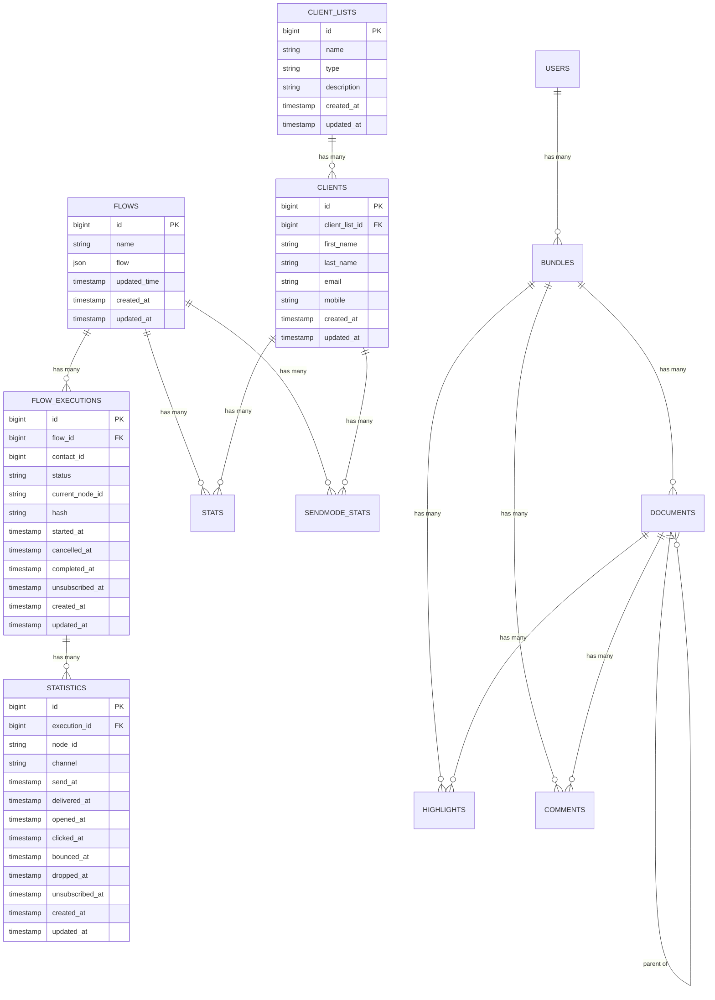
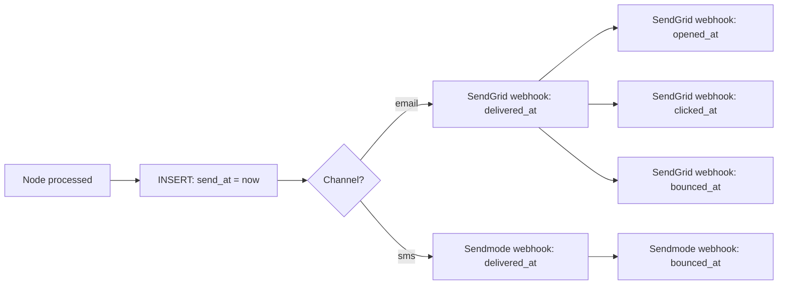

# Database

This document provides a complete reference for the ICS Automation database schema. It covers every table, column, relationship, and the design decisions behind the data model.

---

## Database Overview

| Property | Value |
|----------|-------|
| **Engine** | MySQL 8.0+ |
| **Database Name** | `cms` (shared with Legal CMS) |
| **Table Prefix** | `ics_automation_` |
| **Connection** | Configured in `config/database.php` |
| **ORM** | Laravel Eloquent |

The application shares the Legal CMS database but uses a **table prefix** (`ics_automation_`) to isolate its tables from CMS tables. This means every application table is named `ics_automation_<table_name>`.

### Prefix Configuration

```php
// config/database.php
'mysql' => [
    'prefix' => 'ics_automation_',
],
```

For brevity, this document refers to tables **without** the prefix (e.g., `flows` instead of `ics_automation_flows`).

---

## Entity Relationship Diagram



---

## Table Reference

### `flows`

Stores the definition of automation flows created in the frontend visual builder.

```sql
CREATE TABLE ics_automation_flows (
    id BIGINT UNSIGNED AUTO_INCREMENT PRIMARY KEY,
    name VARCHAR(255) NOT NULL,
    flow JSON NOT NULL,
    updated_time TIMESTAMP DEFAULT CURRENT_TIMESTAMP ON UPDATE CURRENT_TIMESTAMP,
    created_at TIMESTAMP NULL,
    updated_at TIMESTAMP NULL
);
```

| Column | Type | Nullable | Description |
|--------|------|----------|-------------|
| `id` | BIGINT | No | Auto-incrementing primary key. Unique flow identifier. |
| `name` | VARCHAR(255) | No | Human-readable name for the flow (e.g., "Welcome Series", "Follow-up Campaign"). |
| `flow` | JSON | No | The complete flow graph definition in React Flow format. Contains `nodes` and `edges` arrays. |
| `updated_time` | TIMESTAMP | Yes | Automatically updated when the flow is modified. |
| `created_at` | TIMESTAMP | Yes | When the flow was created. |
| `updated_at` | TIMESTAMP | Yes | When the flow was last updated. |

#### Flow JSON Structure

The `flow` column stores the visual graph as JSON:

```json
{
  "nodes": [
    {
      "id": "trigger-node-1",
      "type": "triggerNode",
      "position": { "x": 250, "y": 50 },
      "data": {
        "triggerType": "add-to-list",
        "listId": 5
      }
    },
    {
      "id": "email-node-2",
      "type": "emailNode",
      "position": { "x": 250, "y": 200 },
      "data": {
        "name": "Welcome Email",
        "subject": "Welcome to our service!",
        "templateId": 3
      }
    },
    {
      "id": "delay-node-3",
      "type": "delayNode",
      "position": { "x": 250, "y": 350 },
      "data": {
        "amount": 2,
        "unit": "days"
      }
    },
    {
      "id": "condition-node-4",
      "type": "conditionNode",
      "position": { "x": 250, "y": 500 },
      "data": {
        "conditionType": "activity_status",
        "activity": "opened_email"
      }
    }
  ],
  "edges": [
    {
      "id": "edge-1",
      "source": "trigger-node-1",
      "target": "email-node-2"
    },
    {
      "id": "edge-2",
      "source": "email-node-2",
      "target": "delay-node-3"
    },
    {
      "id": "edge-3",
      "source": "delay-node-3",
      "target": "condition-node-4"
    }
  ]
}
```

---

### `flow_executions`

Tracks each individual run of a flow for a specific contact. This is the central table for monitoring automation progress.

```sql
CREATE TABLE ics_automation_flow_executions (
    id BIGINT UNSIGNED AUTO_INCREMENT PRIMARY KEY,
    flow_id BIGINT UNSIGNED NOT NULL,
    contact_id BIGINT NOT NULL,
    status VARCHAR(50) DEFAULT 'active',
    current_node_id VARCHAR(255) NULL,
    started_at TIMESTAMP NULL,
    cancelled_at TIMESTAMP NULL,
    completed_at TIMESTAMP NULL,
    unsubscribed_at TIMESTAMP NULL,
    hash VARCHAR(64) NOT NULL UNIQUE,
    created_at TIMESTAMP NULL,
    updated_at TIMESTAMP NULL,
    FOREIGN KEY (flow_id) REFERENCES ics_automation_flows(id) ON DELETE CASCADE,
    INDEX idx_contact_flow_status (contact_id, flow_id, status)
);
```

| Column | Type | Nullable | Description |
|--------|------|----------|-------------|
| `id` | BIGINT | No | Auto-incrementing primary key. Unique execution identifier. |
| `flow_id` | BIGINT | No | Foreign key to `flows.id`. Identifies which flow this execution belongs to. Cascade delete: if the flow is deleted, all its executions are deleted. |
| `contact_id` | BIGINT | No | The contact (member) ID from the CMS `members` table. Identifies who this execution is for. |
| `status` | VARCHAR(50) | No | Current execution status. Default: `active`. See status values below. |
| `current_node_id` | VARCHAR(255) | Yes | The ID of the node currently being processed. Updated as the execution progresses through the flow. |
| `started_at` | TIMESTAMP | Yes | When the execution began (first node processed). |
| `cancelled_at` | TIMESTAMP | Yes | When the execution was manually cancelled. |
| `completed_at` | TIMESTAMP | Yes | When the execution finished (all nodes processed). |
| `unsubscribed_at` | TIMESTAMP | Yes | When the contact unsubscribed during this execution. |
| `hash` | VARCHAR(64) | No | Unique 40-character hash for unsubscribe links. Auto-generated on creation. Never reused. |
| `created_at` | TIMESTAMP | Yes | When the execution record was created. |
| `updated_at` | TIMESTAMP | Yes | When the execution was last updated. |

#### Status Values

| Status | Meaning | Transition Trigger |
|--------|---------|-------------------|
| `active` | Execution is currently running | Initial state when created |
| `completed` | All nodes have been processed | No outgoing edge from current node |
| `cancelled` | Execution was manually stopped | API call to `/flow-execution/cancel` |
| `failed` | Execution encountered an error | Unhandled exception in FlowExecutor job |
| `unsubscribed` | Contact opted out during execution | Contact clicked unsubscribe link |

#### Hash Generation

The `hash` is auto-generated by a model boot observer when a new `FlowExecution` is created:

```php
// App\Models\FlowExecution
protected static function boot()
{
    parent::boot();
    static::creating(function ($execution) {
        $execution->hash = Str::random(40);
    });
}
```

This hash is used to create unique unsubscribe URLs embedded in emails:

```
https://automation.icslegal.com/unsubscribe?hash=aBcDeFgHiJkLmNoPqRsTuVwXyZ1234567890
```

#### Index

The composite index `(contact_id, flow_id, status)` optimizes the most common query: finding all active executions for a specific contact and flow.

```sql
-- This query uses the index
SELECT * FROM ics_automation_flow_executions
WHERE contact_id = 121211 AND flow_id = 2 AND status = 'active';
```

---

### `statistics`

Tracks per-node delivery and engagement metrics for each flow execution. This is the primary table for monitoring email and SMS performance.

```sql
CREATE TABLE ics_automation_statistics (
    id BIGINT UNSIGNED AUTO_INCREMENT PRIMARY KEY,
    execution_id BIGINT UNSIGNED NOT NULL,
    node_id VARCHAR(255) NULL,
    channel ENUM('email', 'sms', 'delay', 'condition') NOT NULL,
    send_at TIMESTAMP NULL,
    delivered_at TIMESTAMP NULL,
    opened_at TIMESTAMP NULL,
    clicked_at TIMESTAMP NULL,
    bounced_at TIMESTAMP NULL,
    dropped_at TIMESTAMP NULL,
    unsubscribed_at TIMESTAMP NULL,
    created_at TIMESTAMP NULL,
    updated_at TIMESTAMP NULL,
    FOREIGN KEY (execution_id) REFERENCES ics_automation_flow_executions(id) ON DELETE CASCADE
);
```

| Column | Type | Nullable | Description |
|--------|------|----------|-------------|
| `id` | BIGINT | No | Auto-incrementing primary key. |
| `execution_id` | BIGINT | No | Foreign key to `flow_executions.id`. Identifies which execution this record belongs to. Cascade delete. |
| `node_id` | VARCHAR(255) | Yes | The ID of the node this record tracks (e.g., `email-node-2`). Allows multiple records per execution (one per node). |
| `channel` | ENUM | No | The type of action: `email`, `sms`, `delay`, or `condition`. |
| `send_at` | TIMESTAMP | Yes | When the message was sent (email dispatched or SMS API called). Set immediately when the node is processed. |
| `delivered_at` | TIMESTAMP | Yes | When the message was delivered to the recipient. Set by SendGrid/Sendmode webhook. |
| `opened_at` | TIMESTAMP | Yes | When the email was opened. Set by SendGrid `open` event webhook. |
| `clicked_at` | TIMESTAMP | Yes | When a link in the message was clicked. Set by SendGrid `click` event webhook. |
| `bounced_at` | TIMESTAMP | Yes | When the message bounced (undeliverable). Set by SendGrid `bounce` or Sendmode `FAILED` webhook. |
| `dropped_at` | TIMESTAMP | Yes | When SendGrid dropped the message (e.g., spam filter). Set by SendGrid `dropped` event webhook. |
| `unsubscribed_at` | TIMESTAMP | Yes | When the contact unsubscribed via this message. Set by SendGrid `unsubscribe` event webhook. |
| `created_at` | TIMESTAMP | Yes | When the record was created. |
| `updated_at` | TIMESTAMP | Yes | When the record was last updated. |

#### Lifecycle of a Statistics Record



---

### `stats`

Stores raw SendGrid event data for auditing and debugging. Unlike `statistics` (which tracks per-node metrics), this table stores every individual SendGrid event.

```sql
CREATE TABLE ics_automation_stats (
    id BIGINT UNSIGNED AUTO_INCREMENT PRIMARY KEY,
    contact_id BIGINT UNSIGNED NULL,
    flow_id BIGINT UNSIGNED NULL,
    event_type VARCHAR(255) NOT NULL,
    message_id VARCHAR(255) NOT NULL,
    meta JSON NULL,
    event_time TIMESTAMP NULL,
    created_at TIMESTAMP NULL,
    updated_at TIMESTAMP NULL,
    FOREIGN KEY (contact_id) REFERENCES ics_automation_clients(id) ON DELETE SET NULL,
    FOREIGN KEY (flow_id) REFERENCES ics_automation_flows(id) ON DELETE SET NULL
);
```

| Column | Type | Nullable | Description |
|--------|------|----------|-------------|
| `id` | BIGINT | No | Auto-incrementing primary key. |
| `contact_id` | BIGINT | Yes | Foreign key to `clients.id`. Set to NULL if the client is deleted. |
| `flow_id` | BIGINT | Yes | Foreign key to `flows.id`. Set to NULL if the flow is deleted. |
| `event_type` | VARCHAR(255) | No | SendGrid event type: `processed`, `delivered`, `open`, `click`, `bounce`, `dropped`, `unsubscribe`, `spamreport`. |
| `message_id` | VARCHAR(255) | No | SendGrid's `sg_message_id` for the email. |
| `meta` | JSON | Yes | The complete SendGrid webhook payload. Useful for debugging. |
| `event_time` | TIMESTAMP | Yes | When the event occurred (from SendGrid's `timestamp` field). |
| `created_at` | TIMESTAMP | Yes | When the record was inserted. |
| `updated_at` | TIMESTAMP | Yes | When the record was last updated. |

---

### `sendmode_stats`

Stores SMS delivery receipt data from Sendmode.

```sql
CREATE TABLE ics_automation_sendmode_stats (
    id BIGINT UNSIGNED AUTO_INCREMENT PRIMARY KEY,
    contact_id BIGINT UNSIGNED NULL,
    flow_id BIGINT UNSIGNED NULL,
    status VARCHAR(50) NOT NULL,
    mobile VARCHAR(50) NOT NULL,
    received_at TIMESTAMP NULL,
    created_at TIMESTAMP NULL,
    updated_at TIMESTAMP NULL,
    FOREIGN KEY (contact_id) REFERENCES ics_automation_clients(id) ON DELETE SET NULL,
    FOREIGN KEY (flow_id) REFERENCES ics_automation_flows(id) ON DELETE SET NULL
);
```

| Column | Type | Nullable | Description |
|--------|------|----------|-------------|
| `id` | BIGINT | No | Auto-incrementing primary key. |
| `contact_id` | BIGINT | Yes | Foreign key to `clients.id`. Set to NULL if the client is deleted. |
| `flow_id` | BIGINT | Yes | Foreign key to `flows.id`. Set to NULL if the flow is deleted. |
| `status` | VARCHAR(50) | No | Sendmode delivery status: `DELIVRD`, `EXPIRED`, `UNDELIV`, `REJECTD`, `FAILED`, `OPTED OUT - BLOCKED`. |
| `mobile` | VARCHAR(50) | No | The recipient's mobile number. |
| `received_at` | TIMESTAMP | Yes | When the delivery receipt was received from Sendmode. |
| `created_at` | TIMESTAMP | Yes | When the record was inserted. |
| `updated_at` | TIMESTAMP | Yes | When the record was last updated. |

---

### `client_lists`

Stores contact lists and segments used to group contacts for automation triggers.

```sql
CREATE TABLE ics_automation_client_lists (
    id BIGINT UNSIGNED AUTO_INCREMENT PRIMARY KEY,
    name VARCHAR(255) NOT NULL,
    type ENUM('list', 'segment') NOT NULL,
    description VARCHAR(1000) NULL,
    created_at TIMESTAMP NULL,
    updated_at TIMESTAMP NULL
);
```

| Column | Type | Nullable | Description |
|--------|------|----------|-------------|
| `id` | BIGINT | No | Auto-incrementing primary key. |
| `name` | VARCHAR(255) | No | Human-readable name for the list (e.g., "New Clients Q1 2026"). |
| `type` | ENUM | No | `list` for static lists, `segment` for dynamic segments. Currently, only `list` is actively used. |
| `description` | VARCHAR(1000) | Yes | Optional description of the list's purpose. |
| `created_at` | TIMESTAMP | Yes | When the list was created. |
| `updated_at` | TIMESTAMP | Yes | When the list was last updated. |

---

### `clients`

Stores individual contact records within a client list.

```sql
CREATE TABLE ics_automation_clients (
    id BIGINT UNSIGNED AUTO_INCREMENT PRIMARY KEY,
    client_list_id BIGINT UNSIGNED NOT NULL,
    first_name VARCHAR(255) NOT NULL,
    last_name VARCHAR(255) NULL,
    email VARCHAR(255) NOT NULL,
    mobile VARCHAR(50) NULL,
    created_at TIMESTAMP NULL,
    updated_at TIMESTAMP NULL,
    FOREIGN KEY (client_list_id) REFERENCES ics_automation_client_lists(id) ON DELETE CASCADE
);
```

| Column | Type | Nullable | Description |
|--------|------|----------|-------------|
| `id` | BIGINT | No | Auto-incrementing primary key. |
| `client_list_id` | BIGINT | No | Foreign key to `client_lists.id`. Identifies which list this contact belongs to. Cascade delete. |
| `first_name` | VARCHAR(255) | No | Contact's first name. |
| `last_name` | VARCHAR(255) | Yes | Contact's last name. |
| `email` | VARCHAR(255) | No | Contact's email address. |
| `mobile` | VARCHAR(50) | Yes | Contact's mobile number (used for SMS). |
| `created_at` | TIMESTAMP | Yes | When the contact was added. |
| `updated_at` | TIMESTAMP | Yes | When the contact was last updated. |

---

### `templates`

Stores email template designs and HTML content.

```sql
CREATE TABLE ics_automation_templates (
    id BIGINT UNSIGNED AUTO_INCREMENT PRIMARY KEY,
    name VARCHAR(255) NOT NULL,
    design JSON NULL,
    html LONGTEXT NOT NULL,
    preview_image VARCHAR(255) NULL,
    created_at TIMESTAMP NULL,
    updated_at TIMESTAMP NULL
);
```

| Column | Type | Nullable | Description |
|--------|------|----------|-------------|
| `id` | BIGINT | No | Auto-incrementing primary key. |
| `name` | VARCHAR(255) | No | Human-readable template name. |
| `design` | JSON | Yes | Unlayer editor design JSON. Present if the template was created with the visual builder. |
| `html` | LONGTEXT | No | The rendered HTML content of the email. Always present. Supports `{UNSUBSCRIBE_URL}` and other placeholders. |
| `preview_image` | VARCHAR(255) | Yes | Path to a preview image of the template. |
| `created_at` | TIMESTAMP | Yes | When the template was created. |
| `updated_at` | TIMESTAMP | Yes | When the template was last updated. |

---

### `sms_templates`

Stores SMS template content.

```sql
CREATE TABLE ics_automation_sms_templates (
    id BIGINT UNSIGNED AUTO_INCREMENT PRIMARY KEY,
    name VARCHAR(255) NOT NULL,
    content TEXT NOT NULL,
    created_at TIMESTAMP NULL,
    updated_at TIMESTAMP NULL
);
```

| Column | Type | Nullable | Description |
|--------|------|----------|-------------|
| `id` | BIGINT | No | Auto-incrementing primary key. |
| `name` | VARCHAR(255) | No | Human-readable template name. |
| `content` | TEXT | No | The SMS message text. Supports placeholder variables. |
| `created_at` | TIMESTAMP | Yes | When the template was created. |
| `updated_at` | TIMESTAMP | Yes | When the template was last updated. |

---

### `histories`

Tracks automation history entries for contacts and flows.

```sql
CREATE TABLE ics_automation_histories (
    id BIGINT UNSIGNED AUTO_INCREMENT PRIMARY KEY,
    client_id BIGINT UNSIGNED NULL,
    flow_id BIGINT UNSIGNED NULL,
    member_id BIGINT UNSIGNED NULL,
    started_at TIMESTAMP NULL,
    status VARCHAR(50) DEFAULT 'pending',
    created_at TIMESTAMP NULL,
    updated_at TIMESTAMP NULL,
    FOREIGN KEY (flow_id) REFERENCES ics_automation_flows(id) ON DELETE CASCADE
);
```

| Column | Type | Nullable | Description |
|--------|------|----------|-------------|
| `id` | BIGINT | No | Auto-incrementing primary key. |
| `client_id` | BIGINT | Yes | Associated client ID. |
| `flow_id` | BIGINT | Yes | Associated flow ID. |
| `member_id` | BIGINT | Yes | Associated CMS member ID. |
| `started_at` | TIMESTAMP | Yes | When the action started. |
| `status` | VARCHAR(50) | No | Status of the history entry. Default: `pending`. |
| `created_at` | TIMESTAMP | Yes | When the record was created. |
| `updated_at` | TIMESTAMP | Yes | When the record was last updated. |

---

### `jobs` (Laravel Default)

Stores pending queue jobs. Managed by Laravel's queue system.

```sql
CREATE TABLE ics_automation_jobs (
    id BIGINT UNSIGNED AUTO_INCREMENT PRIMARY KEY,
    queue VARCHAR(255) NOT NULL,
    payload LONGTEXT NOT NULL,
    attempts TINYINT UNSIGNED NOT NULL,
    reserved_at INT UNSIGNED NULL,
    available_at INT UNSIGNED NOT NULL,
    created_at INT UNSIGNED NOT NULL
);
```

| Column | Type | Nullable | Description |
|--------|------|----------|-------------|
| `id` | BIGINT | No | Auto-incrementing primary key. |
| `queue` | VARCHAR(255) | No | Queue name (default: `default`). |
| `payload` | LONGTEXT | No | Serialized job payload (class name, properties, dispatch time). |
| `attempts` | TINYINT | No | Number of times the job has been attempted. |
| `reserved_at` | INT | Yes | Unix timestamp when the job was reserved by a worker. |
| `available_at` | INT | No | Unix timestamp when the job becomes available for processing. |
| `created_at` | INT | No | Unix timestamp when the job was created. |

---

### `failed_jobs` (Laravel Default)

Stores jobs that exceeded their retry attempts.

```sql
CREATE TABLE ics_automation_failed_jobs (
    id BIGINT UNSIGNED AUTO_INCREMENT PRIMARY KEY,
    uuid VARCHAR(255) NOT NULL UNIQUE,
    connection TEXT NOT NULL,
    queue TEXT NOT NULL,
    payload LONGTEXT NOT NULL,
    exception LONGTEXT NOT NULL,
    failed_at TIMESTAMP DEFAULT CURRENT_TIMESTAMP
);
```

| Column | Type | Nullable | Description |
|--------|------|----------|-------------|
| `id` | BIGINT | No | Auto-incrementing primary key. |
| `uuid` | VARCHAR(255) | No | Unique job identifier. |
| `connection` | TEXT | No | Queue connection name (e.g., `database`). |
| `queue` | TEXT | No | Queue name. |
| `payload` | LONGTEXT | No | Serialized job payload. |
| `exception` | LONGTEXT | No | Full exception stack trace. |
| `failed_at` | TIMESTAMP | No | When the job failed. |

---

## External Tables (Not Managed by This Application)

These tables exist in the shared CMS database and are read/written by the application but are **not** managed by this application's migrations.

### `members`

Source table for contact data. Used as the source of truth for contact information during automation execution.

| Column | Type | Description |
|--------|------|-------------|
| `id` | BIGINT | Member identifier (used as `contact_id` in flow executions) |
| `fname` | VARCHAR | First name |
| `lname` | VARCHAR | Last name |
| `email` | VARCHAR | Email address |
| `mobile` | VARCHAR | Mobile number |
| `phone` | VARCHAR | Phone number |

### `case_users`

Authentication table used for login.

| Column | Type | Description |
|--------|------|-------------|
| `id` | BIGINT | User identifier |
| `username` | VARCHAR | Login username |
| `password` | VARCHAR | Password (stored in plaintext — known security concern) |

---

## Relationships Summary

```
Flow (1) ────────────────< FlowExecution (N) ────────────────< Statistics (N)
  │                             │
  │                             └──> contact_id → members table (external)
  │
  └── auto-creates ──> ClientList (1) ────────────────< Client (N)

Template (1) ─── referenced by ───> EmailNode (in Flow JSON)
SmsTemplate (1) ── referenced by ──> SmsNode (in Flow JSON)

Stat (N) ───> Client (1)
Stat (N) ───> Flow (1)

SendmodeStat (N) ───> Client (1)
SendmodeStat (N) ───> Flow (1)
```

---

## Migrations

All tables are created via Laravel migrations in `database/migrations/`.

### Running Migrations

```bash
# Create all tables
php artisan migrate

# Check migration status
php artisan migrate:status

# Rollback last batch
php artisan migrate:rollback

# Reset all migrations
php artisan migrate:reset
```

### Migration Order

Migrations are run in chronological order based on their filename timestamp. The typical order is:

1. `flows` — Must exist first (other tables reference it)
2. `client_lists` — Must exist before `clients`
3. `clients` — References `client_lists`
4. `templates` — Independent
5. `sms_templates` — Independent
6. `flow_executions` — References `flows`
7. `statistics` — References `flow_executions`
8. `stats` — References `clients` and `flows`
9. `sendmode_stats` — References `clients` and `flows`
10. `jobs` — Laravel default queue table
11. `failed_jobs` — Laravel default failed jobs table
12. `histories` — References `flows`

---

## Next Steps

| Document | What You'll Learn |
|----------|------------------|
| [API Reference](./api-documentation) | All API endpoints with request/response examples |
| [Automation Engine](./jobs-queues) | How the queue job system processes flows |
| [Configuration](./configuration) | All environment variables and service settings |
