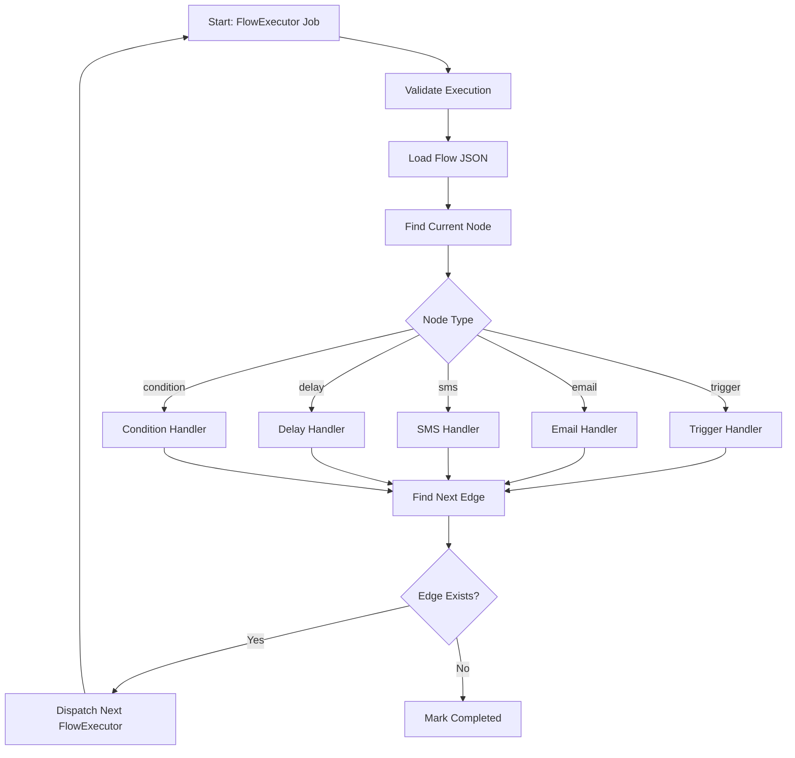
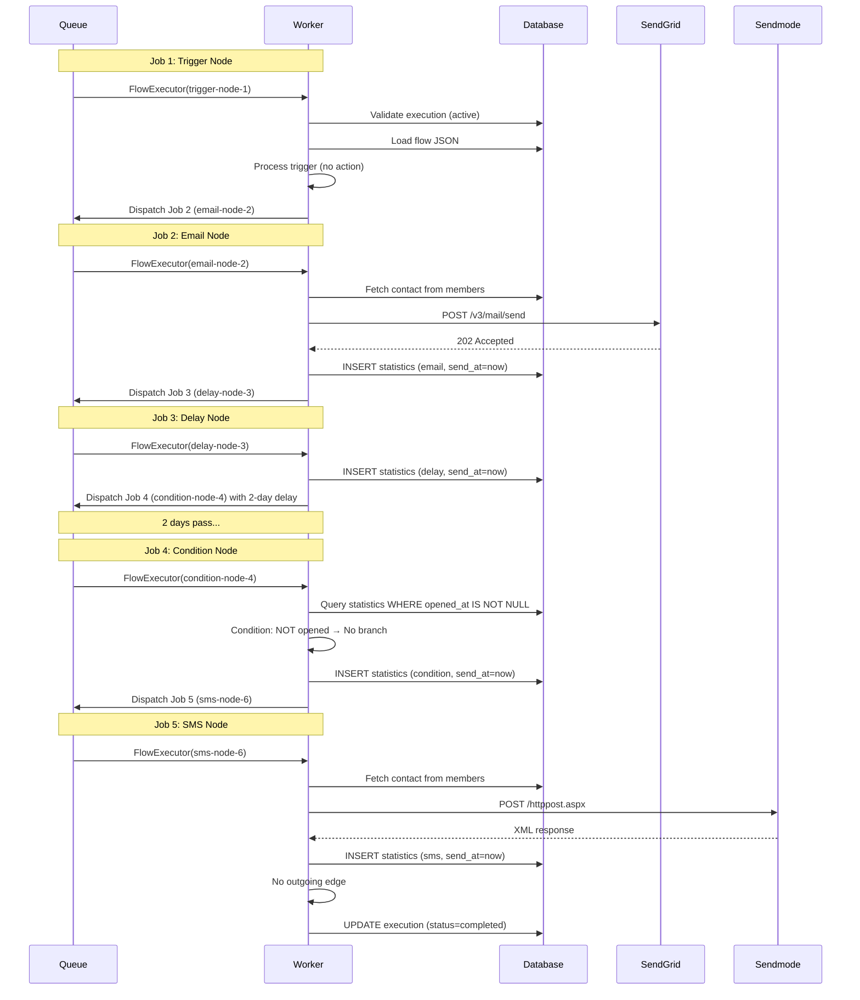

# Flow Execution Algorithm

This document provides a detailed, step-by-step breakdown of the flow execution algorithm. It covers the complete logic of how the `FlowExecutor` job processes each node type, evaluates conditions, and dispatches subsequent jobs.

---

## Algorithm Overview

The flow execution algorithm follows a **chain pattern**: each job processes exactly one node, then dispatches a new job for the next node. This continues until the flow reaches a node with no outgoing edges, at which point the execution is marked as completed.



---

## Complete Pseudocode

```
ALGORITHM FlowExecutor.handle()

INPUT:
    flowId: integer        — The flow to execute
    contactId: integer     — The contact (member) to execute for
    currentNodeId: string  — The node to process in this job
    executionId: integer   — The execution record to track progress

OUTPUT:
    None (side effects: database updates, external API calls, new job dispatches)

─────────────────────────────────────────────────────────────
STEP 1: VALIDATE EXECUTION
─────────────────────────────────────────────────────────────

    execution ← FlowExecution.find(executionId)

    IF execution IS NULL:
        LOG "Execution not found: {executionId}"
        RETURN

    IF execution.status != 'active':
        LOG "Execution is not active: {execution.status}"
        RETURN

    IF execution.unsubscribed_at IS NOT NULL:
        LOG "Contact has unsubscribed"
        RETURN


─────────────────────────────────────────────────────────────
STEP 2: LOAD FLOW DEFINITION
─────────────────────────────────────────────────────────────

    flow ← Flow.find(flowId)

    IF flow IS NULL:
        LOG "Flow not found: {flowId}"
        execution.status ← 'failed'
        execution.save()
        RETURN

    flowData ← JSON.decode(flow.flow)
    nodes ← flowData['nodes']
    edges ← flowData['edges']


─────────────────────────────────────────────────────────────
STEP 3: FIND CURRENT NODE
─────────────────────────────────────────────────────────────

    currentNode ← nodes.find(node WHERE node.id == currentNodeId)

    IF currentNode IS NULL:
        LOG "Node not found: {currentNodeId}"
        execution.status ← 'failed'
        execution.save()
        RETURN


─────────────────────────────────────────────────────────────
STEP 4: DISPATCH TO NODE HANDLER
─────────────────────────────────────────────────────────────

    SWITCH currentNode.type:

        CASE 'triggerNode':
            HANDLE_TRIGGER(currentNode, edges)
            BREAK

        CASE 'emailNode':
            HANDLE_EMAIL(currentNode, edges)
            BREAK

        CASE 'smsNode':
            HANDLE_SMS(currentNode, edges)
            BREAK

        CASE 'delayNode':
            HANDLE_DELAY(currentNode, edges)
            RETURN  // Delay handles its own dispatching

        CASE 'conditionNode':
            HANDLE_CONDITION(currentNode, edges)
            RETURN  // Condition handles its own dispatching


─────────────────────────────────────────────────────────────
STEP 5: DISPATCH NEXT NODE
─────────────────────────────────────────────────────────────

    DISPATCH_NEXT(currentNode, edges)


END ALGORITHM
```

---

## Node Handler Details

### HANDLE_TRIGGER

```
PROCEDURE HANDLE_TRIGGER(node, edges)

    // The trigger node is the entry point. It performs no action
    // other than passing execution to the next connected node.

    LOG "Processing trigger node: {node.id}"

    // Update execution to show we've started
    execution.started_at ← NOW()
    execution.current_node_id ← node.id
    execution.save()

    // No further action — proceed to DISPATCH_NEXT

END PROCEDURE
```

**Purpose:** The trigger node is a marker that indicates where the flow begins. It does not send messages, evaluate conditions, or apply delays. Its only job is to pass execution to the next node.

**Side Effects:**
- Sets `execution.started_at` to the current timestamp
- Updates `execution.current_node_id`

---

### HANDLE_EMAIL

```
PROCEDURE HANDLE_EMAIL(node, edges)

    LOG "Processing email node: {node.id}"

    // Update execution
    execution.current_node_id ← node.id
    execution.save()

    // Fetch contact details from CMS members table
    member ← DB.query("SELECT * FROM members WHERE id = ?", contactId)

    IF member IS NULL:
        LOG "Contact not found in members table: {contactId}"
        CREATE_STATISTICS_RECORD(send_at: NULL)
        RETURN

    // Load email template
    template ← Template.find(node.data.templateId)

    IF template IS NULL:
        LOG "Template not found: {node.data.templateId}"
        CREATE_STATISTICS_RECORD(send_at: NULL)
        RETURN

    // Build the email HTML with placeholder replacement
    html ← template.html
    html ← REPLACE(html, '{UNSUBSCRIBE_URL}', BuildUnsubscribeUrl(execution.hash))
    html ← REPLACE(html, '{CLIENT_FIRST_NAME}', member.fname)
    html ← REPLACE(html, '{CLIENT_LAST_NAME}', member.lname)
    html ← REPLACE(html, '{CLIENT_EMAIL}', member.email)

    // Build SendGrid API request
    payload ← {
        personalizations: [{
            to: [{ email: member.email }]
        }],
        from: { email: "noreply@icslegal.com", name: "ICS Legal" },
        subject: node.data.subject,
        html: html,
        tracking_settings: {
            open_tracking: { enable: true },
            click_tracking: { enable: true }
        },
        custom_args: {
            smart_automation_exe_id: STRING(executionId),
            node_id: node.id
        }
    }

    // Send email via SendGrid
    TRY:
        response ← HTTP.POST(SENDGRID_APIENDPOINT, payload, headers: {
            Authorization: "Bearer " + SENDGRID_APIKEY,
            Content-Type: "application/json"
        })

        IF response.status == 202:
            LOG "Email sent successfully to {member.email}"
            CREATE_STATISTICS_RECORD(send_at: NOW())
        ELSE:
            LOG "Email send failed: {response.status} — {response.body}"
            CREATE_STATISTICS_RECORD(send_at: NULL)

    CATCH Exception as e:
        LOG "Email send error: {e.message}"
        CREATE_STATISTICS_RECORD(send_at: NULL)

END PROCEDURE
```

**Purpose:** Sends an email to the contact using a selected template via the SendGrid API.

**Key Design Decisions:**

1. **Custom Args for Correlation:** The `smart_automation_exe_id` and `node_id` are included in the SendGrid request as `custom_args`. When SendGrid sends webhook events back, these values are included in the payload, allowing the backend to correlate events with the correct execution and node.

2. **Graceful Failure:** If the email fails to send (network error, API error, invalid template), the statistics record is still created with `send_at = NULL`. This allows the flow to continue to the next node while recording that the email failed.

3. **Placeholder Replacement:** The `{UNSUBSCRIBE_URL}` placeholder is replaced with a unique URL for each execution. This URL contains the execution's hash, which is used to identify the execution when the contact clicks unsubscribe.

---

### HANDLE_SMS

```
PROCEDURE HANDLE_SMS(node, edges)

    LOG "Processing SMS node: {node.id}"

    // Update execution
    execution.current_node_id ← node.id
    execution.save()

    // Fetch contact details from CMS members table
    member ← DB.query("SELECT * FROM members WHERE id = ?", contactId)

    IF member IS NULL:
        LOG "Contact not found in members table: {contactId}"
        CREATE_STATISTICS_RECORD(send_at: NULL)
        RETURN

    // Load SMS template
    template ← SmsTemplate.find(node.data.templateId)

    IF template IS NULL:
        LOG "SMS template not found: {node.data.templateId}"
        CREATE_STATISTICS_RECORD(send_at: NULL)
        RETURN

    // Validate and normalize mobile number
    mobile ← VALIDATE_MOBILE(member.mobile)

    IF mobile IS NULL:
        LOG "Invalid mobile number: {member.mobile}"
        CREATE_STATISTICS_RECORD(send_at: NULL)
        RETURN

    // Build SMS content with placeholder replacement
    content ← template.content
    content ← REPLACE(content, '{CLIENT_FIRST_NAME}', member.fname)
    content ← REPLACE(content, '{CLIENT_LAST_NAME}', member.lname)
    content ← REPLACE(content, '{CLIENT_EMAIL}', member.email)

    // Build Sendmode API request
    customerId ← STRING(executionId) + "-" + node.id
    params ← {
        Type: "sendparam",
        username: SENDMODE_USERNAME,
        password: SENDMODE_PASSWORD,
        sender: "ICS Legal",
        number: mobile,
        message: content,
        CustomerID: customerId
    }

    // Send SMS via Sendmode
    TRY:
        response ← HTTP.POST("https://api.sendmode.com/httppost.aspx", params)

        IF response indicates success:
            LOG "SMS sent successfully to {mobile}"
            CREATE_STATISTICS_RECORD(send_at: NOW())
        ELSE:
            LOG "SMS send failed: {response}"
            CREATE_STATISTICS_RECORD(send_at: NULL)

    CATCH Exception as e:
        LOG "SMS send error: {e.message}"
        CREATE_STATISTICS_RECORD(send_at: NULL)

END PROCEDURE
```

**Purpose:** Sends an SMS to the contact using a selected template via the Sendmode API.

**Mobile Number Validation:**

```
FUNCTION VALIDATE_MOBILE(rawMobile)

    IF rawMobile IS NULL OR EMPTY:
        RETURN NULL

    // Handle comma-separated numbers — take the first one
    IF rawMobile CONTAINS ',':
        parts ← SPLIT(rawMobile, ',')
        rawMobile ← TRIM(parts[0])

    // Remove non-digit characters
    cleaned ← REMOVE_ALL(rawMobile, NON_DIGIT_CHARACTERS)

    // Convert UK format (07xxx) to international (44xxx)
    IF cleaned STARTS WITH '07':
        cleaned ← '44' + SUBSTRING(cleaned, 1)

    // Validate length (10-15 digits)
    IF LENGTH(cleaned) < 10 OR LENGTH(cleaned) > 15:
        RETURN NULL

    RETURN cleaned

END FUNCTION
```

**Key Design Decisions:**

1. **CustomerID for Correlation:** The `CustomerID` parameter is set to `{executionId}-{nodeId}`. When Sendmode sends delivery receipts, this value is parsed to find the correct statistics record.

2. **Sender ID:** Hardcoded as `ICS Legal`. This is the name displayed on the recipient's phone.

3. **First Number Only:** If the mobile field contains multiple comma-separated numbers, only the first valid number is used. This prevents sending duplicate SMS messages.

---

### HANDLE_DELAY

```
PROCEDURE HANDLE_DELAY(node, edges)

    LOG "Processing delay node: {node.id}"

    // Update execution
    execution.current_node_id ← node.id
    execution.save()

    // Read delay configuration
    amount ← node.data.amount       // e.g., 2
    unit ← node.data.unit           // e.g., 'days'

    // Create statistics record
    CREATE_STATISTICS_RECORD(
        channel: 'delay',
        send_at: NOW()
    )

    // Find the next edge
    nextEdge ← edges.find(edge WHERE edge.source == node.id)

    IF nextEdge IS NULL:
        LOG "No outgoing edge from delay node"
        execution.status ← 'completed'
        execution.completed_at ← NOW()
        execution.save()
        RETURN

    // Calculate delay time
    delayTime ← NOW().ADD(amount, unit)
    // Example: if amount=2, unit='days' → delayTime = NOW + 2 days

    // Dispatch next job with delay
    FlowExecutor.DISPATCH(
        flowId: flowId,
        contactId: contactId,
        currentNodeId: nextEdge.target,
        executionId: executionId
    ).DELAY(delayTime)

    LOG "Next job dispatched with delay: {delayTime}"

END PROCEDURE
```

**Purpose:** Pauses the execution for a specified amount of time before proceeding to the next node.

**How Delay Works:**

The delay is implemented using Laravel's queue delay feature. When a job is dispatched with a delay, it is inserted into the `ics_automation_jobs` table with `available_at` set to the future time. The queue worker will not pick up the job until `available_at <= NOW()`.

```sql
-- Job inserted with future available_at
INSERT INTO ics_automation_jobs (
    queue, payload, attempts, available_at, created_at
) VALUES (
    'default', '...', 0, 1705398600, 1705225800
);
-- available_at = NOW + 2 days
-- created_at = NOW
```

---

### HANDLE_CONDITION

```
PROCEDURE HANDLE_CONDITION(node, edges)

    LOG "Processing condition node: {node.id}"

    // Update execution
    execution.current_node_id ← node.id
    execution.save()

    // Read condition configuration
    conditionType ← node.data.conditionType   // 'activity_status'
    activity ← node.data.activity             // e.g., 'opened_email'

    // Evaluate the condition
    result ← EVALUATE_CONDITION(executionId, conditionType, activity)

    // Create statistics record
    CREATE_STATISTICS_RECORD(
        channel: 'condition',
        send_at: NOW()
    )

    LOG "Condition result: {result} (activity: {activity})"

    // Find the matching edge based on the result
    IF result IS TRUE:
        // Find the 'yes' branch edge
        nextEdge ← edges.find(edge WHERE
            edge.source == node.id AND
            (edge.sourceHandle IS NULL OR edge.sourceHandle == 'yes')
        )
    ELSE:
        // Find the 'no' branch edge
        nextEdge ← edges.find(edge WHERE
            edge.source == node.id AND
            edge.sourceHandle == 'no'
        )

    IF nextEdge IS NULL:
        LOG "No matching edge for condition result: {result}"
        execution.status ← 'completed'
        execution.completed_at ← NOW()
        execution.save()
        RETURN

    // Dispatch next job for the target node
    FlowExecutor.DISPATCH(
        flowId: flowId,
        contactId: contactId,
        currentNodeId: nextEdge.target,
        executionId: executionId
    )

    LOG "Next job dispatched to node: {nextEdge.target}"

END PROCEDURE
```

**Purpose:** Evaluates a condition based on the contact's behavior and routes execution down the appropriate branch.

**Condition Evaluation:**

```
PROCEDURE EVALUATE_CONDITION(executionId, conditionType, activity)

    IF conditionType != 'activity_status':
        RETURN FALSE

    // Map activity to the statistics column to check
    column ← GET_COLUMN_FOR_ACTIVITY(activity)

    // Query the statistics table
    result ← DB.query(
        "SELECT EXISTS(
            SELECT 1 FROM ics_automation_statistics
            WHERE execution_id = ? AND {column} IS NOT NULL
        )",
        executionId
    )

    RETURN result

END PROCEDURE

FUNCTION GET_COLUMN_FOR_ACTIVITY(activity)

    SWITCH activity:
        CASE 'opened_email':        RETURN 'opened_at'
        CASE 'clicked_email':       RETURN 'clicked_at'
        CASE 'bounce_email':        RETURN 'bounced_at'
        CASE 'received_email':      RETURN 'delivered_at'
        CASE 'clicked_unsubscribe': RETURN 'unsubscribed_at'
        CASE 'received_sms':        RETURN 'delivered_at'  // with channel='sms'
        CASE 'clicked_sms':         RETURN 'clicked_at'    // with channel='sms'
        DEFAULT:                    RETURN NULL

END FUNCTION
```

---

### DISPATCH_NEXT

```
PROCEDURE DISPATCH_NEXT(currentNode, edges)

    // Find the outgoing edge from the current node
    nextEdge ← edges.find(edge WHERE edge.source == currentNode.id)

    IF nextEdge IS NULL:
        // No outgoing edge — the flow is complete
        LOG "No outgoing edge from node: {currentNode.id}"
        execution.status ← 'completed'
        execution.completed_at ← NOW()
        execution.save()
        RETURN

    // Dispatch a new FlowExecutor job for the target node
    FlowExecutor.DISPATCH(
        flowId: flowId,
        contactId: contactId,
        currentNodeId: nextEdge.target,
        executionId: executionId
    )

    LOG "Next job dispatched to node: {nextEdge.target}"

END PROCEDURE
```

**Purpose:** Finds the next connected node and dispatches a new job for it. If no outgoing edge exists, the execution is marked as completed.

---

## Helper: CREATE_STATISTICS_RECORD

```
PROCEDURE CREATE_STATISTICS_RECORD(channel, send_at, ...)

    Statistics.CREATE({
        execution_id: executionId,
        node_id: currentNodeId,
        channel: channel,          // 'email', 'sms', 'delay', or 'condition'
        send_at: send_at,          // NOW() on success, NULL on failure
        delivered_at: ...,
        opened_at: ...,
        clicked_at: ...,
        bounced_at: ...,
        dropped_at: ...,
        unsubscribed_at: ...,
        created_at: NOW(),
        updated_at: NOW()
    })

END PROCEDURE
```

---

## Helper: BuildUnsubscribeUrl

```
FUNCTION BuildUnsubscribeUrl(hash)

    RETURN config('app.url') + '/unsubscribe?hash=' + hash

END FUNCTION
```

**Example Output:**
```
https://automation.icslegal.com/unsubscribe?hash=aBcDeFgHiJkLmNoPqRsTuVwXyZ1234567890
```

---

## Execution Flow Example

Consider this flow:

```
Trigger → Email (Welcome) → Delay (2 days) → Condition (opened?) → Email (Follow-up) [Yes]
                                                                    → SMS (Reminder) [No]
```

Here is the sequence of jobs dispatched:



---

## Edge Cases

### Circular Flow

If a flow contains a circular reference (e.g., Node A → Node B → Node A), the execution will loop indefinitely, creating new jobs for each iteration. The system does not currently detect or prevent circular flows.

**Mitigation:** The frontend flow builder should validate for cycles before saving. Additionally, monitoring the `ics_automation_jobs` table for unusually high job counts can detect runaway executions.

### Missing Node

If the `currentNodeId` in a job does not match any node in the flow JSON, the execution is marked as `failed`:

```
execution.status ← 'failed'
execution.save()
```

This can happen if:
- The flow was modified after the execution started
- The flow JSON is corrupted
- The node was deleted from the flow

### Missing Contact

If the contact is not found in the `members` table, the node handler logs the error and creates a statistics record with `send_at = NULL`. The flow continues to the next node.

### Unsubscribed Contact

If the contact unsubscribes during execution, the next job that runs will detect this in Step 1 (Validate Execution) and exit silently:

```
IF execution.unsubscribed_at IS NOT NULL:
    RETURN
```

This prevents any further nodes from being processed for this contact.

---

## Next Steps

| Document | What You'll Learn |
|----------|------------------|
| [Logging & Monitoring](./logging-&-monitoring) | How to track and debug flow executions |
| [Troubleshooting](./troubleshooting) | Common issues and their solutions |
| [API Reference](./api-documentation) | All API endpoints |
