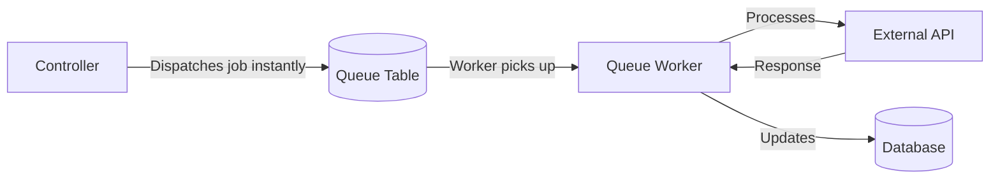
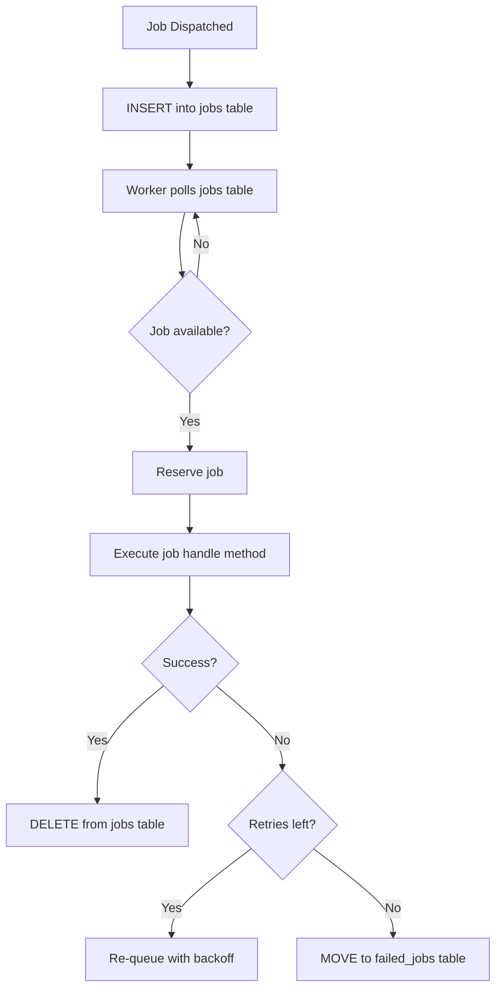
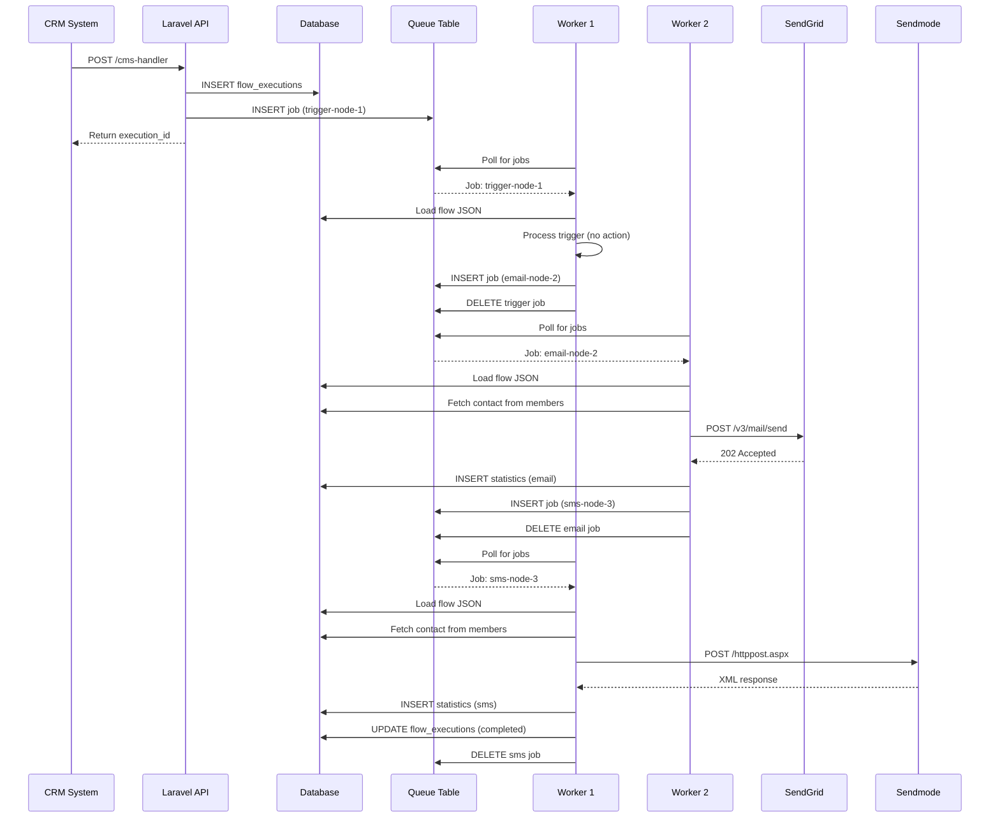

# Jobs & Queues (Automation Engine)

This document provides a deep dive into the Laravel queue system that powers the ICS Automation engine. It explains how jobs work, how the queue processes them, and how the `FlowExecutor` job orchestrates the entire automation flow.

---

## Why Queues?

In a marketing automation system, actions like sending emails and SMS messages involve HTTP requests to external APIs (SendGrid, Sendmode). These requests can take several seconds each. If a flow has multiple nodes, processing them synchronously would:

1. **Block the HTTP request** until the entire flow completes — potentially timing out
2. **Waste server resources** while waiting for external API responses
3. **Provide no retry mechanism** if an API call fails
4. **Make delays impossible** — you cannot "pause" a synchronous request for 2 days

Queues solve all of these problems by **decoupling job dispatch from job execution**:



The controller returns immediately after dispatching the job. The worker processes it in the background.

---

## Laravel Queue System Overview

### Components

| Component | Description |
|-----------|-------------|
| **Job** | A class that represents a unit of work. Contains the logic to execute. |
| **Queue** | A storage mechanism for pending jobs. In our case, a MySQL table. |
| **Worker** | A long-running PHP process that polls the queue for jobs and executes them. |
| **Dispatcher** | The code that creates a job instance and pushes it onto the queue. |

### Queue Driver

The application uses the **database** queue driver. This means:

- Pending jobs are stored in the `ics_automation_jobs` table
- Failed jobs are stored in the `ics_automation_failed_jobs` table
- Workers poll the database table for new jobs



### The Jobs Table

```sql
CREATE TABLE ics_automation_jobs (
    id BIGINT UNSIGNED AUTO_INCREMENT PRIMARY KEY,
    queue VARCHAR(255) NOT NULL,
    payload LONGTEXT NOT NULL,
    attempts TINYINT UNSIGNED NOT NULL,
    reserved_at INT UNSIGNED NULL,
    available_at INT UNSIGNED NOT NULL,
    created_at INT UNSIGNED NOT NULL
);
```

| Column | Description |
|--------|-------------|
| `queue` | Queue name (default: `default`). Allows prioritization. |
| `payload` | JSON containing the job class name, constructor arguments, and metadata. |
| `attempts` | Number of times the job has been attempted. Incremented on each retry. |
| `reserved_at` | Unix timestamp when a worker picked up the job. NULL if still pending. |
| `available_at` | Unix timestamp when the job becomes available for processing. Used for delayed jobs. |
| `created_at` | Unix timestamp when the job was created. |

### The Payload

When a job is dispatched, Laravel serializes it into a JSON payload:

```json
{
  "uuid": "a1b2c3d4-e5f6-7890-abcd-ef1234567890",
  "displayName": "App\\Jobs\\FlowExecutor",
  "job": "Illuminate\\Queue\\CallQueuedHandler@call",
  "maxTries": null,
  "maxExceptions": null,
  "retryUntil": null,
  "timeout": null,
  "timeoutAt": null,
  "data": {
    "commandName": "App\\Jobs\\FlowExecutor",
    "command": "O:22:\"App\\Jobs\\FlowExecutor\":4:{s:7:\"flowId\";i:2;s:10:\"contactId\";i:121211;s:14:\"currentNodeId\";s:13:\"trigger-node-1\";s:12:\"executionId\";i:45;}"
  }
}
```

The `command` field contains a serialized PHP object with the job's properties. When the worker picks up the job, it unserializes this object and calls the `handle()` method.

---

## The FlowExecutor Job

`FlowExecutor` is the core job class that processes automation flows. It lives in `app/Jobs/FlowExecutor.php`.

### Job Properties

```php
class FlowExecutor implements ShouldQueue
{
    use Dispatchable, InteractsWithQueue, Queueable, SerializesModels;

    public int $flowId;
    public int $contactId;
    public string $currentNodeId;
    public int $executionId;

    public function __construct(int $flowId, int $contactId, string $currentNodeId, int $executionId)
    {
        $this->flowId = $flowId;
        $this->contactId = $contactId;
        $this->currentNodeId = $currentNodeId;
        $this->executionId = $executionId;
    }
}
```

| Property | Type | Description |
|----------|------|-------------|
| `$flowId` | int | The ID of the flow being executed. Used to load the flow definition from the database. |
| `$contactId` | int | The ID of the contact (from the CMS `members` table). Used to fetch contact details for email/SMS sending. |
| `$currentNodeId` | string | The ID of the node this job should process. Matches the `id` field of a node in the flow JSON. |
| `$executionId` | int | The ID of the `FlowExecution` record. Used to track progress and create statistics records. |

### The `handle()` Method

The `handle()` method is the entry point when a worker executes the job. Here is the complete execution flow:

```mermaid
graph TD
    A[handle() called] --> B[Validate execution exists and is active]
    B --> C{Valid?}
    C -->|No| D[Return silently]
    C -->|Yes| E[Load flow from database]
    E --> F[Decode flow JSON into nodes and edges]
    F --> G[Find current node by ID]
    G --> H{Node found?}
    H -->|No| I[Mark execution as failed]
    H -->|Yes| J[Get node type]
    J --> K{Node type?}
    K -->|triggerNode| L[Handle Trigger]
    K -->|emailNode| M[Handle Email]
    K -->|smsNode| N[Handle SMS]
    K -->|delayNode| O[Handle Delay]
    K -->|conditionNode| P[Handle Condition]
    L --> Q[Dispatch Next]
    M --> Q
    N --> Q
    O --> Q
    P --> Q
    Q --> R{Outgoing edge?}
    R -->|Yes| S[Dispatch new FlowExecutor for target node]
    R -->|No| T[Mark execution as completed]
```

### Step-by-Step Execution

#### Step 1: Validate Execution

```php
$execution = FlowExecution::find($this->executionId);

if (!$execution || !$execution->isActive()) {
    return; // Silently exit
}
```

The job first checks that the execution record exists and is still active. If the execution has been cancelled, unsubscribed, or completed, the job exits without doing anything. This prevents processing for contacts who have opted out.

#### Step 2: Load Flow Data

```php
$flow = Flow::find($this->flowId);
$flowData = json_decode($flow->flow, true);
$nodes = $flowData['nodes'];
$edges = $flowData['edges'];
```

The flow definition is loaded from the database and decoded from JSON. The `nodes` and `edges` arrays are extracted for processing.

#### Step 3: Find Current Node

```php
$currentNode = collect($nodes)->firstWhere('id', $this->currentNodeId);
```

The node matching `$this->currentNodeId` is located in the nodes array.

#### Step 4: Determine Node Type

```php
$nodeType = $currentNode['type'];
// Examples: 'triggerNode', 'emailNode', 'smsNode', 'delayNode', 'conditionNode'
```

The node type determines which handler is invoked.

#### Step 5: Execute Node Handler

Each node type has a dedicated handler:

**Trigger Node Handler:**

```php
// No action needed — trigger is just the entry point
// Proceed directly to dispatching the next node
```

**Email Node Handler:**

```php
SendEmailAction::run(
    contactId: $this->contactId,
    templateId: $currentNode['data']['templateId'],
    executionId: $this->executionId,
    nodeId: $this->currentNodeId
);
```

This sends the email via SendGrid and creates a statistics record.

**SMS Node Handler:**

```php
SendSmsAction::run(
    contactId: $this->contactId,
    templateId: $currentNode['data']['templateId'],
    executionId: $this->executionId,
    nodeId: $this->currentNodeId
);
```

This sends the SMS via Sendmode and creates a statistics record.

**Delay Node Handler:**

```php
$amount = $currentNode['data']['amount'];
$unit = $currentNode['data']['unit']; // 'minutes', 'hours', 'days'

// Create statistics record
Statistics::create([
    'execution_id' => $this->executionId,
    'node_id' => $this->currentNodeId,
    'channel' => 'delay',
    'send_at' => now(),
]);

// Find next edge and dispatch with delay
$nextEdge = collect($edges)->firstWhere('source', $this->currentNodeId);
if ($nextEdge) {
    FlowExecutor::dispatch(
        $this->flowId,
        $this->contactId,
        $nextEdge['target'],
        $this->executionId
    )->delay(now()->add($amount, $unit));
}
return; // Don't proceed to dispatchNext
```

**Condition Node Handler:**

```php
$evaluator = new FlowConditionEvaluator();
$result = $evaluator->evaluate(
    executionId: $this->executionId,
    conditionType: $currentNode['data']['conditionType'],
    activity: $currentNode['data']['activity']
);

// Create statistics record
Statistics::create([
    'execution_id' => $this->executionId,
    'node_id' => $this->currentNodeId,
    'channel' => 'condition',
    'send_at' => now(),
]);

// Find the matching edge based on the result
$matchingEdge = collect($edges)->firstWhere(function ($edge) use ($result) {
    if ($result) {
        return $edge['source'] === $this->currentNodeId && ($edge['sourceHandle'] ?? null) === 'yes';
    }
    return $edge['source'] === $this->currentNodeId && ($edge['sourceHandle'] ?? null) === 'no';
});

if ($matchingEdge) {
    FlowExecutor::dispatch(
        $this->flowId,
        $this->contactId,
        $matchingEdge['target'],
        $this->executionId
    );
}
return; // Don't proceed to dispatchNext
```

#### Step 6: Dispatch Next Node

For trigger, email, and SMS nodes (but not delay or condition, which handle their own dispatching):

```php
$nextEdge = collect($edges)->firstWhere('source', $this->currentNodeId);

if (!$nextEdge) {
    // No outgoing edge — flow is complete
    $execution->status = 'completed';
    $execution->completed_at = now();
    $execution->save();
    return;
}

// Dispatch a new job for the target node
FlowExecutor::dispatch(
    $this->flowId,
    $this->contactId,
    $nextEdge['target'],
    $this->executionId
);
```

---

## Job Lifecycle

### Dispatch

A job is dispatched by calling `FlowExecutor::dispatch()`:

```php
FlowExecutor::dispatch(
    flowId: 2,
    contactId: 121211,
    currentNodeId: 'trigger-node-1',
    executionId: 45
);
```

This creates a new job instance, serializes it, and inserts a row into the `ics_automation_jobs` table.

### Delayed Dispatch

For delay nodes, the job is dispatched with a delay:

```php
FlowExecutor::dispatch(
    flowId: 2,
    contactId: 121211,
    currentNodeId: 'email-node-2',
    executionId: 45
)->delay(now()->addDays(2));
```

This sets the `available_at` column to 2 days in the future. The worker will not pick up the job until that time.

### Processing

The queue worker continuously polls the `ics_automation_jobs` table:

```bash
php artisan queue:work
```

The worker:

1. Queries for jobs where `available_at <= NOW()` and `reserved_at IS NULL`
2. Marks the job as reserved (sets `reserved_at`)
3. Unserializes the job object
4. Calls the `handle()` method
5. If successful, deletes the job from the table
6. If failed, increments `attempts` and re-queues (or moves to `failed_jobs`)

### Retry

If a job throws an exception, the worker:

1. Catches the exception
2. Increments the `attempts` counter
3. If `attempts < maxTries`, re-queues the job with a backoff delay
4. If `attempts >= maxTries`, moves the job to `ics_automation_failed_jobs`

The default `maxTries` is `null` (unlimited). Configure it when starting the worker:

```bash
php artisan queue:work --tries=3
```

### Failed Jobs

When a job exceeds its retry limit, it is moved to the `ics_automation_failed_jobs` table:

```sql
CREATE TABLE ics_automation_failed_jobs (
    id BIGINT UNSIGNED AUTO_INCREMENT PRIMARY KEY,
    uuid VARCHAR(255) NOT NULL UNIQUE,
    connection TEXT NOT NULL,
    queue TEXT NOT NULL,
    payload LONGTEXT NOT NULL,
    exception LONGTEXT NOT NULL,
    failed_at TIMESTAMP DEFAULT CURRENT_TIMESTAMP
);
```

The `exception` column contains the full stack trace, which is invaluable for debugging.

To view failed jobs:

```bash
php artisan queue:failed
```

To retry a failed job:

```bash
php artisan queue:retry <job-id>
```

To retry all failed jobs:

```bash
php artisan queue:retry all
```

---

## Queue Worker Management

### Starting a Worker

```bash
php artisan queue:work
```

This starts a persistent worker that runs indefinitely, processing jobs as they arrive.

### Worker Options

| Option | Default | Description |
|--------|---------|-------------|
| `--tries=3` | 0 (unlimited) | Maximum number of times to attempt a job before marking it as failed. |
| `--sleep=3` | 3 | Seconds to wait between polling for new jobs. |
| `--timeout=60` | 60 | Maximum seconds a single job can run before being killed. |
| `--memory=512` | 128 | Maximum memory (in MB) before the worker restarts itself. |
| `--queue=default` | default | Which queue(s) to process. Comma-separated for multiple queues. |
| `--max-time=3600` | 0 (unlimited) | Maximum seconds the worker should run before exiting. |

### Production Worker (Supervisor)

In production, use Supervisor to manage workers:

```ini
[program:ics-automation-worker]
process_name=%(program_name)s_%(process_num)02d
command=php /path/to/artisan queue:work --sleep=3 --tries=3 --max-time=3600
autostart=true
autorestart=true
stopasgroup=true
killasgroup=true
user=www-data
numprocs=2
redirect_stderr=true
stdout_logfile=/path/to/storage/logs/worker.log
stopwaitsecs=3600
```

| Setting | Why |
|---------|-----|
| `numprocs=2` | Run 2 workers in parallel for higher throughput |
| `--max-time=3600` | Restart every hour to prevent memory leaks |
| `autostart=true` | Start on system boot |
| `autorestart=true` | Restart if the worker crashes |

### Scaling Workers

If the queue depth grows, add more workers:

```ini
numprocs=4  ; 4 parallel workers
```

Or use multiple queue names for prioritization:

```bash
php artisan queue:work --queue=high,default,low
```

Jobs can be dispatched to specific queues:

```php
FlowExecutor::dispatch(...)->onQueue('high');
```

---

## Job Flow Diagram

Here is the complete job flow for a 3-node flow (Trigger → Email → SMS):



---

## Error Handling

### Job Exceptions

If any step in the `handle()` method throws an exception, the job fails. Common exceptions:

| Exception | Cause | Solution |
|-----------|-------|----------|
| `ModelNotFoundException` | Flow or execution not found in database | Verify IDs are correct |
| `ConnectionException` | Cannot connect to SendGrid/Sendmode | Check network and API credentials |
| `HttpException` | SendGrid/Sendmode returns error status | Check API key and request payload |
| `JsonException` | Flow JSON is malformed | Re-save the flow in the frontend |

### Graceful Degradation

The email and SMS actions are designed to fail gracefully:

```php
try {
    // Send email via SendGrid
    $response = $client->post($endpoint, $payload);
    Statistics::create(['send_at' => now(), ...]);
} catch (\Exception $e) {
    // Still create the statistics record, but without send_at
    Statistics::create(['send_at' => null, ...]);
    Log::error('Email send failed: ' . $e->getMessage());
}
```

This ensures that even if an email fails to send, the execution can continue to the next node, and the failure is logged for investigation.

---

## Performance Considerations

### Job Throughput

| Metric | Value |
|--------|-------|
| Jobs processed per worker per second | ~1–5 (depends on external API latency) |
| Average job processing time | 200ms–2s (email/SMS API calls dominate) |
| Queue depth limit | None (limited only by database capacity) |
| Maximum concurrent workers | Limited by database connections and API rate limits |

### Database Load

Each job execution performs approximately 5–10 database queries:

1. Load execution record (1 query)
2. Load flow record (1 query)
3. Fetch contact from members table (1 query)
4. Load template (1 query)
5. Create statistics record (1 query)
6. Find next edge (in-memory, no query)
7. Insert next job (1 query)
8. Delete current job (1 query)

With 2 workers processing 2 jobs/second each, this results in ~16–32 queries/second — well within MySQL's capacity.

### Memory Usage

Each job is lightweight:

- Job object: ~1KB (4 properties)
- Flow JSON: ~5–50KB (depends on flow complexity)
- Total per job: ~50–100KB

The worker process uses ~50–100MB of RAM. With `--memory=512`, the worker restarts before reaching memory limits.

---

## Next Steps

| Document | What You'll Learn |
|----------|------------------|
| [Flow Execution Algorithm](./flow-execution-algorithm) | Detailed pseudocode for every node handler |
| [API Reference](./api-documentation) | All API endpoints |
| [Configuration](./configuration) | Queue driver and worker configuration |
