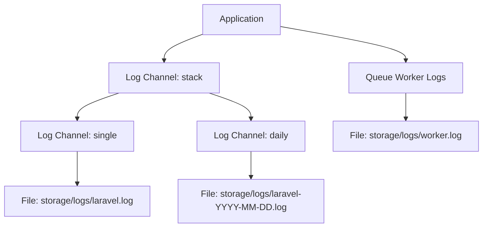

# Logging & Monitoring

This document covers the observability strategy for the ICS Automation backend. It explains how to track flow executions, monitor queue health, debug issues, and set up alerts for critical events.

---

## Logging Architecture

### Log Channels

Laravel's logging system is configured in `config/logging.php`. The application supports multiple log channels:



| Channel | Driver | File | Description |
|---------|--------|------|-------------|
| `stack` | Stack | — | Combines multiple channels. Default channel. |
| `single` | Single file | `storage/logs/laravel.log` | All logs in one file. Good for development. |
| `daily` | Daily rotation | `storage/logs/laravel-YYYY-MM-DD.log` | Rotated daily. Keeps 14 days by default. Recommended for production. |

### Log Levels

| Level | Severity | When to Use | Example |
|-------|----------|-------------|---------|
| `debug` | Lowest | Detailed diagnostic information | Node processing details, query results |
| `info` | Low | Normal operational events | Flow execution started, email sent |
| `notice` | Normal | Significant but normal events | Template loaded, contact imported |
| `warning` | Elevated | Potential issues that don't stop execution | SMS credit low, template not found |
| `error` | High | Errors that prevent an operation | Email send failed, API connection error |
| `critical` | Very High | Critical failures requiring immediate attention | Queue worker crashed, database connection lost |
| `alert` | Severe | System-wide issues | All workers down, database unreachable |
| `emergency` | Highest | System is unusable | Application crash, data corruption |

### What Gets Logged

#### Application Logs (`storage/logs/laravel.log`)

| Event | Level | Example Message |
|-------|-------|----------------|
| Flow execution started | info | `Flow execution started: execution_id=45, flow_id=2, contact_id=121211` |
| Email sent | info | `Email sent successfully to john@example.com` |
| Email send failed | error | `Email send failed: 401 — {"errors":["The provided authorization grant is invalid"]}` |
| SMS sent | info | `SMS sent successfully to 447123456789` |
| SMS send failed | error | `SMS send failed: Invalid mobile number` |
| Contact not found | warning | `Contact not found in members table: 121211` |
| Template not found | error | `Template not found: 999` |
| Condition evaluated | debug | `Condition result: false (activity: opened_email)` |
| Execution completed | info | `Flow execution completed: execution_id=45` |
| Execution unsubscribed | info | `Contact unsubscribed: execution_id=45` |
| Webhook event processed | info | `SendGrid event processed: delivered for execution_id=45` |
| Queue job failed | error | `Job failed: App\Jobs\FlowExecutor — ConnectionException: Connection refused` |

#### Queue Worker Logs (`storage/logs/worker.log`)

| Event | Level | Example Message |
|-------|-------|----------------|
| Worker started | info | `Processing jobs from the [default] queue.` |
| Job processed | info | `Processed: App\Jobs\FlowExecutor` |
| Job failed | error | `Failed: App\Jobs\FlowExecutor — Exception: ...` |
| Job retried | warning | `Job retry attempt 2 of 3: App\Jobs\FlowExecutor` |

---

## Flow Execution Tracking

### Execution Status Dashboard

The `ics_automation_flow_executions` table is the primary source of truth for execution status:

```sql
-- All active executions
SELECT
    fe.id,
    fe.flow_id,
    f.name AS flow_name,
    fe.contact_id,
    fe.current_node_id,
    fe.status,
    fe.started_at,
    fe.created_at
FROM ics_automation_flow_executions fe
JOIN ics_automation_flows f ON f.id = fe.flow_id
WHERE fe.status = 'active'
ORDER BY fe.created_at DESC;
```

### Execution Progress

To see the current progress of a specific execution:

```sql
SELECT
    fe.id AS execution_id,
    f.name AS flow_name,
    fe.status,
    fe.current_node_id,
    fe.started_at,
    fe.completed_at,
    COUNT(s.id) AS nodes_processed,
    SUM(CASE WHEN s.delivered_at IS NOT NULL THEN 1 ELSE 0 END) AS delivered,
    SUM(CASE WHEN s.opened_at IS NOT NULL THEN 1 ELSE 0 END) AS opened,
    SUM(CASE WHEN s.clicked_at IS NOT NULL THEN 1 ELSE 0 END) AS clicked
FROM ics_automation_flow_executions fe
JOIN ics_automation_flows f ON f.id = fe.flow_id
LEFT JOIN ics_automation_statistics s ON s.execution_id = fe.id
WHERE fe.id = 45
GROUP BY fe.id;
```

### Node-Level Statistics

To see the detailed statistics for each node in an execution:

```sql
SELECT
    s.node_id,
    s.channel,
    s.send_at,
    s.delivered_at,
    s.opened_at,
    s.clicked_at,
    s.bounced_at,
    s.dropped_at,
    s.unsubscribed_at
FROM ics_automation_statistics s
WHERE s.execution_id = 45
ORDER BY s.created_at ASC;
```

**Example Output:**

| node_id | channel | send_at | delivered_at | opened_at | clicked_at |
|---------|---------|---------|-------------|-----------|------------|
| trigger-node-1 | email | 2026-01-15 10:30:00 | 2026-01-15 10:30:05 | 2026-01-15 11:00:00 | NULL |
| delay-node-3 | delay | 2026-01-15 10:30:10 | NULL | NULL | NULL |
| condition-node-4 | condition | 2026-01-17 10:30:10 | NULL | NULL | NULL |
| email-node-5 | email | 2026-01-17 10:30:15 | 2026-01-17 10:30:20 | NULL | NULL |

---

## Queue Monitoring

### Queue Depth

Check how many jobs are waiting to be processed:

```sql
-- Total pending jobs
SELECT COUNT(*) AS pending_jobs
FROM ics_automation_jobs
WHERE available_at <= UNIX_TIMESTAMP(NOW());

-- Jobs by queue name
SELECT queue, COUNT(*) AS count
FROM ics_automation_jobs
GROUP BY queue;

-- Delayed jobs (not yet available)
SELECT COUNT(*) AS delayed_jobs
FROM ics_automation_jobs
WHERE available_at > UNIX_TIMESTAMP(NOW());
```

### Failed Jobs

Monitor failed jobs:

```sql
-- Total failed jobs
SELECT COUNT(*) AS failed_jobs
FROM ics_automation_failed_jobs;

-- Recent failures with error details
SELECT
    id,
    queue,
    LEFT(exception, 200) AS error_preview,
    failed_at
FROM ics_automation_failed_jobs
ORDER BY failed_at DESC
LIMIT 20;

-- Failed jobs by exception type
SELECT
    SUBSTRING_INDEX(SUBSTRING_INDEX(exception, ':', 1), '\\', -1) AS exception_type,
    COUNT(*) AS count
FROM ics_automation_failed_jobs
GROUP BY exception_type
ORDER BY count DESC;
```

### Retry Failed Jobs

```bash
# View all failed jobs
php artisan queue:failed

# Retry a specific job
php artisan queue:retry <job-id>

# Retry all failed jobs
php artisan queue:retry all

# Delete all failed jobs
php artisan queue:flush
```

### Worker Health

Check if queue workers are running:

```bash
# Linux/macOS
ps aux | grep "queue:work"

# Windows
tasklist | findstr "php"
```

With Supervisor:

```bash
sudo supervisorctl status ics-automation-worker:*
```

Expected output:

```
ics-automation-worker:ics-automation-worker_00   RUNNING   pid 1234, uptime 2:15:30
ics-automation-worker:ics-automation-worker_01   RUNNING   pid 1235, uptime 2:15:30
```

---

## Webhook Monitoring

### SendGrid Events

Track SendGrid webhook events:

```sql
-- Recent SendGrid events
SELECT
    event_type,
    message_id,
    event_time,
    created_at
FROM ics_automation_stats
ORDER BY event_time DESC
LIMIT 20;

-- Events by type for a specific flow
SELECT
    event_type,
    COUNT(*) AS count
FROM ics_automation_stats
WHERE flow_id = 2
GROUP BY event_type
ORDER BY count DESC;

-- Events for a specific execution
SELECT
    event_type,
    message_id,
    event_time
FROM ics_automation_stats
WHERE flow_id = 2 AND event_time > '2026-01-15'
ORDER BY event_time ASC;
```

### Sendmode Delivery Receipts

Track SMS delivery receipts:

```sql
-- Recent delivery receipts
SELECT
    status,
    mobile,
    received_at
FROM ics_automation_sendmode_stats
ORDER BY received_at DESC
LIMIT 20;

-- Delivery success rate
SELECT
    status,
    COUNT(*) AS count,
    ROUND(COUNT(*) * 100.0 / (SELECT COUNT(*) FROM ics_automation_sendmode_stats), 2) AS percentage
FROM ics_automation_sendmode_stats
GROUP BY status
ORDER BY count DESC;
```

---

## Debugging Tools

### Artisan Commands

| Command | Description |
|---------|-------------|
| `php artisan queue:work` | Start a queue worker in the foreground |
| `php artisan queue:listen` | Start a queue listener (auto-restarts on failure) |
| `php artisan queue:retry all` | Retry all failed jobs |
| `php artisan queue:flush` | Delete all failed jobs |
| `php artisan queue:clear` | Delete all pending jobs from a queue |
| `php artisan queue:failed` | List all failed jobs |
| `php artisan cache:clear` | Clear application cache |
| `php artisan config:clear` | Clear configuration cache |
| `php artisan route:list` | List all registered API routes |
| `php artisan migrate:status` | Show migration status |
| `php artisan tinker` | Interactive PHP REPL for debugging |

### Tinker Debugging

```bash
php artisan tinker
```

```php
// Check a flow execution
$execution = \App\Models\FlowExecution::find(45);
echo $execution->status;           // 'active'
echo $execution->current_node_id;  // 'email-node-2'

// Check statistics for an execution
$stats = \App\Models\Statistics::where('execution_id', 45)->get();
foreach ($stats as $stat) {
    echo "{$stat->node_id}: {$stat->channel} — sent: {$stat->send_at}\n";
}

// Check SendGrid events for a contact
$events = \App\Models\Stat::where('contact_id', 121211)->get();
foreach ($events as $event) {
    echo "{$event->event_type} at {$event->event_time}\n";
}

// Manually dispatch a FlowExecutor job
\App\Jobs\FlowExecutor::dispatch(
    flowId: 2,
    contactId: 121211,
    currentNodeId: 'trigger-node-1',
    executionId: 45
);

// Check the queue depth
echo \DB::table('ics_automation_jobs')->count();

// Check failed jobs
$failed = \DB::table('ics_automation_failed_jobs')->get();
foreach ($failed as $job) {
    echo "Job {$job->id} failed at {$job->failed_at}: {$job->exception}\n";
}
```

---

## Performance Monitoring

### Database Query Performance

Enable query logging in development:

```php
// In AppServiceProvider::boot()
DB::listen(function ($query) {
    \Log::debug('Query: ' . $query->sql, [
        'bindings' => $query->bindings,
        'time' => $query->time,
    ]);
});
```

Monitor slow queries:

```sql
-- Enable slow query log in MySQL
SET GLOBAL slow_query_log = 'ON';
SET GLOBAL long_query_time = 2;  -- Log queries taking more than 2 seconds
```

### Queue Worker Performance

Monitor worker throughput:

```bash
# Count jobs processed in the last hour
SELECT COUNT(*) AS jobs_processed
FROM ics_automation_jobs
WHERE created_at > UNIX_TIMESTAMP(NOW() - INTERVAL 1 HOUR);

# Average job processing time (approximate)
SELECT
    AVG(reserved_at - created_at) AS avg_wait_time,
    COUNT(*) AS total_jobs
FROM ics_automation_jobs
WHERE reserved_at IS NOT NULL
    AND created_at > UNIX_TIMESTAMP(NOW() - INTERVAL 1 DAY);
```

### API Response Times

Monitor API endpoint performance using Laravel Telescope or custom middleware:

```php
// Response time middleware
public function handle($request, Closure $next)
{
    $start = microtime(true);
    $response = $next($request);
    $duration = round((microtime(true) - $start) * 1000, 2);

    \Log::info("{$request->method()} {$request->path()} — {$duration}ms");

    return $response;
}
```

---

## Alerting Recommendations

### Critical Alerts

| Metric | Threshold | Action |
|--------|-----------|--------|
| Queue depth | > 1,000 pending jobs | Scale queue workers |
| Failed jobs | > 50 failed jobs | Investigate and retry |
| Worker down | 0 workers running | Restart workers |
| Database connection | Connection refused | Check MySQL status |
| SendGrid API errors | > 10% failure rate | Check API key and quota |
| Sendmode API errors | > 10% failure rate | Check credentials and credits |

### Warning Alerts

| Metric | Threshold | Action |
|--------|-----------|--------|
| SMS credits | < 100 remaining | Top up credits |
| Email bounce rate | > 5% | Review email templates and contact lists |
| Queue wait time | > 5 minutes | Scale workers or investigate bottlenecks |
| Disk usage | > 80% | Clean old logs |
| Log file size | > 100MB | Rotate logs |

### Monitoring Dashboard

A recommended monitoring dashboard should display:

```
┌─────────────────────────────────────────────────────────┐
│                  ICS Automation Dashboard               │
├─────────────────────────────────────────────────────────┤
│                                                         │
│  Queue Depth: 23 pending    │  Failed Jobs: 2           │
│  Workers: 2 running         │  Avg Wait: 1.2s          │
│                                                         │
├─────────────────────────────────────────────────────────┤
│                                                         │
│  Active Executions: 15      │  Completed Today: 142     │
│  Emails Sent Today: 230     │  SMS Sent Today: 89       │
│  Email Delivery Rate: 98.5% │  SMS Delivery Rate: 97.2% │
│                                                         │
├─────────────────────────────────────────────────────────┤
│                                                         │
│  SendGrid Credits: N/A      │  Sendmode Credits: 1,500  │
│  Last Webhook: 2 min ago    │  Last DLR: 5 min ago      │
│                                                         │
└─────────────────────────────────────────────────────────┘
```

---

## Log Rotation

### Using Laravel Daily Channel

Set in `.env`:

```env
LOG_CHANNEL=daily
LOG_DEPRECATIONS_CHANNEL=null
```

This creates daily log files and keeps 14 days by default. Configure retention in `config/logging.php`:

```php
'daily' => [
    'driver' => 'daily',
    'path' => storage_path('logs/laravel.log'),
    'level' => env('LOG_LEVEL', 'debug'),
    'days' => 30,  // Keep 30 days of logs
],
```

### Using Logrotate (Linux)

```bash
# /etc/logrotate.d/laravel

/path/to/storage/logs/*.log {
    daily
    rotate 30
    compress
    delaycompress
    missingok
    notifempty
    create 0640 www-data www-data
    sharedscripts
    postrotate
        php /path/to/artisan cache:clear > /dev/null 2>&1 || true
    endscript
}
```

---

## Next Steps

| Document | What You'll Learn |
|----------|------------------|
| [Security](./security) | Authentication, validation, and security best practices |
| [Troubleshooting](./troubleshooting) | Common issues and their solutions |
| [Maintenance & Deployment](./maintenance-&-deployment) | Deployment procedures and maintenance tasks |
