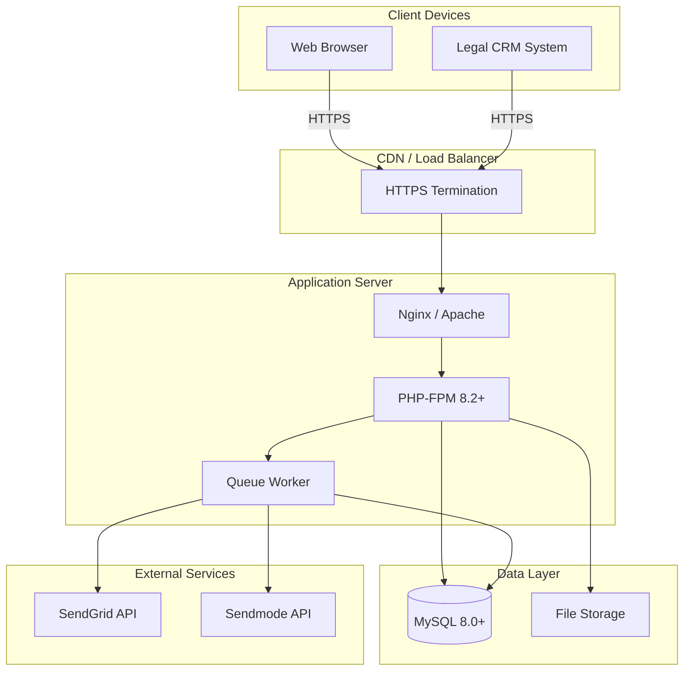

# Maintenance & Deployment

This document covers the operational aspects of the ICS Automation backend: deployment procedures, maintenance tasks, backup strategies, and ongoing operational best practices.

---

## Deployment Architecture



---

## Deployment Steps

### Prerequisites

| Requirement | Version | Notes |
|-------------|---------|-------|
| **Server OS** | Ubuntu 22.04 LTS / CentOS 8+ | Linux recommended |
| **PHP** | 8.2+ | With extensions: pdo_mysql, mbstring, openssl, tokenizer, xml, ctype, json, bcmath, fileinfo, curl, gd |
| **MySQL** | 8.0+ | Shared with CMS |
| **Composer** | 2.5+ | PHP dependency manager |
| **Nginx** | 1.18+ | Web server and reverse proxy |
| **Supervisor** | 3.3+ | Process manager for queue workers |
| **Git** | 2.30+ | Version control |

### Step 1: Server Preparation

```bash
# Update system packages
sudo apt update && sudo apt upgrade -y

# Install PHP and extensions
sudo apt install -y php8.2 php8.2-fpm php8.2-mysql php8.2-mbstring \
    php8.2-xml php8.2-curl php8.2-zip php8.2-gd php8.2-bcmath php8.2-fileinfo

# Install Composer
curl -sS https://getcomposer.org/installer | php
sudo mv composer.phar /usr/local/bin/composer

# Install Nginx
sudo apt install -y nginx

# Install Supervisor
sudo apt install -y supervisor

# Install Git
sudo apt install -y git
```

### Step 2: Deploy Application Code

```bash
# Create application directory
sudo mkdir -p /var/www/ics-automation
sudo chown $USER:$USER /var/www/ics-automation

# Clone or copy the application
cd /var/www/ics-automation
git clone git@github.com:dev-techics/ics-automation.git .

# Or copy from a deployment artifact
# unzip dist-update.zip -d /var/www/ics-automation
```

### Step 3: Install Dependencies

```bash
cd /var/www/ics-automation

# Install PHP dependencies (production)
composer install --no-dev --optimize-autoloader --no-interaction
```

### Step 4: Configure Environment

```bash
# Copy environment template
cp .env.example .env

# Generate application key
php artisan key:generate --force
```

Edit `.env` with production values:

```env
APP_NAME="ICS Automation"
APP_ENV=production
APP_DEBUG=false
APP_URL=https://automation.icslegal.com
FRONTEND_URL=https://automation.icslegal.com

DB_CONNECTION=mysql
DB_HOST=127.0.0.1
DB_PORT=3306
DB_DATABASE=cms
DB_USERNAME=your_db_user
DB_PASSWORD=your_secure_db_password

SENDGRID_APIKEY=SG.xxxxxxxxxx
SENDGRID_APIENDPOINT=https://api.sendgrid.com/v3/mail/send

SENDMODE_USERNAME=your_username
SENDMODE_PASSWORD=your_password
SENDMODE_API_KEY=your_api_key

QUEUE_CONNECTION=database
CACHE_DRIVER=file
SESSION_DRIVER=file

LOG_CHANNEL=daily
LOG_LEVEL=error
```

### Step 5: Set Up Database

```bash
# Run migrations
php artisan migrate --force

# Verify tables were created
mysql -u your_db_user -p cms -e "SHOW TABLES LIKE 'ics_automation_%';"
```

### Step 6: Set File Permissions

```bash
# Set ownership
sudo chown -R www-data:www-data /var/www/ics-automation

# Set directory permissions
sudo find /var/www/ics-automation -type d -exec chmod 755 {} \;
sudo find /var/www/ics-automation -type f -exec chmod 644 {} \;

# Ensure storage and bootstrap/cache are writable
sudo chmod -R 775 /var/www/ics-automation/storage
sudo chmod -R 775 /var/www/ics-automation/bootstrap/cache
```

### Step 7: Configure Nginx

Create an Nginx server block:

```nginx
# /etc/nginx/sites-available/ics-automation

server {
    listen 80;
    server_name automation.icslegal.com;
    root /var/www/ics-automation/public;

    add_header X-Frame-Options "SAMEORIGIN";
    add_header X-Content-Type-Options "nosniff";
    add_header X-XSS-Protection "1; mode=block";
    add_header Referrer-Policy "strict-origin-when-cross-origin";

    index index.php;

    charset utf-8;

    # Main location
    location / {
        try_files $uri $uri/ /index.php?$query_string;
    }

    # PHP handling
    location ~ \.php$ {
        fastcgi_pass unix:/var/run/php/php8.2-fpm.sock;
        fastcgi_index index.php;
        fastcgi_param SCRIPT_FILENAME $realpath_root$fastcgi_script_name;
        include fastcgi_params;
        fastcgi_read_timeout 300;
    }

    # Deny access to hidden files
    location ~ /\. {
        deny all;
    }

    # Deny access to .env
    location ~ /\.env {
        deny all;
    }

    # Deny access to composer files
    location ~ /composer\.(json|lock) {
        deny all;
    }

    # Deny access to vendor directory
    location ~ /vendor/ {
        deny all;
    }

    # Logging
    access_log /var/log/nginx/ics-automation-access.log;
    error_log /var/log/nginx/ics-automation-error.log;
}
```

Enable the site:

```bash
sudo ln -s /etc/nginx/sites-available/ics-automation /etc/nginx/sites-enabled/
sudo nginx -t
sudo systemctl reload nginx
```

### Step 8: Set Up SSL

```bash
# Install Certbot
sudo apt install -y certbot python3-certbot-nginx

# Obtain and install SSL certificate
sudo certbot --nginx -d automation.icslegal.com

# Auto-renewal is configured automatically
sudo certbot renew --dry-run
```

### Step 9: Configure Queue Workers

Create a Supervisor configuration:

```ini
; /etc/supervisor/conf.d/ics-automation-worker.conf

[program:ics-automation-worker]
process_name=%(program_name)s_%(process_num)02d
command=php /var/www/ics-automation/artisan queue:work --sleep=3 --tries=3 --max-time=3600
autostart=true
autorestart=true
stopasgroup=true
killasgroup=true
user=www-data
numprocs=2
redirect_stderr=true
stdout_logfile=/var/www/ics-automation/storage/logs/worker.log
stopwaitsecs=3600
```

Start the workers:

```bash
sudo supervisorctl reread
sudo supervisorctl update
sudo supervisorctl start ics-automation-worker:*
sudo supervisorctl status
```

### Step 10: Optimize for Production

```bash
# Cache configuration
php artisan config:cache

# Cache routes
php artisan route:cache

# Cache views (if any)
php artisan view:cache

# Optimize class loading
composer dump-autoload --optimize
```

### Step 11: Verify Deployment

```bash
# Check application health
curl -s https://automation.icslegal.com/api/flows | head -c 200

# Check queue workers
sudo supervisorctl status ics-automation-worker:*

# Check logs
tail -f /var/www/ics-automation/storage/logs/laravel.log
tail -f /var/www/ics-automation/storage/logs/worker.log

# Check Nginx logs
tail -f /var/log/nginx/ics-automation-error.log
```

---

## Deployment Strategies

### Zero-Downtime Deployment

For zero-downtime deployments, use a symlink-based strategy:

```bash
#!/bin/bash
# deploy.sh

APP_DIR="/var/www/ics-automation"
RELEASES_DIR="/var/www/ics-automation/releases"
CURRENT_LINK="/var/www/ics-automation/current"
TIMESTAMP=$(date +%Y%m%d_%H%M%S)
RELEASE_DIR="$RELEASES_DIR/$TIMESTAMP"

# Create releases directory
mkdir -p $RELEASES_DIR

# Clone latest code
git clone git@github.com:dev-techics/ics-automation.git $RELEASE_DIR
cd $RELEASE_DIR

# Install dependencies
composer install --no-dev --optimize-autoloader --no-interaction

# Copy environment file
cp $APP_DIR/.env $RELEASE_DIR/.env

# Run migrations
php artisan migrate --force

# Optimize
php artisan config:cache
php artisan route:cache
php artisan view:cache

# Set permissions
sudo chown -R www-data:www-data $RELEASE_DIR
sudo chmod -R 775 $RELEASE_DIR/storage
sudo chmod -R 775 $RELEASE_DIR/bootstrap/cache

# Update symlink
ln -sfn $RELEASE_DIR $CURRENT_LINK

# Reload PHP-FPM
sudo systemctl reload php8.2-fpm

# Restart queue workers
sudo supervisorctl restart ics-automation-worker:*

# Clean old releases (keep last 5)
cd $RELEASES_DIR
ls -t | tail -n +6 | xargs -r rm -rf

echo "Deployment complete: $RELEASE_DIR"
```

### Rolling Deployment

For multi-server deployments, update servers one at a time:

1. Remove server from load balancer
2. Deploy new code
3. Run migrations (only on first server)
4. Restart services
5. Verify health
6. Add server back to load balancer
7. Repeat for next server

---

## Maintenance Tasks

### Daily Tasks

| Task | Command | Frequency |
|------|---------|-----------|
| Check queue depth | `SELECT COUNT(*) FROM ics_automation_jobs;` | Daily |
| Check failed jobs | `php artisan queue:failed` | Daily |
| Review error logs | `tail -100 storage/logs/laravel.log` | Daily |
| Check disk space | `df -h` | Daily |

### Weekly Tasks

| Task | Command | Frequency |
|------|---------|-----------|
| Retry failed jobs | `php artisan queue:retry all` | Weekly |
| Check Sendmode credits | `curl https://automation.icslegal.com/api/credits/sendmode` | Weekly |
| Review execution stats | Query `ics_automation_statistics` | Weekly |
| Check SSL certificate expiry | `certbot certificates` | Weekly |

### Monthly Tasks

| Task | Command | Frequency |
|------|---------|-----------|
| Update dependencies | `composer update` | Monthly |
| Clean old statistics | Delete records older than 6 months | Monthly |
| Rotate log files | Verify log rotation is working | Monthly |
| Database optimization | `OPTIMIZE TABLE` on large tables | Monthly |
| Review access logs | Check for suspicious activity | Monthly |

### Database Maintenance

```sql
-- Optimize large tables
OPTIMIZE TABLE ics_automation_flow_executions;
OPTIMIZE TABLE ics_automation_statistics;
OPTIMIZE TABLE ics_automation_stats;
OPTIMIZE TABLE ics_automation_sendmode_stats;
OPTIMIZE TABLE ics_automation_jobs;
OPTIMIZE TABLE ics_automation_failed_jobs;

-- Analyze table statistics for query optimizer
ANALYZE TABLE ics_automation_flow_executions;
ANALYZE TABLE ics_automation_statistics;

-- Clean old raw SendGrid events (older than 6 months)
DELETE FROM ics_automation_stats
WHERE event_time < DATE_SUB(NOW(), INTERVAL 6 MONTH);

-- Clean old Sendmode stats (older than 6 months)
DELETE FROM ics_automation_sendmode_stats
WHERE received_at < DATE_SUB(NOW(), INTERVAL 6 MONTH);

-- Clean completed executions older than 1 year
DELETE FROM ics_automation_flow_executions
WHERE status = 'completed' AND completed_at < DATE_SUB(NOW(), INTERVAL 1 YEAR);
```

### Log Management

```bash
# Remove logs older than 30 days
find /var/www/ics-automation/storage/logs -name "*.log" -mtime +30 -delete

# Compress logs older than 7 days
find /var/www/ics-automation/storage/logs -name "*.log" -mtime +7 -exec gzip {} \;

# Check log directory size
du -sh /var/www/ics-automation/storage/logs/
```

---

## Backup Strategy

### Database Backup

Create automated daily backups:

```bash
#!/bin/bash
# backup.sh

BACKUP_DIR="/var/backups/ics-automation"
DATE=$(date +%Y%m%d_%H%M%S)
DB_NAME="cms"
DB_USER="your_db_user"
DB_PASS="your_db_password"
RETENTION_DAYS=30

# Create backup directory
mkdir -p $BACKUP_DIR

# Backup only ics_automation tables
TABLES=$(mysql -u $DB_USER -p$DB_PASS -N -e \
    "SELECT GROUP_CONCAT(TABLE_NAME SEPARATOR ' ') \
     FROM INFORMATION_SCHEMA.TABLES \
     WHERE TABLE_SCHEMA = '$DB_NAME' AND TABLE_NAME LIKE 'ics_automation_%'")

mysqldump -u $DB_USER -p$DB_PASS $DB_NAME $TABLES \
    > $BACKUP_DIR/ics_automation_$DATE.sql

# Compress
gzip $BACKUP_DIR/ics_automation_$DATE.sql

# Remove old backups
find $BACKUP_DIR -name "*.sql.gz" -mtime +$RETENTION_DAYS -delete

echo "Backup complete: ics_automation_$DATE.sql.gz"
```

Set up a cron job:

```bash
# Run daily at 2:00 AM
0 2 * * * /path/to/backup.sh >> /var/log/ics-automation-backup.log 2>&1
```

### File Backup

```bash
#!/bin/bash
# file-backup.sh

BACKUP_DIR="/var/backups/ics-automation"
DATE=$(date +%Y%m%d_%H%M%S)

# Backup storage directory (uploaded files, logs)
tar -czf $BACKUP_DIR/storage_$DATE.tar.gz \
    /var/www/ics-automation/storage/

# Backup .env file
cp /var/www/ics-automation/.env $BACKUP_DIR/env_$DATE

# Remove old backups
find $BACKUP_DIR -name "*.tar.gz" -mtime +30 -delete
find $BACKUP_DIR -name "env_*" -mtime +30 -delete
```

### Restore from Backup

```bash
# Decompress database backup
gunzip /var/backups/ics-automation/ics_automation_20260101_020000.sql.gz

# Restore database
mysql -u your_db_user -p cms < /var/backups/ics-automation/ics_automation_20260101_020000.sql

# Restore files
tar -xzf /var/backups/ics-automation/storage_20260101_020000.tar.gz -C /

# Restore .env
cp /var/backups/ics-automation/env_20260101_020000 /var/www/ics-automation/.env
```

---

## Update Procedures

### Application Update

```bash
# 1. Navigate to application directory
cd /var/www/ics-automation

# 2. Pull latest code
git pull origin main

# 3. Install/update dependencies
composer install --no-dev --optimize-autoloader --no-interaction

# 4. Run new migrations
php artisan migrate --force

# 5. Clear and rebuild caches
php artisan config:cache
php artisan route:cache
php artisan view:cache

# 6. Restart queue workers
sudo supervisorctl restart ics-automation-worker:*

# 7. Verify deployment
curl -s https://automation.icslegal.com/api/flows | head -c 200
```

### Rollback Procedure

If an update causes issues:

```bash
# 1. Revert to previous commit
cd /var/www/ics-automation
git reset --hard HEAD~1

# 2. Rollback last migration batch
php artisan migrate:rollback --force

# 3. Rebuild caches
php artisan config:cache
php artisan route:cache

# 4. Restart workers
sudo supervisorctl restart ics-automation-worker:*
```

### Dependency Update

```bash
# Update PHP dependencies
composer update --no-dev --optimize-autoloader

# Test after update
php artisan test  # if tests exist
php artisan route:list
php artisan migrate:status
```

---

## Monitoring Setup

### Health Check Endpoint

Add a health check route:

```php
// routes/api.php
Route::get('/health', function () {
    $checks = [];

    // Database check
    try {
        DB::connection()->getPdo();
        $checks['database'] = 'ok';
    } catch (\Exception $e) {
        $checks['database'] = 'error: ' . $e->getMessage();
    }

    // Queue check
    $queueSize = DB::table('ics_automation_jobs')->count();
    $checks['queue_depth'] = $queueSize;

    // Failed jobs check
    $failedJobs = DB::table('ics_automation_failed_jobs')->count();
    $checks['failed_jobs'] = $failedJobs;

    // Worker check
    $workerStatus = [];
    exec('sudo supervisorctl status ics-automation-worker:* 2>/dev/null', $workerStatus);
    $checks['workers'] = $workerStatus;

    $overallStatus = ($checks['database'] === 'ok' && $failedJobs < 50) ? 'healthy' : 'degraded';

    return response()->json([
        'status' => $overallStatus,
        'timestamp' => now()->toISOString(),
        'checks' => $checks,
    ], $overallStatus === 'healthy' ? 200 : 503);
});
```

### Uptime Monitoring

Use an external service to monitor the health endpoint:

| Service | URL to Monitor | Expected Response |
|---------|---------------|-------------------|
| UptimeRobot | `https://automation.icslegal.com/api/health` | HTTP 200 |
| Pingdom | `https://automation.icslegal.com/api/flows` | HTTP 200 |
| Custom cron | `curl -sf https://automation.icslegal.com/api/health` | Exit code 0 |

### Log Aggregation

For production environments, consider sending logs to a centralized logging service:

| Service | Integration Method |
|---------|-------------------|
| Papertrail | syslog driver |
| Loggly | monolog handler |
| Datadog | monolog handler |
| AWS CloudWatch | custom driver |

---

## Scheduled Tasks

Laravel's task scheduler can automate periodic maintenance:

```php
// app/Console/Kernel.php
protected function schedule(Schedule $schedule)
{
    // Clean old statistics daily at 1 AM
    $schedule->call(function () {
        DB::delete("DELETE FROM ics_automation_stats WHERE event_time < DATE_SUB(NOW(), INTERVAL 6 MONTH)");
        DB::delete("DELETE FROM ics_automation_sendmode_stats WHERE received_at < DATE_SUB(NOW(), INTERVAL 6 MONTH)");
    })->dailyAt('01:00');

    // Check Sendmode credits weekly
    $schedule->call(function () {
        $response = Http::get('http://rest.sendmode.com/v2/credits', [
            'api_key' => env('SENDMODE_API_KEY'),
        ]);
        $credits = $response->json('credits');
        if ($credits < 100) {
            \Log::warning("Low Sendmode credits: {$credits}");
        }
    })->weeklyOn(1, '09:00');

    // Clean old logs monthly
    $schedule->exec('find /var/www/ics-automation/storage/logs -name "*.log" -mtime +30 -delete')
        ->monthly();

    // Optimize database tables monthly
    $schedule->call(function () {
        $tables = ['ics_automation_flow_executions', 'ics_automation_statistics', 'ics_automation_stats'];
        foreach ($tables as $table) {
            DB::statement("OPTIMIZE TABLE {$table}");
        }
    })->monthlyOn(1, '03:00');
}
```

Enable the scheduler in cron:

```bash
# Add to crontab
* * * * * cd /var/www/ics-automation && php artisan schedule:run >> /dev/null 2>&1
```

---

## Next Steps

| Document | What You'll Learn |
|----------|------------------|
| [Troubleshooting](./troubleshooting) | Common issues and their solutions |
| [Security](./security) | Security architecture and best practices |
| [Logging & Monitoring](./logging-&-monitoring) | Observability and debugging |
