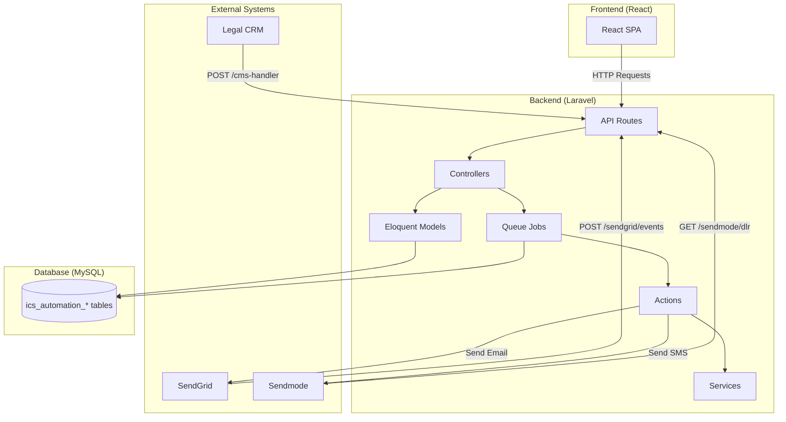
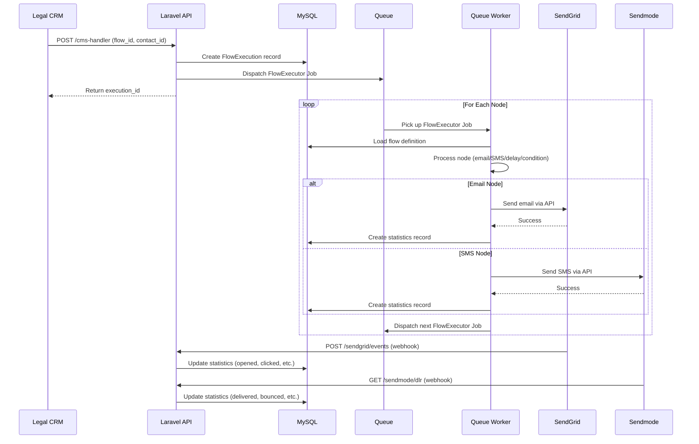
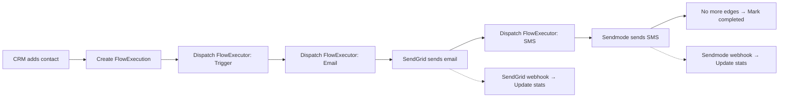

# Backend Overview

The ICS Automation backend is a **Laravel 12** API service that powers the automation engine for the ICS Legal platform. It is responsible for executing marketing automation workflows, sending emails and SMS messages, tracking engagement, and managing contacts — all asynchronously through a queued job system.

---

## What This System Does

ICS Automation is a **behavior-driven marketing automation platform**. It allows legal firms to create visual automation workflows (called "Flows") that automatically engage contacts through email and SMS based on real-time interactions.

### Core Capabilities

- **Visual Flow Builder** — Drag-and-drop automation workflows with Trigger, Email, SMS, Delay, and Condition nodes
- **Asynchronous Execution** — Every node runs as an independent queued job, enabling reliable, scalable processing
- **Email Delivery** — Sends transactional and marketing emails via SendGrid with full engagement tracking (opens, clicks, bounces)
- **SMS Delivery** — Sends SMS messages via Sendmode with delivery receipt tracking
- **Conditional Branching** — Dynamically routes contacts down different paths based on their behavior (e.g., "if they opened the email, send follow-up; otherwise, send reminder")
- **Contact Management** — Import contacts from the CMS, organize them into lists/segments, and track their automation history
- **Template System** — Email templates via Unlayer visual builder or raw HTML editor; SMS templates with credit calculation
- **Webhook Integration** — Receives real-time events from SendGrid and Sendmode to update engagement statistics
- **CRM Integration** — External CRM systems trigger automation flows via API calls

---

## Technology Stack

| Layer | Technology | Version | Purpose |
|-------|-----------|---------|---------|
| **Framework** | Laravel | 12.x | MVC architecture, routing, ORM, queue system |
| **Language** | PHP | 8.2+ | Server-side application logic |
| **Database** | MySQL | 8.0+ | Persistent data storage |
| **Queue Driver** | Database | — | Background job processing |
| **Email Service** | SendGrid | API v3 | Email delivery and event tracking |
| **SMS Service** | Sendmode | HTTP POST | SMS delivery and delivery receipts |
| **PDF Generation** | phpwkhtmltopdf | 2.5 | PDF rendering |
| **Screenshots** | Spatie Browsershot | 5.2 | Headless Chrome screenshots |
| **Auth** | Laravel Sanctum | — | API token authentication (installed, not actively used) |

---

## System Architecture at a Glance



---

## Key Concepts

### Flow

A **Flow** is a visual automation workflow defined as a JSON graph of nodes and edges. It represents the complete automation strategy — when to send messages, what to send, and how to react to user behavior.

```
Flow = Nodes (actions) + Edges (connections)
```

### Node

A **Node** is a single step in a flow. There are five node types:

| Node Type | Purpose |
|-----------|---------|
| **Trigger** | Entry point — defines how the flow starts |
| **Email** | Sends an email to the contact |
| **SMS** | Sends an SMS to the contact |
| **Delay** | Pauses execution for a specified time |
| **Condition** | Evaluates user behavior and branches the flow |

### Execution

An **Execution** is a single run of a flow for a specific contact. Each execution tracks its own progress, current node, and engagement statistics. One flow can have many executions (one per contact).

### Job

A **Job** is a queued unit of work. The `FlowExecutor` job processes exactly **one node** per execution. After processing a node, it dispatches a new job for the next node. This chain continues until the flow completes.

---

## How It Works (High Level)



---

## Project Structure

```
ics-automation-backend/
├── app/
│   ├── Actions/Flow/          # Business logic actions
│   │   ├── SendEmailAction.php
│   │   └── SendSmsAction.php
│   ├── Http/
│   │   ├── Controllers/       # API controllers
│   │   └── Middleware/        # HTTP middleware
│   ├── Jobs/                  # Queued jobs
│   │   └── FlowExecutor.php   # Core automation job
│   ├── Models/                # Eloquent models
│   ├── Providers/             # Service providers
│   └── Services/              # Business services
│       └── FlowConditionEvaluator.php
├── bootstrap/                 # Framework bootstrap files
├── config/                    # Configuration files
├── database/
│   ├── migrations/            # Database migrations
│   └── seeders/               # Database seeders
├── public/                    # Public web root
├── resources/                 # Views, language files
├── routes/
│   └── api.php                # API route definitions
├── storage/
│   ├── app/                   # Application storage
│   ├── framework/             # Framework cache/sessions
│   └── logs/                  # Application logs
├── tests/                     # Test files
├── .env.example               # Environment template
├── artisan                    # Laravel CLI
├── composer.json              # PHP dependencies
└── vite.config.js             # Asset bundler config
```

---

## API Endpoints Summary

The backend exposes a RESTful API with the following endpoint groups:

| Group | Base Path | Description |
|-------|-----------|-------------|
| Authentication | `/login` | User login |
| Flows | `/flows` | CRUD for automation flows |
| Email Templates | `/templates` | CRUD for email templates |
| SMS Templates | `/sms-templates` | CRUD for SMS templates |
| Clients | `/clients` | Contact management |
| Segments | `/segment-list` | Contact list/segment management |
| Import | `/import/cms-members` | Import contacts from CMS |
| CRM Trigger | `/cms-handler` | Trigger flow execution from CRM |
| Flow Execution | `/flow-execution/*` | Manage running executions |
| Webhooks | `/sendgrid/events`, `/sendmode/dlr` | Receive delivery events |
| Unsubscribe | `/unsubscribe`, `/subscribe` | Handle opt-out/opt-in |
| Credits | `/credits/*`, `/required-credit` | SMS credit management |

---

## Data Flow: End-to-End Example

Here is what happens when a contact goes through a simple 3-node flow (Trigger → Email → SMS):



1. **CRM triggers** the flow by calling `POST /cms-handler` with `flow_id` and `contact_id`
2. Backend creates a **FlowExecution** record with status `active` and a unique unsubscribe `hash`
3. Backend dispatches the first **FlowExecutor** job for the Trigger node
4. Trigger node finds the next edge → dispatches a new FlowExecutor for the Email node
5. Email node loads the template, replaces placeholders, sends via **SendGrid**, creates a statistics record
6. Email node finds the next edge → dispatches a new FlowExecutor for the SMS node
7. SMS node validates the mobile number, sends via **Sendmode**, creates a statistics record
8. SMS node finds no outgoing edges → marks the execution as `completed`
9. Later, **SendGrid webhook** delivers open/click events → updates the statistics record
10. Later, **Sendmode DLR webhook** delivers the SMS receipt → updates the statistics record

---

## Design Principles

| Principle | Implementation |
|-----------|---------------|
| **Asynchronous Processing** | Every node runs as an independent queued job — no blocking HTTP requests |
| **Fault Tolerance** | If a job fails, it can be retried independently; other nodes are unaffected |
| **Stateless Jobs** | Each job carries all the data it needs (flowId, contactId, currentNodeId, executionId) |
| **Event-Driven Tracking** | Webhooks from SendGrid and Sendmode update statistics in real-time |
| **Separation of Concerns** | Controllers handle requests, Actions handle business logic, Jobs handle execution |
| **Scalable by Design** | Queue workers can be scaled horizontally to handle increasing automation volume |

---

## What Is Not Covered

The following features exist in the codebase but are **not actively used** in the current system:

- **Document Bundle System** — Bundle, Document, Highlight, and Comment controllers are fully implemented but have no API routes defined
- **Laravel Sanctum Authentication** — Installed and configured but not applied to any API routes
- **StatController / SendmodeStatController** — Empty scaffold controllers
- **AuthController register/logout/me** — Methods exist but are not routed

---

## Next Steps

| Document | What You'll Learn |
|----------|------------------|
| [Installation & Setup](./installation-&-setup) | How to set up the backend locally |
| [Architecture](./architecture) | Detailed system architecture and component design |
| [Configuration](./configuration) | All environment variables and service configuration |
| [Database](./database) | Complete database schema and relationships |
| [API Reference](./api-documentation) | Full API endpoint documentation |
| [Automation Engine](./jobs-queues) | How the job queue system processes flows |
| [Flow Execution Algorithm](./flow-execution-algorithm) | Step-by-step execution logic |
