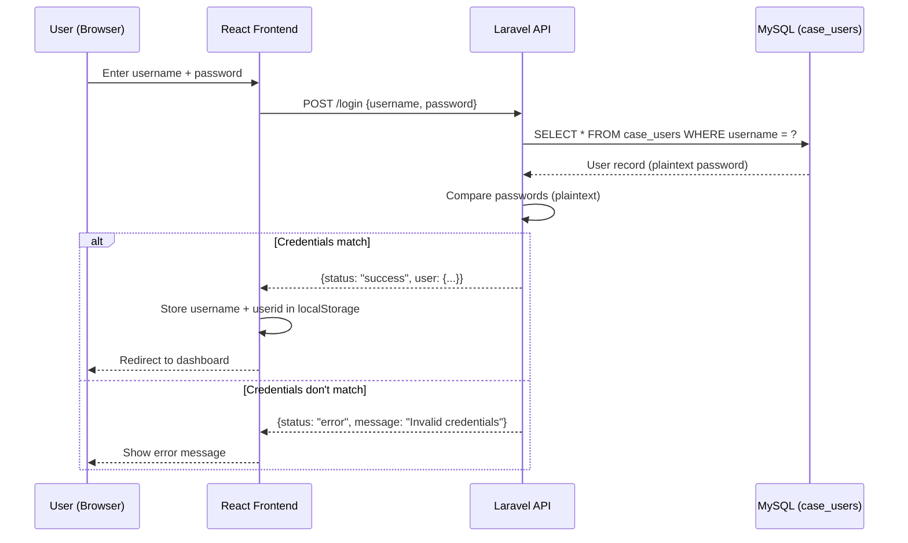

# Security

This document covers the security architecture of the ICS Automation backend. It describes the authentication model, data protection measures, known vulnerabilities, and recommended improvements.

---

## Security Overview

The ICS Automation backend handles sensitive data including contact information (names, emails, phone numbers), email content, and automation workflows. The security model is currently **minimal** — the system relies on network-level security (private hosting, CORS restrictions) rather than application-level authentication for API routes.

```mermaid
graph TD
    A[Threat Model] --> B[Authentication]
    A --> C[Data Protection]
    A --> D[Input Validation]
    A --> E[Webhook Security]
    A --> F[Known Vulnerabilities]

    B --> B1[No API auth middleware]
    B --> B2[Plaintext passwords]
    B --> B3[localStorage tokens]

    C --> C1[Env file protection]
    C --> C2[HTTPS recommended]
    C --> C3[No data encryption at rest]

    D --> D1[Laravel validation]
    D --> D2[Eloquent parameterized queries]
    D --> D3[JSON schema validation]

    E --> E1[No SendGrid signature verification]
    E --> E2[No Sendmode IP whitelisting]

    F --> F1[Plaintext passwords]
    F --> F2[Unprotected API routes]
    F --> F3[No rate limiting]
    F --> F4[No CSRF protection for API]
```



---

## Authentication

### Current Implementation

The authentication flow works as follows:



**Key Details:**

| Aspect | Current State |
|--------|--------------|
| **Authentication table** | `case_users` (external CMS table) |
| **Password storage** | Plaintext — **critical vulnerability** |
| **Token mechanism** | None — frontend stores `userid` in `localStorage` |
| **API route protection** | None — all API routes are publicly accessible |
| **Session management** | None — no server-side session |
| **Password hashing** | None — plaintext comparison |
| **Token expiration** | None — `localStorage` persists until cleared |

### Authentication Code

```php
// app/Http/Controllers/AuthController.php
public function login(Request $request)
{
    $validated = $request->validate([
        'username' => 'required|string',
        'password' => 'required',
    ]);

    $user = DB::table('case_users')
        ->where('username', $validated['username'])
        ->first();

    if ($user && $user->password === $validated['password']) {
        return response()->json([
            'status' => 'success',
            'user' => $user,
        ]);
    }

    return response()->json([
        'status' => 'error',
        'message' => 'Invalid credentials',
    ], 401);
}
```

### Frontend Route Protection

The frontend uses a `ProtectedRoute` component that checks for `userid` in `localStorage`:

```tsx
// src/routes/index.tsx
const ProtectedRoute = ({ children }: { children: React.ReactNode }) => {
    const userid = localStorage.getItem("userid");
    if (!userid) {
        return <Navigate to="/login" replace />;
    }
    return <>{children}</>;
};
```

**This is not security** — it is a UX convenience. Anyone with knowledge of the API endpoints can bypass the frontend and make direct API calls.

---

## Input Validation

### Laravel Validation

All API endpoints use Laravel's built-in validation to ensure data integrity:

| Endpoint | Validation Rules |
|----------|-----------------|
| `POST /login` | `username: required|string`, `password: required` |
| `POST /flows` | `name: required|string|max:255`, `flow: required|array` |
| `PUT /flows/{id}` | `name: sometimes|string|max:255`, `flow: sometimes|array` |
| `POST /templates` | `name: required|string|max:255`, `design: nullable|array`, `html: required|string` |
| `POST /sms-templates` | `name: required|string|max:255`, `content: required|string` |
| `POST /clients` | `client_list_id: required|exists:ics_automation_client_lists`, `member_id: required|integer` |
| `POST /segment-list` | `name: required|string|max:255`, `description: required|string|min:5|max:1000`, `type: required|in:list,segment` |
| `POST /cms-handler` | `flow_id: required|integer`, `contact_id: required|integer`, `start_at: nullable|date_format:d-m-Y` |
| `POST /flow-execution/cancel` | `contact_id: required|integer|exists:ics_automation_clients`, `flow_id: nullable|integer|exists:ics_automation_flows` |

### SQL Injection Prevention

Laravel's Eloquent ORM uses **parameterized queries** by default, which prevents SQL injection:

```php
// Safe — Eloquent uses parameterized queries
$flow = Flow::find($id);

// Safe — query builder uses parameterized queries
$clients = Client::where('client_list_id', $listId)->get();

// Safe — raw query with bindings
$results = DB::select('SELECT * FROM members WHERE id = ?', [$memberId]);
```

**Warning:** If raw SQL queries are used without bindings, SQL injection is possible:

```php
// UNSAFE — never do this
$results = DB::select("SELECT * FROM members WHERE id = $memberId");
```

### XSS Prevention

Email templates store HTML content in the database. When this HTML is sent via SendGrid, it is rendered in the recipient's email client. The application does not sanitize HTML content, which means:

- Template creators can include any HTML (including `<script>` tags)
- SendGrid's email rendering engine may strip or sanitize some elements
- This is a **stored XSS** risk if template creation is accessible to untrusted users

---

## Data Protection

### Environment Variables

Sensitive configuration is stored in the `.env` file, which is excluded from version control:

```gitignore
# .gitignore
.env
.env.backup
.env.production
```

**Sensitive variables:**

| Variable | Risk if Exposed |
|----------|----------------|
| `APP_KEY` | Cookie/session decryption, password reset token forgery |
| `DB_PASSWORD` | Direct database access |
| `SENDGRID_APIKEY` | Unauthorized email sending, account takeover |
| `SENDMODE_USERNAME` | SMS account access |
| `SENDMODE_PASSWORD` | SMS account access |
| `SENDMODE_API_KEY` | Credit balance access, unauthorized SMS sending |

### Database Access

The database is shared with the Legal CMS. The `ics_automation_` prefix isolates automation tables from CMS tables, but:

- Any user with database access can read all tables
- There is no row-level security
- There is no encryption at rest

### HTTPS

All production traffic should use HTTPS. Configure:

```env
APP_URL=https://automation.icslegal.com
```

And set up SSL termination at the web server (Nginx/Apache) or load balancer level.

### Unsubscribe Hash Security

Each `FlowExecution` gets a unique 40-character hash:

```php
$execution->hash = Str::random(40);
```

This hash is used in unsubscribe URLs and is:

- **Unpredictable** — 40 random characters (alphanumeric)
- **Unique** — enforced by a UNIQUE constraint in the database
- **Single-purpose** — only used for unsubscribe/subscribe links

The hash provides **security through obscurity** — knowing the hash is equivalent to having access to the execution. However, if the hash is leaked (e.g., in server logs, referrer headers), anyone with the hash can unsubscribe or re-subscribe the contact.

---

## CORS Configuration

CORS restricts which domains can make cross-origin requests to the API:

```php
// config/cors.php
return [
    'allowed_origins' => [
        'http://localhost:3000',
        'http://localhost:3001',
        'http://localhost:5173',
        'https://automation.icslegal.com',
        'https://staginglegalcms.techics.com',
        'https://cms.icslegal.com',
    ],
    'supports_credentials' => true,
];
```

**What CORS does:**

- Prevents browsers from allowing JavaScript on unauthorized domains to make API requests
- Does **not** prevent server-to-server requests (e.g., from Postman, curl, or other backends)
- Does **not** prevent direct API access (only browser-based cross-origin requests)

---

## Webhook Security

### SendGrid Webhook

The SendGrid webhook (`POST /sendgrid/events`) receives email event notifications. Currently, it does **not** verify the request signature.

**Recommended: Enable Signed Webhooks**

1. In SendGrid dashboard, enable **Signed Event Webhook**
2. Configure the public key in the application
3. Verify the `X-Twilio-Email-Event-Webhook-Signature` header on each request

```php
// Example signature verification
public function update(Request $request)
{
    $signature = $request->header('X-Twilio-Email-Event-Webhook-Signature');
    $timestamp = $request->header('X-Twilio-Email-Event-Webhook-Timestamp');
    $payload = $request->getContent();

    $publicKey = env('SENDGRID_WEBHOOK_PUBLIC_KEY');
    $verified = $this->verifySignature($publicKey, $signature, $timestamp, $payload);

    if (!$verified) {
        return response()->json(['error' => 'Invalid signature'], 401);
    }

    // Process events...
}
```

### Sendmode DLR Webhook

The Sendmode DLR webhook (`GET /sendmode/dlr`) receives SMS delivery receipts. Currently, it does **not** verify the request source.

**Recommended: IP Whitelisting**

Configure the web server to only accept requests from Sendmode's IP addresses:

```nginx
# Nginx configuration
location /api/sendmode/dlr {
    allow 1.2.3.4;  # Sendmode IP
    allow 5.6.7.8;  # Sendmode IP
    deny all;

    # ... proxy to Laravel
}
```

---

## Known Vulnerabilities

### 1. Plaintext Passwords (Critical)

**Severity:** Critical
**Impact:** Any database breach exposes all user passwords
**Location:** `case_users` table, `AuthController@login`

The `case_users` table stores passwords in plaintext. If an attacker gains read access to the database, they immediately have all user credentials.

**Recommended Fix:**

```php
// Migration to hash existing passwords
$users = DB::table('case_users')->get();
foreach ($users as $user) {
    DB::table('case_users')
        ->where('id', $user->id)
        ->update(['password' => Hash::make($user->password)]);
}

// Update login to use hashed passwords
if ($user && Hash::check($validated['password'], $user->password)) {
    // authenticated
}
```

### 2. Unprotected API Routes (High)

**Severity:** High
**Impact:** Anyone can read, create, update, and delete all data via the API
**Location:** `routes/api.php`

All API routes are publicly accessible. An attacker can:

- Read all flows, templates, and contacts
- Create, modify, or delete flows
- Import or delete contacts
- Cancel executions
- Trigger flows for any contact

**Recommended Fix:**

```php
// routes/api.php
Route::middleware('auth:sanctum')->group(function () {
    // Protected routes
    Route::apiResource('flows', FlowController::class);
    Route::apiResource('templates', TemplateController::class);
    Route::apiResource('sms-templates', SmsTemplateController::class);
    Route::apiResource('clients', ClientController::class);
    Route::apiResource('segment-list', ClientListController::class);
    Route::post('/flow-execution/cancel', [FlowExecutionController::class, 'cancel']);
    Route::get('/flow-execution', [FlowExecutionController::class, 'index']);
    // ... more protected routes
});

// Public routes (webhooks, unsubscribe, login)
Route::post('/login', [AuthController::class, 'login']);
Route::post('/sendgrid/events', [StatisticsController::class, 'update']);
Route::get('/sendmode/dlr', [StatisticsController::class, 'sendModeDeliveryCallback']);
Route::get('/unsubscribe', [UnsubscribeController::class, 'unsubscribe']);
Route::get('/subscribe', [UnsubscribeController::class, 'subscribe']);
Route::post('/cms-handler', [CmsController::class, 'import']);
```

### 3. No Rate Limiting (Medium)

**Severity:** Medium
**Impact:** API can be abused with unlimited requests
**Location:** `routes/api.php`

**Recommended Fix:**

```php
// Rate limit all API routes
Route::middleware('throttle:60,1')->group(function () {
    // All API routes
});

// Stricter rate limit for login
Route::post('/login', [AuthController::class, 'login'])
    ->middleware('throttle:10,1');
```

### 4. No CSRF Protection for API (Low)

**Severity:** Low
**Impact:** CSRF attacks are possible for browser-based requests
**Location:** Laravel default configuration

Laravel's CSRF protection is not applied to API routes (which is standard for stateless APIs). However, if the API is accessed from a browser, CSRF attacks are possible.

**Recommended Fix:**

- Use Sanctum's CSRF protection for SPA authentication
- Or ensure all API requests use custom headers (not cookies) for authentication

---

## Security Checklist

### Production Deployment

- [ ] `APP_DEBUG=false` — Disable debug mode
- [ ] `APP_ENV=production` — Set production environment
- [ ] HTTPS enabled — All traffic encrypted
- [ ] `.env` not accessible from web — Verify web root is `public/`
- [ ] Database credentials are strong — Use complex passwords
- [ ] API keys are rotated regularly — Set a rotation schedule
- [ ] CORS origins are restricted — Only production domains listed
- [ ] Error pages are generic — No stack traces in production
- [ ] File permissions are correct — `storage/` writable, `.env` not readable by web

### Ongoing Security

- [ ] Monitor failed login attempts — Set up alerting
- [ ] Review access logs regularly — Check for suspicious activity
- [ ] Rotate API keys periodically — Every 90 days recommended
- [ ] Update dependencies regularly — `composer update`
- [ ] Backup database regularly — Daily automated backups
- [ ] Test webhook signatures — Verify SendGrid/Sendmode webhooks
- [ ] Audit user access — Review who has access to the system

---

## Next Steps

| Document | What You'll Learn |
|----------|------------------|
| [Maintenance & Deployment](./maintenance-&-deployment) | Deployment procedures and maintenance tasks |
| [Troubleshooting](./troubleshooting) | Common issues and their solutions |
| [Logging & Monitoring](./logging-&-monitoring) | Observability and debugging |
