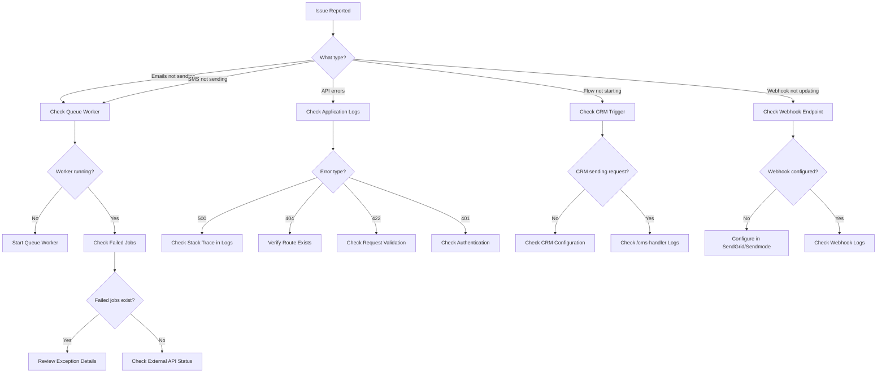

# Troubleshooting

This document covers common issues, error scenarios, debugging techniques, and frequently asked questions for the ICS Automation backend.

---

## Quick Diagnostic Flowchart

When something goes wrong, follow this diagnostic flow:



---

## Queue Worker Issues

### Problem: Emails and SMS Are Not Being Sent

**Symptoms:**
- Flows are triggered but no emails or SMS messages are delivered
- Contacts are added to lists but nothing happens
- The `ics_automation_jobs` table has pending jobs

**Diagnosis:**

```bash
# Check if queue worker is running
ps aux | grep "queue:work"

# Check pending jobs
SELECT COUNT(*) FROM ics_automation_jobs;

# Check failed jobs
php artisan queue:failed
```

**Solutions:**

1. **Start the queue worker:**

```bash
php artisan queue:work --tries=3
```

2. **Restart the queue worker** (if it was running but stuck):

```bash
php artisan queue:restart
```

3. **If using Supervisor:**

```bash
sudo supervisorctl status ics-automation-worker:*
sudo supervisorctl restart ics-automation-worker:*
```

4. **Check the worker log for errors:**

```bash
tail -100 /var/www/ics-automation/storage/logs/worker.log
```

---

### Problem: Jobs Are Failing Repeatedly

**Symptoms:**
- Jobs move to the `ics_automation_failed_jobs` table
- Worker log shows repeated exceptions

**Diagnosis:**

```bash
# View failed jobs
php artisan queue:failed

# View failed job details
SELECT id, exception, failed_at FROM ics_automation_failed_jobs ORDER BY failed_at DESC LIMIT 10;
```

**Common Causes and Solutions:**

| Exception | Cause | Solution |
|-----------|-------|----------|
| `ConnectionException: Connection refused` | Cannot connect to SendGrid/Sendmode | Check network connectivity and API endpoints |
| `HttpException: 401 Unauthorized` | Invalid API key | Verify `SENDGRID_APIKEY` in `.env` |
| `ModelNotFoundException` | Flow or execution deleted | Check if the referenced record still exists |
| `JsonException` | Malformed flow JSON | Re-save the flow in the frontend |
| `PDOException: Deadlock found` | Database deadlock | Retry the job; check for long-running transactions |
| `ErrorException: Undefined array key` | Missing node data | Verify the flow JSON has all required fields |

**Retry Failed Jobs:**

```bash
# Retry all
php artisan queue:retry all

# Retry specific jobs
php artisan queue:retry 1 2 3

# Delete all failed jobs
php artisan queue:flush
```

---

### Problem: Queue Worker Consumes Too Much Memory

**Symptoms:**
- Worker process grows to several hundred MB
- Server runs out of memory

**Solutions:**

1. **Set memory limit for the worker:**

```bash
php artisan queue:work --memory=512
```

2. **Set max execution time** (restarts worker periodically):

```bash
php artisan queue:work --max-time=3600
```

3. **In Supervisor configuration:**

```ini
command=php artisan queue:work --sleep=3 --tries=3 --max-time=3600 --memory=512
```

---

## Email Sending Issues

### Problem: Emails Are Not Being Sent

**Symptoms:**
- Flow execution reaches the email node
- No email is received by the contact
- Statistics record shows `send_at = NULL`

**Diagnosis:**

```bash
# Check application logs
tail -100 storage/logs/laravel.log | grep -i "email"

# Check SendGrid API connectivity
curl -i https://api.sendgrid.com/v3/mail/send \
  -H "Authorization: Bearer $SENDGRID_APIKEY" \
  -H "Content-Type: application/json" \
  -d '{"personalizations":[{"to":[{"email":"test@example.com"}]}],"from":{"email":"test@example.com"},"subject":"Test","content":[{"type":"text/plain","value":"Test"}]}'
```

**Common Causes:**

| Cause | How to Check | Solution |
|-------|-------------|----------|
| Queue worker not running | `ps aux \| grep queue:work` | Start the queue worker |
| Invalid SendGrid API key | Check logs for `401 Unauthorized` | Update `SENDGRID_APIKEY` in `.env` |
| SendGrid account suspended | Log in to SendGrid dashboard | Contact SendGrid support |
| Email template not found | Check logs for `Template not found` | Verify template exists in database |
| Contact email is invalid | Check `members` table for contact | Verify contact data |
| SendGrid API endpoint down | `curl -I https://api.sendgrid.com` | Wait for SendGrid to recover |

---

### Problem: Email Tracking (Opens/Clicks) Not Working

**Symptoms:**
- Emails are sent but `opened_at` and `clicked_at` remain NULL in the statistics table
- SendGrid shows events but the application does not update

**Diagnosis:**

```sql
-- Check if SendGrid events are being received
SELECT event_type, COUNT(*) FROM ics_automation_stats
ORDER BY event_time DESC LIMIT 20;

-- Check if statistics records exist
SELECT * FROM ics_automation_statistics WHERE execution_id = 45;
```

**Common Causes:**

| Cause | How to Check | Solution |
|-------|-------------|----------|
| SendGrid webhook not configured | Check SendGrid dashboard → Settings → Mail Settings → Event Notification | Configure webhook URL: `https://automation.icslegal.com/api/sendgrid/events` |
| Webhook endpoint not accessible | `curl -X POST https://automation.icslegal.com/api/sendgrid/events` | Check firewall and Nginx configuration |
| Missing custom_args in email | Check SendGrid email payload | Verify `SendEmailAction` includes `smart_automation_exe_id` and `node_id` |
| Email client blocks tracking pixels | Check SendGrid dashboard for open events | This is a client-side limitation, not a system issue |

---

### Problem: Unsubscribe Links Not Working

**Symptoms:**
- Contact clicks unsubscribe link but is not unsubscribed
- Error page is shown

**Diagnosis:**

```sql
-- Check if the hash exists
SELECT id, status, unsubscribed_at FROM ics_automation_flow_executions
WHERE hash = 'the_hash_from_the_url';
```

**Common Causes:**

| Cause | How to Check | Solution |
|-------|-------------|----------|
| `{UNSUBSCRIBE_URL}` not in template | Check template HTML | Add `{UNSUBSCRIBE_URL}` placeholder to the template |
| Hash is malformed | Check the URL in the email | Verify the URL format: `https://.../unsubscribe?hash=xxx` |
| `APP_URL` is incorrect | Check `.env` file | Set correct `APP_URL` |
| `FRONTEND_URL` is incorrect | Check `.env` file | Set correct `FRONTEND_URL` for redirect |

---

## SMS Sending Issues

### Problem: SMS Messages Are Not Being Sent

**Symptoms:**
- Flow execution reaches the SMS node
- No SMS is received by the contact
- Statistics record shows `send_at = NULL`

**Diagnosis:**

```bash
# Check application logs
tail -100 storage/logs/laravel.log | grep -i "sms"

# Check Sendmode API connectivity
curl -X POST https://api.sendmode.com/httppost.aspx \
  -d "Type=sendparam&username=$SENDMODE_USERNAME&password=$SENDMODE_PASSWORD&sender=ICS+Legal&number=447123456789&message=Test"
```

**Common Causes:**

| Cause | How to Check | Solution |
|-------|-------------|----------|
| Queue worker not running | `ps aux \| grep queue:work` | Start the queue worker |
| Invalid Sendmode credentials | Check logs for authentication errors | Update `SENDMODE_USERNAME` and `SENDMODE_PASSWORD` |
| Insufficient credits | `GET /api/credits/sendmode` | Top up Sendmode credits |
| Invalid mobile number | Check `members.mobile` field | Ensure number is valid (10-15 digits) |
| Sendmode API down | Check Sendmode status page | Wait for Sendmode to recover |

---

### Problem: International SMS Not Working

**Symptoms:**
- UK SMS sends successfully but international numbers fail

**Diagnosis:**

```sql
-- Check mobile numbers in the members table
SELECT id, mobile FROM members WHERE id = 121211;
```

**Solution:**

The system auto-converts UK `07xxx` to `44xxx` format. For international numbers:

- Ensure the number includes the country code (e.g., `+1` for US, `+91` for India)
- The number must be 10–15 digits after removing non-numeric characters
- International numbers cost 2.5x the base credit

---

### Problem: SMS Credit Calculation Is Incorrect

**Symptoms:**
- The required credit count does not match expectations

**Solution:**

Credit calculation follows these rules:

| Message Length | Segments | Credits (UK) | Credits (International) |
|---------------|----------|-------------|------------------------|
| 1–160 | 1 | 1 | 2.5 |
| 161–299 | 2 | 2 | 5 |
| 300–440 | 3 | 3 | 7.5 |
| 441–593 | 4 | 4 | 10 |
| 594–746 | 5 | 5 | 12.5 |

The formula for messages longer than 440 characters:

```
credits = 1 + ceil((chars - 160) / 153)
```

---

## Flow Execution Issues

### Problem: Flow Does Not Start

**Symptoms:**
- CRM calls `/cms-handler` but the flow does not execute
- No `FlowExecution` record is created

**Diagnosis:**

```bash
# Check if the CRM request is reaching the backend
tail -100 storage/logs/laravel.log | grep -i "cms-handler"

# Check if the flow exists
SELECT id, name FROM ics_automation_flows WHERE id = 2;

# Check if the contact exists in the members table
SELECT id, fname, lname, email FROM members WHERE id = 121211;
```

**Common Causes:**

| Cause | How to Check | Solution |
|-------|-------------|----------|
| Flow ID does not exist | Query `ics_automation_flows` | Verify the flow ID in the CRM request |
| Contact ID does not exist | Query `members` table | Verify the contact ID in the CRM request |
| Queue worker not running | `ps aux \| grep queue:work` | Start the queue worker |
| Flow JSON is invalid | Check `flow` column in `ics_automation_flows` | Re-save the flow in the frontend |
| Missing trigger node | Check flow JSON for `triggerNode` | Ensure flow has a trigger node |

---

### Problem: Flow Is Stuck on a Node

**Symptoms:**
- Execution status is `active` but `current_node_id` does not change
- No progress for an extended period

**Diagnosis:**

```sql
-- Check current execution status
SELECT id, status, current_node_id, started_at, updated_at
FROM ics_automation_flow_executions WHERE id = 45;

-- Check the flow JSON for the current node
SELECT JSON_EXTRACT(flow, '$.nodes[*].id') AS node_ids
FROM ics_automation_flows WHERE id = 2;

-- Check for outgoing edges from the current node
SELECT JSON_EXTRACT(flow, '$.edges[*]') AS edges
FROM ics_automation_flows WHERE id = 2;
```

**Common Causes:**

| Cause | How to Check | Solution |
|-------|-------------|----------|
| No outgoing edge from current node | Check flow JSON edges | Add an edge from the current node in the flow builder |
| Condition always evaluates to false | Check `ics_automation_statistics` for the activity | Verify the condition criteria matches actual user behavior |
| Delay node with very long delay | Check delay node configuration | Reduce delay time or wait for the delay to expire |
| Queue worker not processing | `ps aux \| grep queue:work` | Restart the queue worker |

---

### Problem: Flow Completes Prematurely

**Symptoms:**
- Execution status is `completed` but not all nodes were processed
- Some nodes were skipped

**Diagnosis:**

```sql
-- Check statistics for the execution
SELECT node_id, channel, send_at FROM ics_automation_statistics
WHERE execution_id = 45 ORDER BY created_at ASC;
```

**Common Causes:**

| Cause | How to Check | Solution |
|-------|-------------|----------|
| Nodes not connected in flow builder | Check flow JSON edges | Ensure all nodes are connected with edges |
| Condition node routed to a short path | Check condition evaluation | This is expected behavior — the condition determined the path |
| Contact unsubscribed mid-flow | Check `unsubscribed_at` | This is expected — the contact opted out |

---

## Database Issues

### Problem: Database Connection Error

**Error:** `SQLSTATE[HY000] [2002] Connection refused`

**Diagnosis:**

```bash
# Check if MySQL is running
sudo systemctl status mysql

# Test connection
mysql -u root -p -h 127.0.0.1 cms
```

**Solutions:**

1. **Start MySQL:**

```bash
sudo systemctl start mysql
```

2. **Verify credentials in `.env`:**

```env
DB_CONNECTION=mysql
DB_HOST=127.0.0.1
DB_PORT=3306
DB_DATABASE=cms
DB_USERNAME=root
DB_PASSWORD=
```

3. **Check MySQL user permissions:**

```sql
SHOW GRANTS FOR 'root'@'localhost';
```

---

### Problem: Migration Errors

**Error:** `Migration table not found`

**Solution:**

```bash
php artisan migrate:install
php artisan migrate --force
```

**Error:** `Table already exists`

**Solution:**

```bash
# Check migration status
php artisan migrate:status

# If tables exist but migrations are not recorded, fake them
php artisan migrate:install
php artisan migrate --pretend

# Or reset and re-run
php artisan migrate:reset --force
php artisan migrate --force
```

**Error:** `Foreign key constraint is incorrectly formed`

**Solution:**

```sql
-- Check if the referenced table exists
SHOW TABLES LIKE 'ics_automation_%';

-- Check if the referenced column exists
DESCRIBE ics_automation_flows;
```

---

## API Issues

### Problem: 404 Not Found

**Error:** `{"message": "Not Found"}`

**Diagnosis:**

```bash
# List all registered routes
php artisan route:list

# Check if the route exists
php artisan route:list | grep "flows"
```

**Solutions:**

1. Verify the URL is correct (case-sensitive)
2. Check if the route is defined in `routes/api.php`
3. Clear route cache: `php artisan route:clear`

---

### Problem: 422 Validation Error

**Error:**

```json
{
  "message": "The name field is required.",
  "errors": {
    "name": ["The name field is required."]
  }
}
```

**Solution:**

Check the request body against the validation rules for the endpoint. See the [API Reference](./api-documentation) for validation rules per endpoint.

---

### Problem: 500 Internal Server Error

**Error:** `{"message": "Server Error"}`

**Diagnosis:**

```bash
# Check the application log
tail -100 storage/logs/laravel.log

# Enable debug mode temporarily (development only)
# Set APP_DEBUG=true in .env
```

**Common Causes:**

| Cause | Solution |
|-------|----------|
| Missing database column | Run `php artisan migrate` |
| Undefined variable in code | Check the stack trace in logs |
| Class not found | Run `composer dump-autoload` |
| Configuration error | Run `php artisan config:clear` |

---

## Webhook Issues

### Problem: SendGrid Webhook Not Receiving Events

**Diagnosis:**

```bash
# Test the webhook endpoint
curl -X POST https://automation.icslegal.com/api/sendgrid/events \
  -H "Content-Type: application/json" \
  -d '[{"email":"test@example.com","event":"delivered","timestamp":1705312200,"sg_message_id":"test","custom_args":{"smart_automation_exe_id":"45","node_id":"email-node-2"}}]'

# Check application logs
tail -100 storage/logs/laravel.log | grep -i "sendgrid"
```

**Checklist:**

- [ ] Webhook URL is configured in SendGrid dashboard: `https://automation.icslegal.com/api/sendgrid/events`
- [ ] All event types are selected (processed, delivered, open, click, bounce, dropped, unsubscribe)
- [ ] The endpoint is accessible from the internet (not blocked by firewall)
- [ ] Nginx allows POST requests to the endpoint
- [ ] Application logs show incoming webhook requests

---

### Problem: Sendmode DLR Webhook Not Receiving Events

**Diagnosis:**

```bash
# Test the webhook endpoint
curl "https://automation.icslegal.com/api/sendmode/dlr?EventID=123&Phonenumber=447123456789&Status=DELIVRD&CustomerID=45-sms-node-6"

# Check application logs
tail -100 storage/logs/laravel.log | grep -i "sendmode"
```

**Checklist:**

- [ ] Callback URL is configured in Sendmode dashboard: `https://automation.icslegal.com/api/sendmode/dlr`
- [ ] The endpoint is accessible from the internet
- [ ] Application logs show incoming webhook requests

---

## Performance Issues

### Problem: Slow API Responses

**Diagnosis:**

```bash
# Enable query logging
# Add to AppServiceProvider::boot():
# DB::listen(function ($query) { Log::info($query->sql, $query->bindings); });

# Check slow queries in MySQL
SHOW PROCESSLIST;
```

**Solutions:**

1. **Add database indexes:**

```sql
CREATE INDEX idx_flow_executions_contact_flow_status
ON ics_automation_flow_executions(contact_id, flow_id, status);

CREATE INDEX idx_statistics_execution_channel
ON ics_automation_statistics(execution_id, channel);
```

2. **Clean old data:**

```sql
DELETE FROM ics_automation_stats WHERE event_time < DATE_SUB(NOW(), INTERVAL 6 MONTH);
DELETE FROM ics_automation_sendmode_stats WHERE received_at < DATE_SUB(NOW(), INTERVAL 6 MONTH);
```

3. **Optimize tables:**

```sql
OPTIMIZE TABLE ics_automation_flow_executions;
OPTIMIZE TABLE ics_automation_statistics;
```

---

### Problem: High Database Load

**Diagnosis:**

```sql
-- Check active connections
SHOW STATUS LIKE 'Threads_connected';

-- Check slow queries
SHOW VARIABLES LIKE 'slow_query_log';

-- Check table sizes
SELECT
    table_name,
    ROUND(((data_length + index_length) / 1024 / 1024), 2) AS size_mb
FROM information_schema.tables
WHERE table_schema = 'cms'
    AND table_name LIKE 'ics_automation_%'
ORDER BY size_mb DESC;
```

**Solutions:**

1. Scale queue workers horizontally
2. Add database read replicas
3. Archive old data
4. Optimize frequently-run queries

---

## Frequently Asked Questions

### Q: How do I cancel a running flow for a contact?

**A:** Use the cancel endpoint:

```bash
curl -X POST https://automation.icslegal.com/api/flow-execution/cancel \
  -H "Content-Type: application/json" \
  -d '{"contact_id": 121211, "flow_id": 2}'
```

To cancel all flows for a contact, omit `flow_id`:

```bash
curl -X POST https://automation.icslegal.com/api/flow-execution/cancel \
  -H "Content-Type: application/json" \
  -d '{"contact_id": 121211}'
```

---

### Q: How do I check which flows are running for a contact?

**A:** Use the active flows endpoint:

```bash
curl https://automation.icslegal.com/api/flow-execution/active/121211
```

---

### Q: How do I check remaining SMS credits?

**A:** Use the credits endpoint:

```bash
curl https://automation.icslegal.com/api/credits/sendmode
```

---

### Q: How do I check how many credits a flow needs?

**A:** Use the required credit endpoint:

```bash
curl https://automation.icslegal.com/api/required-credit
curl https://automation.icslegal.com/api/required-credit/2
```

---

### Q: Can I schedule a flow to start at a specific date?

**A:** Yes, include `start_at` in the CMS handler request:

```json
{
  "flow_id": 2,
  "contact_id": 121211,
  "start_at": "31-01-2026"
}
```

The `start_at` format is `DD-MM-YYYY`. The first `FlowExecutor` job will be dispatched with a delay until the specified date.

---

### Q: How do I re-subscribe an unsubscribed contact?

**A:** The contact can click the re-subscribe link in a previous email, or you can manually update the execution:

```sql
UPDATE ics_automation_flow_executions
SET unsubscribed_at = NULL, status = 'active'
WHERE hash = 'the_hash_value';
```

---

### Q: Why are some nodes not connected in my flow?

**A:** Nodes must be connected manually by clicking the handlers in the flow builder. Currently, there is no drag-and-drop auto-connection feature. Every node (except the last one) must have at least one outgoing edge.

---

### Q: How do I test the flow execution without sending real emails/SMS?

**A:** Currently, there is no sandbox mode. To test safely:

1. Use test email addresses you control
2. Use a test mobile number
3. Check the `ics_automation_statistics` table to verify execution progress
4. Check the application logs for send results

---

### Q: How do I delete a flow and all its data?

**A:** Deleting a flow via `DELETE /flows/{id}` will cascade-delete all executions and statistics. However, it will **not** delete:

- The associated client list
- Raw SendGrid events in `ics_automation_stats`
- Sendmode stats in `ics_automation_sendmode_stats`

To fully clean up:

```sql
-- Delete the flow (cascades to executions and statistics)
DELETE FROM ics_automation_flows WHERE id = 2;

-- Delete the associated client list
DELETE FROM ics_automation_client_lists WHERE id = 5;

-- Delete raw events
DELETE FROM ics_automation_stats WHERE flow_id = 2;
DELETE FROM ics_automation_sendmode_stats WHERE flow_id = 2;
```

---

### Q: Can I run multiple flows for the same contact simultaneously?

**A:** Yes. A contact can have multiple active executions across different flows. Each execution is tracked independently in the `ics_automation_flow_executions` table.

---

### Q: What happens if a contact is in multiple lists that trigger different flows?

**A:** Each list-to-flow connection triggers a separate execution. If a contact is added to two lists that are connected to two different flows, two separate executions will start.

---

### Q: How do I increase the number of queue workers?

**A:** Edit the Supervisor configuration:

```ini
numprocs=4  ; Change from 2 to 4
```

Then restart:

```bash
sudo supervisorctl reread
sudo supervisorctl update
sudo supervisorctl restart ics-automation-worker:*
```

---

### Q: How do I clear all pending jobs from the queue?

**A:** Use the queue clear command:

```bash
php artisan queue:clear
```

Or manually delete from the database:

```sql
DELETE FROM ics_automation_jobs;
```

---

### Q: How do I check the health of the system?

**A:** Run these checks:

```bash
# Queue depth
SELECT COUNT(*) FROM ics_automation_jobs;

# Failed jobs
SELECT COUNT(*) FROM ics_automation_failed_jobs;

# Active executions
SELECT COUNT(*) FROM ics_automation_flow_executions WHERE status = 'active';

# Worker status
sudo supervisorctl status ics-automation-worker:*

# Disk space
df -h

# Memory usage
free -m
```
