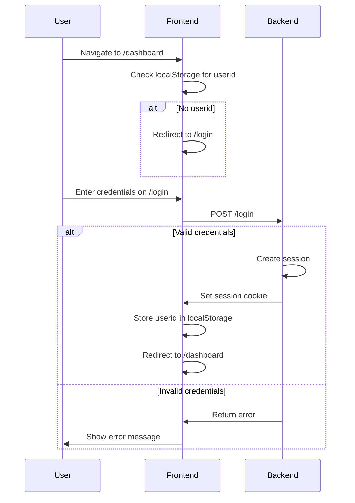

# Authentication

The application uses cookie-based session authentication with a client-side route guard.

## Authentication Flow



## ProtectedRoute

**Location:** `src/routes/ProtectedRoute.tsx`

The route guard wraps the dashboard route tree and checks for an active session:

```tsx
const ProtectedRoute = ({ children }: { children: JSX.Element }) => {
  const loggedIn = !!localStorage.getItem("userid");
  return loggedIn ? children : <Navigate to="/login" replace />;
};
```

### Usage

```tsx
{
  path: "/dashboard",
  element: <ProtectedRoute><Dashboard /></ProtectedRoute>,
  children: [...DashboardRoutes],
}
```

## Login Page

**Location:** `src/pages/website/login/`

| File | Purpose |
|------|---------|
| `LoginPage.tsx` | Login form component |
| `components/SocialButton.tsx` | Social login button |
| `hooks/index.tsx` | Login form hooks |
| `api/index.ts` | Login API calls |
| `types/index.ts` | Login type definitions |

### Session Storage

Upon successful login, the backend sets a session cookie and the frontend stores the user ID in `localStorage`:

```typescript
localStorage.setItem("userid", userId);
```

This value is used by `ProtectedRoute` to determine access.

## Logout

Logout is handled by the backend, which destroys the session cookie. The frontend should clear `localStorage` and redirect to `/login`.

## Security Considerations

- **Cookie-based auth** — Sessions are managed server-side with `withCredentials: true` on the Axios instance
- **CSRF protection** — Should be handled by the Laravel backend
- **No token storage** — The frontend does not store JWT tokens; only a user ID reference in localStorage
- **Route protection** — Client-side only; server-side route protection should also be enforced on the backend
