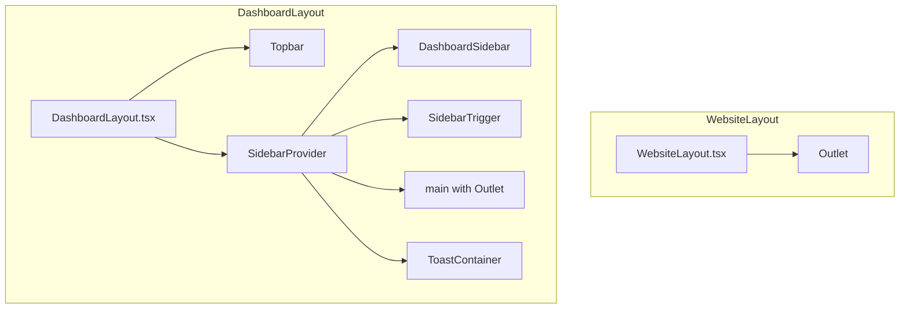

# Layout System

The application uses two top-level layout components that wrap route content. Layouts are conditionally rendered based on route `handle` configuration.

## Layout Architecture



## DashboardLayout

**Location:** `src/layout/DashboardLayout.tsx`

The dashboard layout provides the authenticated admin interface with a fixed topbar, collapsible sidebar, and scrollable content area.

### Structure

```tsx
<DashboardLayout>
  <Topbar>                          {/* Fixed header bar */}
    <DashboardTopbar />
  </Topbar>
  
  <div className="pt-14">           {/* Offset for fixed topbar */}
    <SidebarProvider>               {/* Collapsible sidebar context */}
      <DashboardSidebar />          {/* Navigation sidebar */}
      
      <main>                        {/* Scrollable content area */}
        <Outlet />                  {/* Route component renders here */}
      </main>
      
      <ToastContainer />            {/* Global toast notifications */}
    </SidebarProvider>
  </div>
</DashboardLayout>
```

### Layout Toggle

The layout checks the current route's `handle` property to determine whether to render the full layout or just the route component:

```tsx
const matches = useMatches();
const current = matches[matches.length - 1] as { handle?: RouteHandle };
const showLayout = current?.handle?.layout !== false;

if (!showLayout) return <Outlet />;  // Render without layout
```

This pattern allows specific routes (like the flow builder) to render full-screen without the sidebar and topbar.

### Components

| Component | Location | Purpose |
|-----------|----------|---------|
| `Topbar` | `src/components/dashboard/Topbar.tsx` | Top bar wrapper |
| `DashboardTopbar` | `src/components/dashboard/topbar/DashboardTopbar.tsx` | Dashboard-specific top bar content |
| `DashboardSidebar` | `src/components/dashboard/DashboardSidebar.tsx` | Navigation sidebar with menu items |
| `SidebarProvider` | `src/components/ui/sidebar.tsx` | shadcn sidebar context provider |
| `SidebarTrigger` | `src/components/ui/sidebar.tsx` | Sidebar toggle button |
| `ToastContainer` | `react-toastify` | Global notification container |

## WebsiteLayout

**Location:** `src/layout/WebsiteLayout.tsx`

A placeholder layout for public-facing pages. Currently renders a minimal wrapper with the text "Website Layout" and an `<Outlet />`. This is intended for future expansion when the public website is developed.

```tsx
const WebsiteLayout: React.FC = () => {
  const matches = useMatches();
  const current = matches[matches.length - 1] as { handle?: RouteHandle };
  const showLayout = current?.handle?.layout !== false;

  if (!showLayout) return <Outlet />;

  return (
    <div>
      <p>Website Layout</p>
      <Outlet />
    </div>
  );
};
```

## RouteHandle Interface

Both layouts use the same interface for route handle type checking:

```tsx
interface RouteHandle {
  layout?: boolean;
}
```

| Value | Behavior |
|-------|----------|
| `undefined` / `true` | Render full layout |
| `false` | Render route component only |
