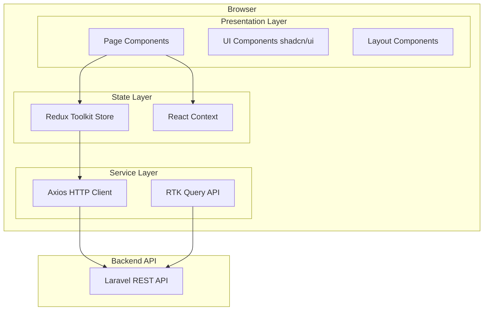
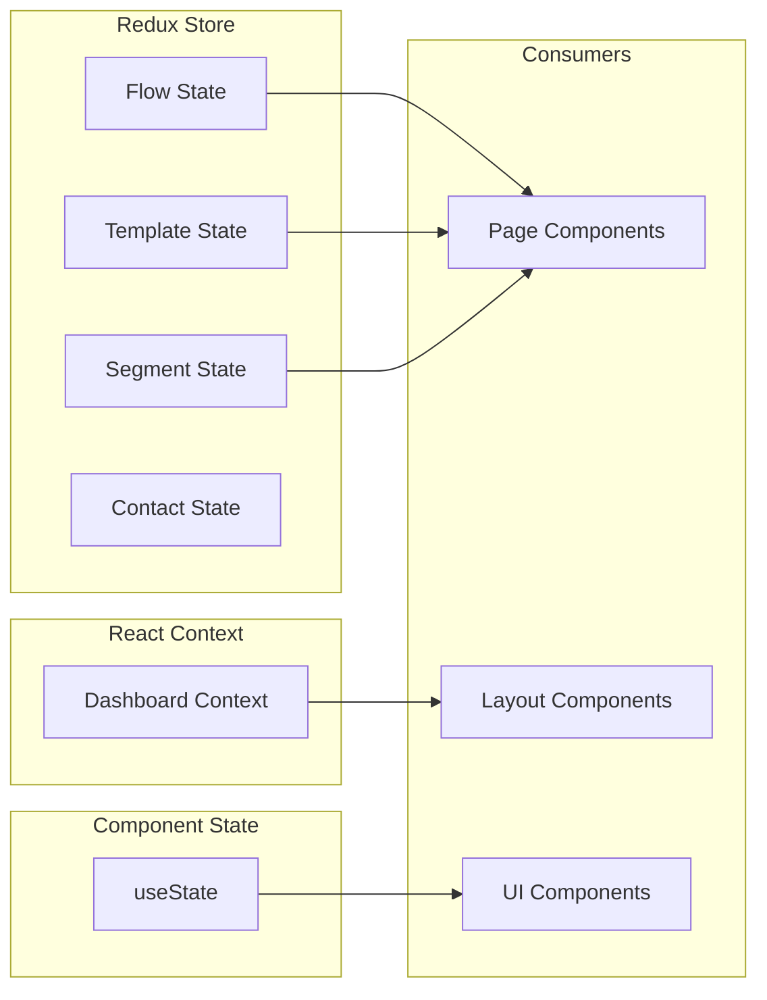

# Frontend Overview

The ICS Automation frontend is a single-page application (SPA) built with React 19, TypeScript, and Vite. It provides a visual interface for creating and managing marketing automation workflows, email templates, SMS campaigns, and contact segments.

## Architecture

The application follows a **feature-module architecture** with centralized state management. Each business domain (flows, templates, segments, contacts) is encapsulated in its own module with colocated components, state, and types.

## Technology Stack

| Category | Technology | Version | Purpose |
|----------|-----------|---------|---------|
| Framework | React | 19.x | UI component model |
| Language | TypeScript | 5.9.x | Type safety |
| Build Tool | Vite | 5.x | Fast bundling and dev server |
| Routing | React Router | 7.x | Client-side routing |
| State Management | Redux Toolkit | 2.x | Global state management |
| HTTP Client | Axios | 1.x | API communication |
| Flow Canvas | @xyflow/react | 12.x | Drag-and-drop flow editor |
| Email Editor | react-email-editor | 1.x | Unlayer-based email builder |
| Styling | Tailwind CSS | 4.x | Utility-first CSS |
| UI Components | shadcn/ui + Radix | - | Accessible component primitives |
| Tables | @tanstack/react-table | 8.x | Data table rendering |
| Notifications | react-toastify | 11.x | Toast notifications |
| Icons | Lucide React, HugeIcons | - | Icon libraries |

## Design Principles

### Feature-Module Organization

Each feature module is self-contained with its own components, Redux slice, and type definitions. This enables:

- **Independent development** — teams can work on separate modules without conflicts
- **Clear ownership** — each module has a single responsibility
- **Easy extraction** — modules can be split into separate packages if needed

### Separation of Concerns

| Layer | Responsibility | Location |
|-------|---------------|----------|
| Presentation | UI rendering, user interaction | `src/pages/`, `src/components/` |
| State | Data management, business logic | `src/pages/*/redux/`, `src/app/store.ts` |
| Service | API communication, data fetching | `src/api/`, `src/app/api.ts` |
| Layout | Page structure, navigation | `src/layout/` |
| Routing | URL-to-component mapping | `src/routes/` |

### State Management Strategy

The application uses a **dual state management** approach:

- **Redux Toolkit** — for server state, complex business logic, and cross-component state
- **React Context** — for UI state that is specific to the dashboard layout (sidebar visibility, dialog states)

## Application Modules

### Dashboard

The authenticated admin panel containing all automation management features.

| Module | Route | Description |
|--------|-------|-------------|
| Home | `/dashboard/home` | Analytics and performance overview |
| Flows | `/dashboard/flows` | List and manage automation workflows |
| Flow Builder | `/dashboard/flows/create-flow` | Visual workflow editor |
| Templates | `/dashboard/template-list` | Email template gallery |
| Template Builder | `/dashboard/template-builder` | Drag-and-drop email editor |
| SMS Templates | `/dashboard/sms-template-builder` | SMS template editor |
| Lists & Segments | `/dashboard/lists` | Contact management |
| Import Contacts | `/dashboard/lists/:id` | CSV import and contact picker |

### Public Website

Unauthenticated pages accessible to all users.

| Page | Route | Description |
|------|-------|-------------|
| Home | `/` | Landing page |
| Login | `/login` | Authentication |
| Unsubscribe | `/unsubscribe` | Email unsubscribe handler |
| Not Found | `/not-found` | 404 error page |

## Key Architectural Decisions

### React Flow (@xyflow/react) for Flow Builder

The flow builder uses `@xyflow/react` (formerly React Flow) for the visual workflow editor. This library provides:

- Node-based canvas with drag-and-drop
- Edge connections with validation
- Zoom, pan, and minimap controls
- Custom node rendering

### Unlayer Email Editor

Email templates are built using `react-email-editor` (Unlayer), which provides:

- Drag-and-drop email design
- Pre-built content blocks
- Responsive output
- JSON design state storage

### Feature-Sliced Redux

Each feature module contains its own Redux slice, registered in the central store. This pattern keeps state logic close to the components that use it while maintaining a single store instance.
