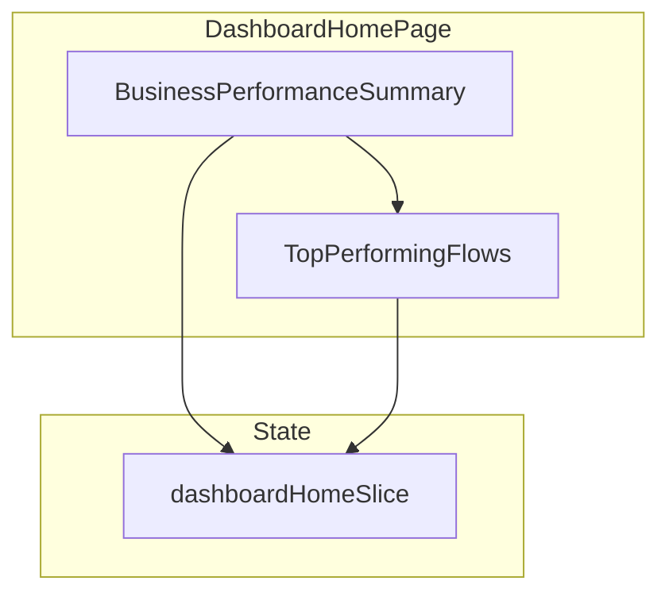

# Dashboard Home

The Dashboard Home page provides an overview of automation performance and key metrics.

## Architecture



## Components

### DashboardHomePage

**Location:** `src/pages/dashboard/home/DashboardHomePage.tsx`

The page entry point composing two main sections:

```tsx
const DashboardHomePage = () => {
  return (
    <>
      <BusinessPerformanceSummary />
      <TopPerformingFlows />
    </>
  );
};
```

### BusinessPerformanceSummary

**Location:** `src/pages/dashboard/home/components/BusinessSummary.tsx`

Displays key performance indicators:

- Total contacts
- Active flows
- Emails sent
- SMS sent
- Open rates
- Click rates

### TopPerformingFlows

**Location:** `src/pages/dashboard/home/components/FlowAnalytics.tsx`

Shows analytics for the highest-performing automation flows, ranked by engagement metrics.

## State Management

**Location:** `src/pages/dashboard/home/redux/dashboardHomeSlice.ts`

Manages the loading and display of dashboard metrics and flow analytics data.
