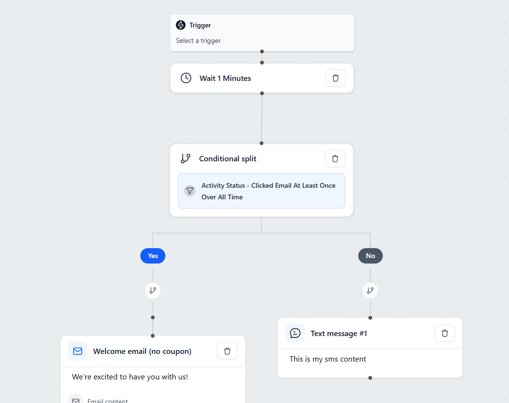

# Flow Builder

The Flow Builder allows you to create automated workflows.  
You can design how emails and SMS messages are sent to customers based on specific conditions, timing, and user behavior. This is an example of you can you create flow form flow builder.

Go to [flow manage](https://automation.icslegal.com/dashboard/flows) Generate New project.


## Technical Description

The Flow Builder is built using a modular, component-driven architecture designed for scalability and efficient state management. It allows users to visually create automated workflows by connecting different action nodes such as triggers, conditions, delays, emails, and SMS.

### Core Technologies

    **React + TypeScript** — Provides a predictable, type-safe component architecture.
    **React Flow** — Powers the drag-and-drop flow canvas, node rendering, connections, and position management.
    **Tailwind CSS** — Ensures a clean and customizable UI design with utility-first styling.
    **Redux Toolkit** — Manages the global flow state, including nodes, edges, active selections, and sidebar configurations.

### System Architecture

```
create-flow/
├─ components/
│  ├─ common/                         # Shared UI components for sidebars
│  ├─ flow-area/                      # Main flow editor (React Flow)
│  │  ├─ components/                  # Individual node components
│  │  │  ├─ ConditionNode.tsx
│  │  │  ├─ DelayNode.tsx
│  │  │  ├─ EmailNode.tsx
│  │  │  ├─ SmsNode.tsx
│  │  │  └─ TriggerNode.tsx
│  │  └─ FlowArea.tsx                 # Canvas rendering and node handling
│  ├─ header/                         # Top header toolbar
│  ├─ left-sidebar/                   # Node selection & creation area
│  └─ right-sidebar/                  # Options panel for configuring selected nodes
│     ├─ components/
│     │  ├─ ui/                       # Template interfaces and trigger UI elements
│     │  ├─ ConditionOptions.tsx
│     │  ├─ DelayOptions.tsx
│     │  ├─ EmailOptions.tsx
│     │  ├─ SmsOptions.tsx
│     │  └─ TriggerOptions.tsx
│     └─ RightSidebar.tsx
├─ redux/
│  └─ createFlowSlice.ts              # Global state for nodes, edges, and selections
├─ CreateFlowPage.tsx                 # Page wrapper integrating all components
└─ type.ts                            # Shared TypeScript types for flow nodes
```

### How It Works

#### 1. Node Rendering (React Flow)

All blocks (Trigger, Condition, Email, SMS, Delay) are **custom React Flow nodes**.

**React Flow manages:**

- Node positioning & persistence
- Edge creation and validation
- Drag-and-drop from sidebar
- Zoom, pan, and minimap

**Each custom node includes:**

- Tailwind-styled UI
- Input/output handles (using `reactflow` handles)
- Direct Redux integration for live setting updates

#### 2. State Management (Redux Toolkit)

`createFlowSlice.ts` holds the **complete flow state**:

- Nodes & edges
- Selected node ID
- Sidebar visibility
- All node-specific configurations (templates, delays, conditions, etc.)
- Flow metadata (name, status, etc.)

Every change (drag, connect, edit) dispatches a Redux action → predictable, undoable, and centrally managed state.

#### 3. Sidebars & Configuration

**Left Sidebar**

- Catalog of all available node types
- Drag new nodes onto the canvas
- Grouped into **Triggers**, **Actions**, and **Logic**

**Right Sidebar** (contextual)  
Appears when a node is selected and dynamically loads the appropriate options component:

- `TriggerOptions.tsx`
- `ConditionOptions.tsx`
- `DelayOptions.tsx`
- `EmailOptions.tsx`
- `SmsOptions.tsx`

#### 4. Node Types & Purpose

| Node Type | Purpose                                                                |
| --------- | ---------------------------------------------------------------------- |
| Trigger   | Entry point (e.g., Contact added to list, Form submitted, Tag applied) |
| Condition | Branch flow based on contact data, behavior, or custom rules           |
| Email     | Send email using a selected template                                   |
| SMS       | Send SMS message                                                       |
| Delay     | Wait for a specific duration or until a condition is met               |

#### 5. Template Selection & Dialogs

Located in `right-sidebar/components/ui/`:

- Template gallery with live preview
- Search & filtering
- Modal dialogs for template selection
- Real-time preview of selected email/SMS template

#### 6. Page Composition

`CreateFlowPage.tsx` orchestrates the entire editor:

- Header with **Save** / **Publish** buttons
- Left sidebar (node palette)
- React Flow canvas
- Right sidebar (dynamic configuration panel)
- Initial data loading from backend API
