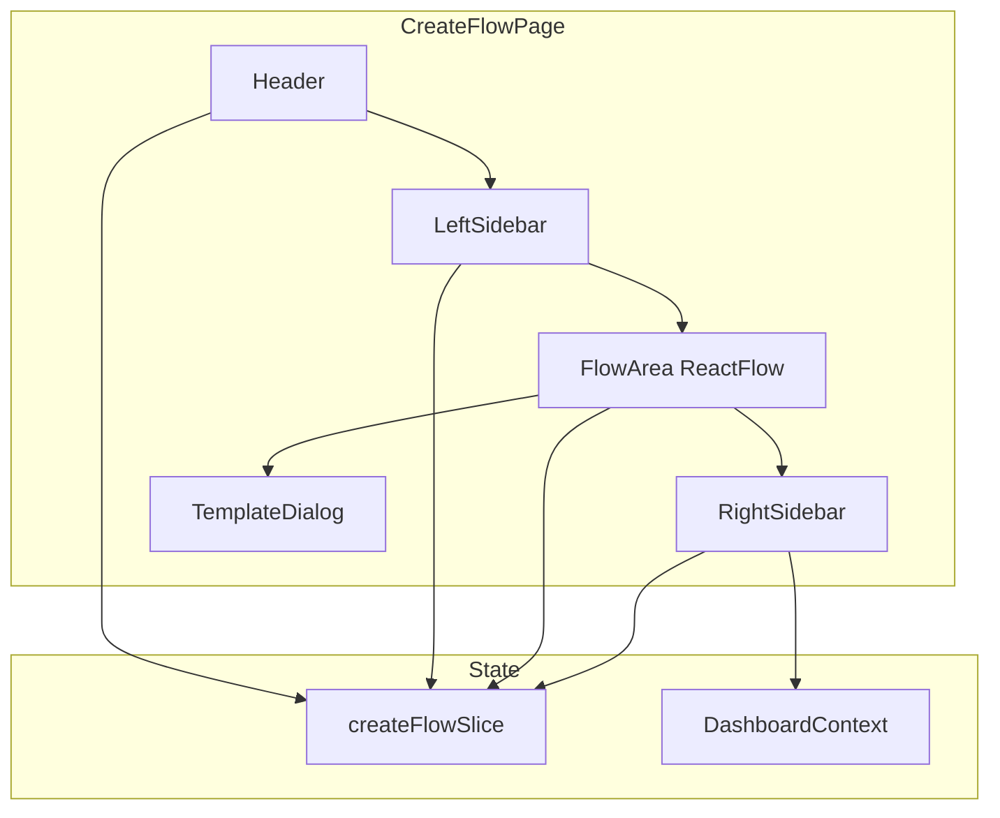

# Flow Builder

The Flow Builder is a visual workflow editor that allows users to create automation pipelines by connecting nodes on a canvas. It is built with `@xyflow/react` (React Flow) and manages state through Redux Toolkit.

## Architecture


```mermaid
graph TB
    subgraph "CreateFlowPage"
        Header[Header]
        LeftSidebar[LeftSidebar]
        FlowArea[FlowArea ReactFlow]
        RightSidebar[RightSidebar]
        TemplateDialog[TemplateDialog]
        
        Header --> LeftSidebar
        LeftSidebar --> FlowArea
        FlowArea --> RightSidebar
        FlowArea --> TemplateDialog
    end
    
    subgraph "State"
        Redux[createFlowSlice]
        Context[DashboardContext]
    end
    
    Header --> Redux
    LeftSidebar --> Redux
    FlowArea --> Redux
    RightSidebar --> Redux
    RightSidebar --> Context
```

## Component Structure

```
create-flow/
├── CreateFlowPage.tsx              # Page entry point
├── type.ts                         # TypeScript interfaces
├── redux/
│   └── createFlowSlice.ts          # State management
└── components/
    ├── header/
    │   └── Header.tsx              # Toolbar with save/publish
    ├── left-sidebar/
    │   └── LeftSidebar.tsx         # Node palette
    ├── flow-area/
    │   ├── FlowArea.tsx            # React Flow canvas
    │   └── components/
    │       ├── TriggerNode.tsx     # Trigger node
    │       ├── ConditionNode.tsx   # Conditional branch node
    │       ├── EmailNode.tsx       # Email action node
    │       ├── SmsNode.tsx         # SMS action node
    │       └── DelayNode.tsx       # Wait/delay node
    ├── right-sidebar/
    │   ├── RightSidebar.tsx        # Configuration panel
    │   └── components/
    │       ├── ConditionOptions.tsx
    │       ├── DelayOptions.tsx
    │       ├── EmailOptions.tsx
    │       ├── SmsOptions.tsx
    │       ├── TriggerOptions.tsx
    │       └── ui/
    │           ├── template-dialog/
    │           └── template-preview-dialog/
    └── common/                     # Shared sidebar components
```

## Node Types

| Node Type | Component | Purpose |
|-----------|-----------|---------|
| Trigger | `TriggerNode` | Entry point for the flow (contact added, form submitted, tag applied) |
| Condition | `ConditionNode` | Branch logic based on contact properties or behavior |
| Email | `EmailNode` | Send an email using a selected template |
| SMS | `SmsNode` | Send an SMS message |
| Delay | `DelayNode` | Wait for a specified duration before proceeding |

## Flow Canvas (FlowArea)

The `FlowArea` component wraps the React Flow canvas with `ReactFlowProvider`:

```tsx
<ReactFlowProvider>
  <FlowArea />
</ReactFlowProvider>
```

### Features

- **Drag-and-drop** — Nodes are dragged from the left sidebar onto the canvas
- **Edge connections** — Output handles connect to input handles to define flow paths
- **Zoom and pan** — Canvas supports mouse wheel zoom and click-drag pan
- **Node selection** — Clicking a node selects it and opens the right sidebar configuration panel
- **Custom node rendering** — Each node type has a custom component with Tailwind styling

## State Management

The flow state is managed in `createFlowSlice.ts`:

```typescript
interface CreateFlowState {
  name: string;
  nodes: Node[];
  edges: Edge[];
  nodeData: Record<string, any>;
  lists: List[];
  templates: Template[];
  selectedTemplate: number | null;
  execution_position: string;
  statistics?: Statistics[];
  focusedNode: string | null;
  isSaving: boolean;
  saveError: string | null;
  preview: boolean;
}
```

### Node Data

Each node's configuration is stored in the `nodeData` object, keyed by node ID:

```typescript
nodeData: {
  "node-abc123": {
    templateId: 5,
    delay: { duration: 2, unit: "hours" },
    condition: { activity: "opened_email", times: "at_least_once" }
  }
}
```

### Saving a Flow

The `saveFlow` thunk serializes the current state and sends it to the backend:

```typescript
export const saveFlow = createAsyncThunk<FlowResponse>(
  "createFlow/save",
  async (_, { getState }) => {
    const { name, nodes, edges, nodeData } = (getState() as any).createFlow;
    const response = await axiosInstance.post("/flows", {
      name,
      flow: { nodes, edges, nodeData },
    });
    return response.data;
  }
);
```

## Preview Mode

When the URL contains `/preview/`, the page renders only the `FlowArea` component without the sidebars or header:

```tsx
const isPreview = location.pathname.includes("/preview/");
if (isPreview) {
  return (
    <ReactFlowProvider>
      <FlowArea />
    </ReactFlowProvider>
  );
}
```

This is used for viewing flow execution progress in real-time.

## Template Selection

Email and SMS nodes can select templates through a dialog:

1. User clicks "Select Template" in the right sidebar
2. `TemplateDialog` opens with a searchable list of available templates
3. User selects a template and confirms
4. The template ID is stored in the node's `nodeData`

Template previews are available through `TemplatePreviewDialog`.

## Loading a Flow

When editing an existing flow, the `loadFlow` thunk fetches the flow data:

```typescript
export const loadFlow = createAsyncThunk(
  "createFlow/loadFlow",
  async (flowId: string) => {
    const response = await axiosInstance.get(`/flows/${flowId}`);
    return response.data.data;
  }
);
```

The fulfilled handler parses the stored flow JSON and restores nodes, edges, and nodeData:

```typescript
builder.addCase(loadFlow.fulfilled, (state, action) => {
  const flow = JSON.parse(action.payload.flow);
  state.name = action.payload.name;
  state.nodes = structuredClone(flow.nodes || []);
  state.edges = structuredClone(flow.edges || []);
  state.nodeData = structuredClone(flow.nodeData || {});
});
```

## Execution View

The `loadExeNode` thunk loads a flow's execution state:

```typescript
export const loadExeNode = createAsyncThunk(
  "createFlow/loadExeNode",
  async ({ exeId }: { exeId: string }, { dispatch }) => {
    const response = await axiosInstance.get(`flow-execution/step?exe_id=${exeId}`);
    const exeData = response.data;
    if (exeData.flow_id) {
      await dispatch(loadFlow(String(exeData.flow_id)));
    }
    return exeData;
  }
);
```

This sets the `execution_position` (current node being processed) and `statistics` (per-node delivery metrics).
