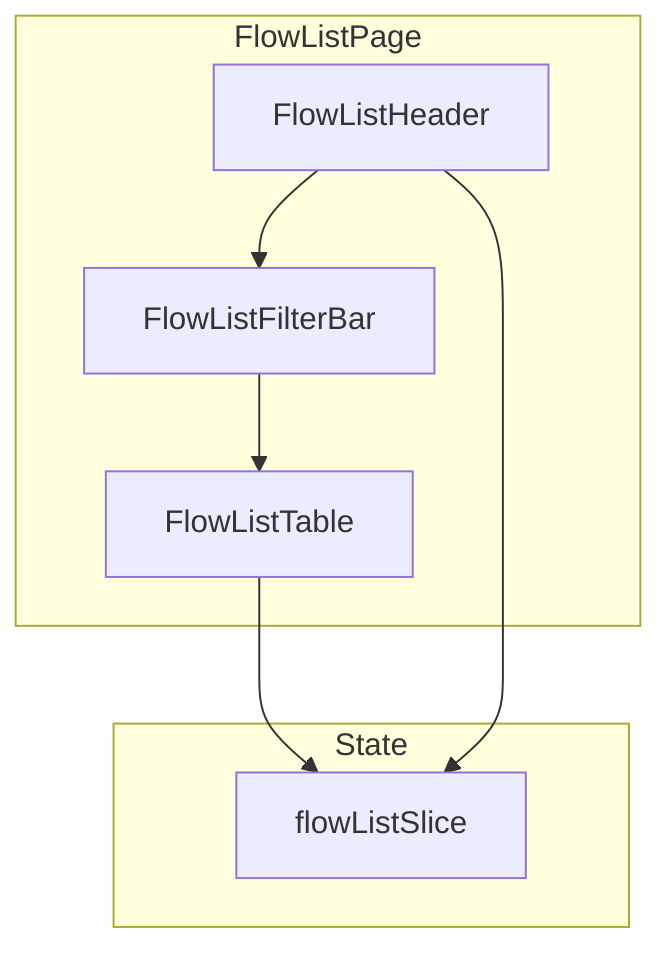

# Flow List

The Flow List page displays all automation workflows in a sortable, filterable table. Users can create, edit, delete, and monitor flows from this interface.

## Architecture



## Components

### FlowListPage

**Location:** `src/pages/dashboard/flow-list/FlowListPage.tsx`

The page entry point composing the header, filter bar, and table:

```tsx
const FlowListPage: React.FC = () => {
  return (
    <div className="min-h-screen">
      <FlowsHeader />
      <FlowsFilterBar />
      <FlowsTable />
    </div>
  );
};
```

### FlowListHeader

Provides the page title and a "Create Flow" button that navigates to the flow builder.

### FlowListFilterBar

Contains search input, status filters, and sorting controls for the flow table.

### FlowListTable

Renders the flow data using `@tanstack/react-table` with columns for:

| Column | Description |
|--------|-------------|
| Flow name | Name of the automation |
| Status | Active, paused, or draft |
| Created | Creation date |
| Updated | Last modified date |
| Actions | Edit, delete, preview |

## State Management

**Location:** `src/pages/dashboard/flow-list/redux/flowListSlice.tsx`

### State Shape

```typescript
interface FlowState {
  flows: FlowType[];
  isLoading: boolean;
  loadError: string | null;
  sortField: string;
  sortDirection: "asc" | "desc";
  selectedFlowId: string | null;
  requiredCredit: RequiredCreditType[];
  isCreditLoading: boolean;
  creditLoadError: string | null;
  remainingCredit: RemainingCreditType | 0;
  isRemainingCreditLoading: boolean;
  remainingCreditLoadError: string | null;
}
```

### Sync Reducers

| Action | Description |
|--------|-------------|
| `setSort` | Toggle sort field and direction |
| `selectFlow` | Set selected flow ID |
| `addFlow` | Append a new flow to the list |
| `updateFlow` | Update an existing flow |
| `removeFlow` | Remove a flow by ID |

### Async Thunks

| Thunk | Method | Endpoint | Description |
|-------|--------|----------|-------------|
| `loadFlows` | GET | `/flows` | Fetch all flows |
| `loadRequiredCredits` | GET | `/required-credit` | Fetch credit requirements per flow |
| `loadRemainingCredits` | GET | `/credits/sendmode` | Fetch Sendmode SMS balance |

## Flow Type

```typescript
interface FlowType {
  id: string;
  name: string;
  // Additional fields from backend response
}
```

## Credit Management

The flow list page also displays credit information:

- **Required credits** — Estimated credit cost per flow (UK and international)
- **Remaining credits** — Current Sendmode account balance

This information helps users monitor their SMS credit usage across flows.
