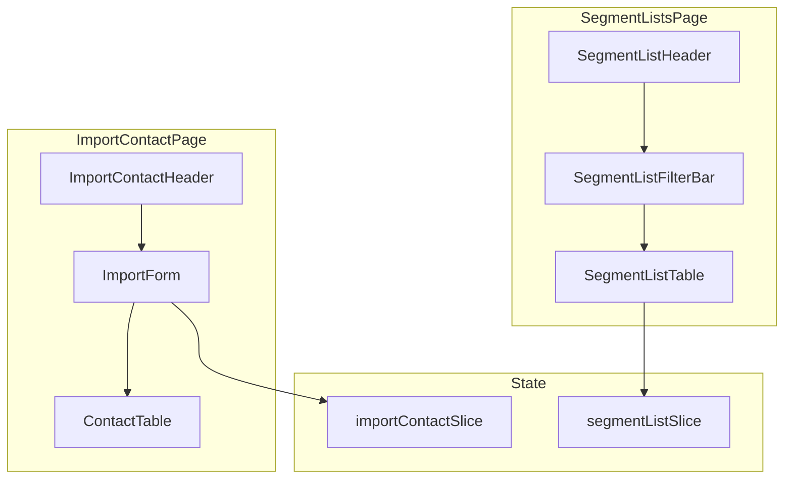

# Lists & Segments

The Lists & Segments module manages contact organization. Users can create static lists, define dynamic segments with rule-based criteria, import contacts via CSV, and manage individual contact records.

## Architecture



## Segment Lists Page

**Location:** `src/pages/dashboard/segment-list/`

Displays all lists and segments in a table with filtering and sorting.

### Components

| Component | Purpose |
|-----------|---------|
| `SegmentListPage.tsx` | Page entry point |
| `components/SegmentListHeader.tsx` | Page header with create button |
| `components/SegmentListFilterBar.tsx` | Filter and search controls |
| `components/SegmentListTable.tsx` | Data table with list/segment entries |

### State

**Location:** `src/pages/dashboard/segment-list/redux/segmentListSlice.ts`

```typescript
interface SegmentListState {
  segments: SegmentItem[];
  loading: boolean;
  error: string | null;
  currentSegment: SegmentItem | null;
}

interface SegmentItem {
  id: string;
  name: string;
  type: "list" | "segment";
  description?: string;
  members: number;
  created: string;
  isStarred?: boolean;
  isExpandable?: boolean;
}
```

### Operations

| Operation | Thunk | Method | Endpoint |
|-----------|-------|--------|----------|
| Fetch all | `fetchLists` | GET | `/segment-list` |
| Create | `createList` | POST | `/segment-list` |
| Update | `updateList` | PUT | `/segment-list/:id` |
| Delete | `deleteList` | DELETE | `/segment-list/:id` |
| Fetch one | `fetchListById` | GET | `/segment-list/:id` |

## Import Contact Page

**Location:** `src/pages/dashboard/import-contact/`

Handles contact import into lists via CSV upload or manual entry.

### Components

| Component | Purpose |
|-----------|---------|
| `ImportContactPage.tsx` | Page entry point |
| `components/` | Import form, CSV parser, contact picker |

### State

**Location:** `src/pages/dashboard/import-contact/redux/importContactSlice.tsx`

Manages import state, uploaded contacts, and validation errors.

## Lists vs Segments

| Feature | List | Segment |
|---------|------|---------|
| Type | Static | Dynamic |
| Membership | Manually managed | Rule-based auto-update |
| Use Case | One-off campaigns, fixed groups | Targeted automations, behavioral groups |
| Updates | Manual add/remove | Automatic based on conditions |

## Contact Data Model

Contacts include standard and custom fields:

| Field | Type | Description |
|-------|------|-------------|
| `id` | string | Unique identifier |
| `email` | string | Primary contact email |
| `name` | string | Full name |
| `phone` | string | Phone number |
| `tags` | string[] | Assigned tags |
| `custom_fields` | object | Custom field values |
| `created_at` | string | Creation timestamp |
| `updated_at` | string | Last modified timestamp |

## Segment Rules

Segments use rule-based criteria to dynamically include contacts. Rules are defined using:

- **Activity conditions** — Email opens, clicks, bounces, SMS receives
- **Property conditions** — Contact field values, tags, list membership
- **Time conditions** — Activity within a time window
- **Logical operators** — AND/OR for combining multiple rules

Available condition types are defined in `src/data/condition.ts`:

```typescript
export const conditionList = [
  { value: "activity_status", label: "What someone has done (or not done)" },
];

export const activityList = [
  { value: "clicked_email", label: "Click" },
  { value: "bounce_email", label: "Bounce" },
  { value: "opened_email", label: "Open" },
  { value: "received_email", label: "Receive" },
  { value: "clicked_unsubscribe", label: "Clicked unsubscribe" },
];
```
