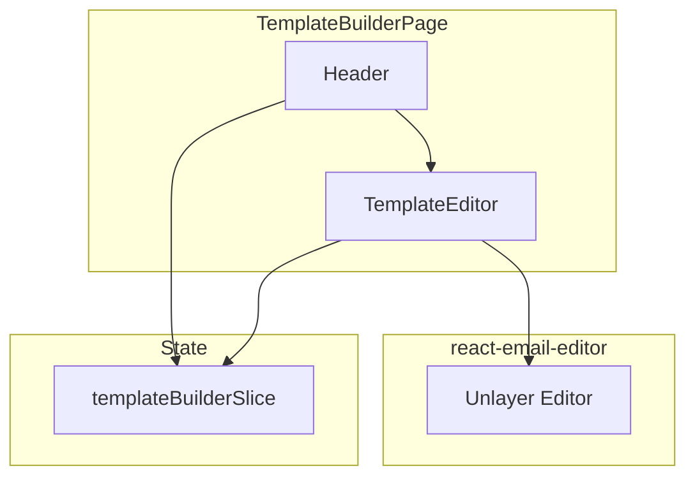

# Template Builder

The Template Builder provides a drag-and-drop email editor powered by Unlayer (`react-email-editor`). Users can create, edit, and save professional email templates without writing HTML.

## Architecture



## Components

### TemplateBuilderPage

**Location:** `src/pages/dashboard/template-builder/TemplateBuilderPage.tsx`

The page entry point that loads an existing template or initializes a new one:

```tsx
const TemplateBuilderPage = () => {
  const dispatch = useAppDispatch();
  const { id } = useParams<{ id: string }>();

  useEffect(() => {
    dispatch(id ? loadTemplate(id) : resetTemplate());
  }, [id, dispatch]);

  const emailEditorRef = useRef<EditorRef>(null);
  return (
    <div className="flex flex-col h-screen">
      <Header />
      <TemplateEditor editorReference={emailEditorRef} />
    </div>
  );
};
```

### TemplateContentEditor

**Location:** `src/pages/dashboard/template-builder/TemplateContentEditor.tsx`

An alternative view that uses `ContentEditor` instead of `TemplateEditor`, providing a different editing experience.

### TemplateEditor

Wraps the Unlayer editor with save/export functionality.

### ContentEditor

Provides an alternative editing interface for template content.

### Header

The toolbar component with actions for saving, exporting, and navigating.

## State Management

**Location:** `src/pages/dashboard/template-builder/redux/templateBuilderSlice.ts`

Manages template loading, saving, and editor state.

### Async Thunks

| Thunk | Method | Endpoint | Description |
|-------|--------|----------|-------------|
| `loadTemplate` | GET | `/templates/:id` | Load an existing template |
| `saveTemplate` | POST/PUT | `/templates` | Save or update a template |

## Unlayer Integration

The `react-email-editor` component provides:

- **Drag-and-drop blocks** — Text, images, buttons, dividers, social icons, spacers
- **Responsive design** — Templates automatically adapt to desktop, tablet, and mobile
- **Design state** — Templates are stored as JSON, not raw HTML
- **HTML export** — The editor can export the final HTML for email delivery

### Editor Reference

The editor is accessed through a ref:

```tsx
const emailEditorRef = useRef<EditorRef>(null);

// Load design JSON
emailEditorRef.current?.editor.loadDesign(design);

// Export HTML
emailEditorRef.current?.editor.exportHtml((data) => {
  const { html } = data;
  // Save html to backend
});
```

## Template Data Model

Templates stored in the backend include:

| Field | Type | Description |
|-------|------|-------------|
| `id` | number | Unique identifier |
| `name` | string | Template name |
| `html` | string | Rendered HTML output |
| `design` | string \| null | Unlayer JSON design state |
| `updated_at` | string | Last modified timestamp |

## SMS Template Builder

**Location:** `src/pages/dashboard/sms-template-builder/`

A separate editor for SMS templates with its own Redux slice (`smsTemplateBuilderSlice`). SMS templates are simpler than email templates and do not use the Unlayer editor.

### Routes

| Route | Description |
|-------|-------------|
| `/dashboard/sms-template-builder` | Create new SMS template |
| `/dashboard/sms-template-builder/:id` | Edit existing SMS template |
| `/dashboard/sms-template-builder/flow/:id?` | Create SMS template from flow context |
