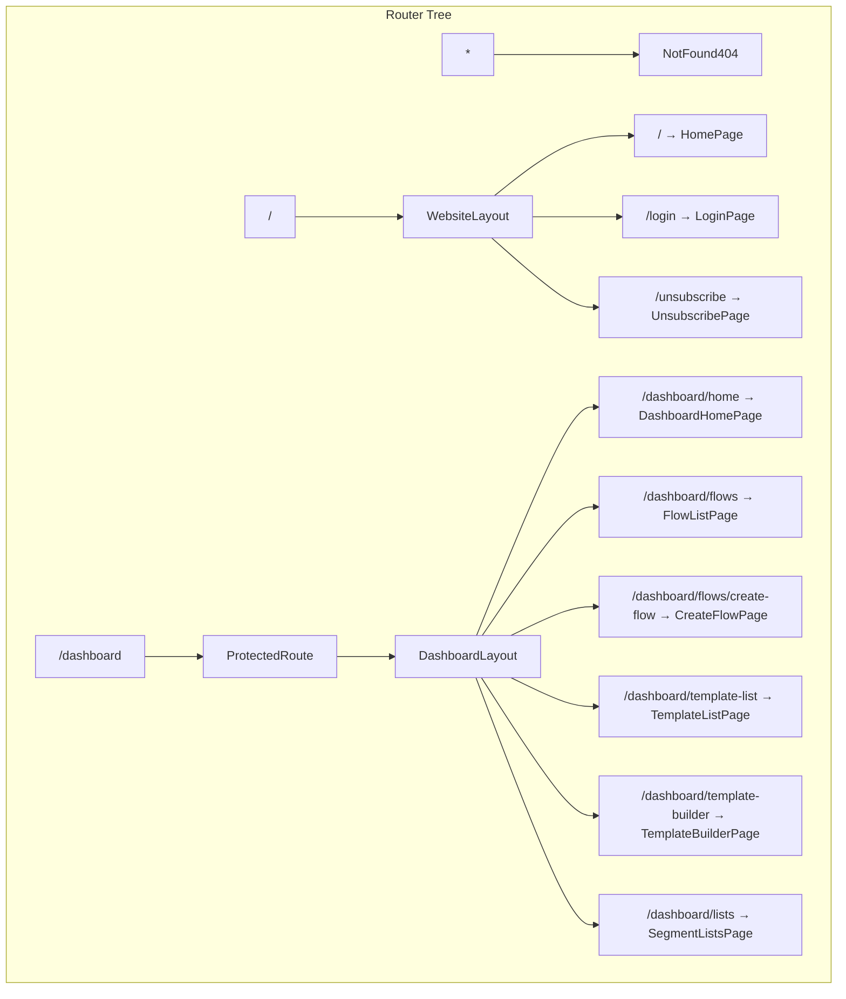

# Routing

The application uses **React Router v7** with `createBrowserRouter` for declarative route configuration. All routes are defined in `src/routes/` and composed into a single router instance.

## Router Architecture



## Route Configuration

### Entry Point (`src/routes/index.tsx`)

The router is initialized with `createBrowserRouter` and organized into three top-level branches:

```tsx
const routes = createBrowserRouter([
  {
    path: "/",
    element: <WebsiteLayout />,
    children: [...WebRoutes],
  },
  {
    path: "/dashboard",
    element: <ProtectedRoute><Dashboard /></ProtectedRoute>,
    children: [...DashboardRoutes],
  },
  {
    path: "*",
    element: <NotFound404 />,
  },
]);
```

### Dashboard Routes (`src/routes/dashboard.tsx`)

| Path | Component | Layout | Description |
|------|-----------|--------|-------------|
| `home` | `DashboardHomePage` | Full | Analytics overview |
| `flows` | `FlowListPage` | Full | Flow listing and management |
| `flows/:id?` | `CreateFlowPage` | **None** | Flow editor (full-screen) |
| `flows/preview/:exeId?` | `CreateFlowPage` | **None** | Flow execution preview |
| `flows/create-flow` | `CreateFlowPage` | **None** | New flow creation |
| `campaigns` | `ComingSoon` | Full | Placeholder |
| `template-builder/:id?` | `TemplateBuilderPage` | **None** | Email template editor |
| `template-content-editor/:id?` | `TemplateContentEditor` | **None** | Template content editor |
| `lists` | `SegmentListsPage` | Full | Contact lists and segments |
| `lists/:id?` | `ImportContactPage` | Full | Contact import |
| `template-list` | `TemplateListPage` | Full | Template gallery |
| `sms-template-builder/:id?` | `SMSTemplateBuilder` | **None** | SMS template editor |
| `sms-template-builder/flow/:id?` | `SMSTemplateBuilder` | **None** | SMS template from flow |
| `unsubscribed` | `UnsubscribePage` | **None** | Unsubscribe confirmation |
| `subscribed` | `UnsubscribePage` | **None** | Subscription confirmation |

### Website Routes (`src/routes/website.tsx`)

| Path | Component | Layout | Description |
|------|-----------|--------|-------------|
| `/` | `HomePage` | Full | Landing page |
| `/login` | `LoginPage` | **None** | Authentication |
| `/unsubscribe` | `UnsubscribePage` | **None** | Email unsubscribe |
| `/subscribed` | `UnsubscribePage` | **None** | Subscription confirmation |
| `/not-found` | `NotFoundPage` | Full | 404 page |
| `test` | `TestPage` | **None** | Development testing |

## Route Handles

React Router's `handle` property is used to control layout visibility. Routes with `handle: { layout: false }` render without the surrounding layout chrome.

```tsx
{
  path: "flows/:id?",
  element: <CreateFlowPage />,
  handle: { layout: false },  // Renders full-screen, no sidebar/topbar
}
```

The layout components check this via `useMatches()`:

```tsx
const matches = useMatches();
const current = matches[matches.length - 1] as { handle?: RouteHandle };
const showLayout = current?.handle?.layout !== false;

if (!showLayout) return <Outlet />;
```

## Authentication Guard

The `ProtectedRoute` component wraps the dashboard route tree and checks for an active session:

```tsx
const ProtectedRoute = ({ children }: { children: JSX.Element }) => {
  const loggedIn = !!localStorage.getItem("userid");
  return loggedIn ? children : <Navigate to="/login" replace />;
};
```

Unauthenticated users are redirected to `/login`. After login, the `userid` key in `localStorage` serves as the session indicator.

## Adding New Routes

1. **Dashboard route**: Add an entry to `src/routes/dashboard.tsx`
2. **Public route**: Add an entry to `src/routes/website.tsx`
3. **Full-screen page** (no layout): Add `handle: { layout: false }`
4. **Create the page component** in the appropriate `src/pages/` subdirectory
