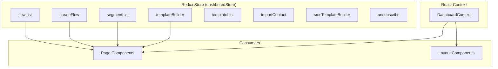

# State Management

The application uses a dual state management strategy: **Redux Toolkit** for server and business state, and **React Context** for dashboard UI state.

## Architecture Overview



## Redux Store Configuration

**Location:** `src/app/store.ts`

The store is configured with `configureStore` from Redux Toolkit, aggregating all feature slices:

```typescript
export const dashboardStore = configureStore({
  reducer: {
    flowList: flowListReducer,
    createFlow: createFlowReducer,
    createTemplate: createTemplateReducer,
    segmentList: segmentListReducer,
    templateBuilder: templateBuilderReducer,
    templateList: templateListReducer,
    importContact: importContactReducer,
    smsTemplateBuilder: smsTemplateBuilderReducer,
    unsubscribe: unsubscribeReducer,
  },
});

export type DashboardRootState = ReturnType<typeof dashboardStore.getState>;
export type DashboardAppDispatch = typeof dashboardStore.dispatch;
```

### Typed Hooks

**Location:** `src/hooks/redux-hook.ts`

Typed hooks are provided for type-safe Redux access:

```typescript
export const useAppDispatch = () => useDispatch<DashboardAppDispatch>();
export const useAppSelector: TypedUseSelectorHook<DashboardRootState> = useSelector;
```

All components should use these hooks instead of the untyped `useDispatch` and `useSelector`.

## Feature Slices

### createFlow Slice

**Location:** `src/pages/dashboard/create-flow/redux/createFlowSlice.ts`

The most complex slice, managing the flow builder state.

#### State Shape

```typescript
interface CreateFlowState {
  name: string;                    // Flow name
  nodes: Node[];                   // React Flow nodes
  edges: Edge[];                   // React Flow edges
  nodeData: Record<string, any>;   // Per-node configuration data
  lists: List[];                   // Available contact lists
  templates: Template[];           // Available email templates
  selectedTemplate: number | null; // Currently selected template
  execution_position: string;      // Current execution node ID
  statistics?: Statistics[];       // Flow execution statistics
  focusedNode: string | null;      // Currently focused node
  isSaving: boolean;               // Save operation in progress
  saveError: string | null;        // Last save error
  preview: boolean;                // Preview mode flag
}
```

#### Async Thunks

| Thunk | Method | Endpoint | Description |
|-------|--------|----------|-------------|
| `saveFlow` | POST | `/flows` | Create a new flow |
| `updateFlow` | PUT | `/flows/${id}` | Update an existing flow |
| `loadFlow` | GET | `/flows/${flowId}` | Load a flow by ID |
| `loadLists` | GET | `/segment-list` | Load available contact lists |
| `loadTemplates` | GET | `/templates` | Load available email templates |
| `loadPreview` | GET | `/templates/${id}` | Load template preview |
| `loadExeNode` | GET | `/flow-execution/step?exe_id=` | Load flow execution state |

#### Sync Reducers

| Action | Description |
|--------|-------------|
| `setFlowName` | Update flow name |
| `addData` | Merge data into a node's configuration |
| `setNodes` | Replace all nodes |
| `addNode` | Add a single node |
| `updateNode` | Update a node by ID |
| `setEdges` | Replace all edges |
| `addEdge` | Add a single edge |
| `removeNode` | Remove a node and its connected edges |
| `removeEdge` | Remove an edge by ID |
| `setSelectedTemplate` | Set selected template ID |
| `setExecutionPosition` | Set current execution node |
| `setFocusNode` | Set focused node |
| `resetFlow` | Reset to initial state |

### flowList Slice

**Location:** `src/pages/dashboard/flow-list/redux/flowListSlice.tsx`

Manages the flow listing page state.

#### State Shape

```typescript
interface FlowState {
  flows: FlowType[];
  isLoading: boolean;
  loadError: string | null;
  sortField: string;
  sortDirection: "asc" | "desc";
  selectedFlowId: string | null;
  requiredCredit: RequiredCreditType[];
  isCreditLoading: boolean;
  creditLoadError: string | null;
  remainingCredit: RemainingCreditType | 0;
  isRemainingCreditLoading: boolean;
  remainingCreditLoadError: string | null;
}
```

#### Async Thunks

| Thunk | Method | Endpoint | Description |
|-------|--------|----------|-------------|
| `loadFlows` | GET | `/flows` | Load all flows |
| `loadRequiredCredits` | GET | `/required-credit` | Load credit requirements |
| `loadRemainingCredits` | GET | `/credits/sendmode` | Load Sendmode balance |

### segmentList Slice

**Location:** `src/pages/dashboard/segment-list/redux/segmentListSlice.ts`

Manages contact lists and segments.

#### State Shape

```typescript
interface SegmentListState {
  segments: SegmentItem[];
  loading: boolean;
  error: string | null;
  currentSegment: SegmentItem | null;
}
```

#### Async Thunks

| Thunk | Method | Endpoint | Description |
|-------|--------|----------|-------------|
| `fetchLists` | GET | `/segment-list` | Load all lists/segments |
| `createList` | POST | `/segment-list` | Create a new list |
| `updateList` | PUT | `/segment-list/${id}` | Update a list |
| `deleteList` | DELETE | `/segment-list/${id}` | Delete a list |
| `fetchListById` | GET | `/segment-list/${id}` | Load a single list |

### Other Slices

| Slice | Location | Purpose |
|-------|----------|---------|
| `templateBuilder` | `src/pages/dashboard/template-builder/redux/` | Email template editor state |
| `templateList` | `src/pages/dashboard/template-list/redux/` | Template gallery state |
| `smsTemplateBuilder` | `src/pages/dashboard/sms-template-builder/redux/` | SMS template editor state |
| `importContact` | `src/pages/dashboard/import-contact/redux/` | Contact import state |
| `unsubscribe` | `src/pages/website/unsubscribe/redux/` | Unsubscribe page state |

## React Context

### DashboardContext

**Location:** `src/context/dashboard-context/DashboardContext.tsx`

Manages UI state that is shared across the dashboard layout and flow builder components.

#### Context Shape

```typescript
interface DashboardContextType {
  flowLeftSidebar: boolean;
  setFlowLeftSidebar: (value: boolean) => void;
  flowRightSidebar: boolean;
  setFlowRightSidebar: (value: boolean) => void;
  flowRightSidebarContent: string;
  setFlowRightSidebarContent: (value: string) => void;
  selectedNode: string;
  setSelectedNode: (value: string) => void;
  templateDialog: boolean;
  setTemplateDialog: (value: boolean) => void;
  templatePrevewDialog: boolean;
  setTemplatePreviewDialog: (value: boolean) => void;
}
```

#### Usage

```tsx
const { flowRightSidebar, setFlowRightSidebar, selectedNode } = useDashboardContext();
```

The context is provided at the app root in `main.tsx`:

```tsx
<Provider store={dashboardStore}>
  <DashboardProvider>
    <App />
  </DashboardProvider>
</Provider>
```

## State Management Guidelines

1. **Use Redux** for server state, cross-component state, and complex business logic
2. **Use Context** for layout-level UI state (sidebar visibility, dialog states)
3. **Use local state** (`useState`) for component-internal state
4. **Always use typed hooks** (`useAppDispatch`, `useAppSelector`) instead of raw Redux hooks
5. **Colocate slices** with their feature modules for maintainability
