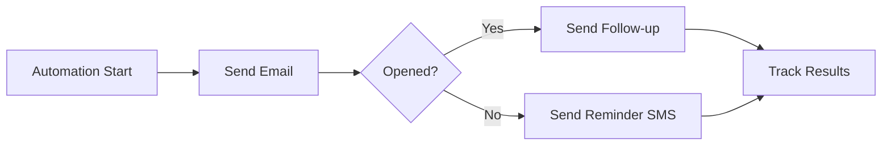

---

sidebar_position: 2
---

# How to Use

This guide walks you through using Smart Automation — from creating your first template to running a complete automation flow. Whether you are new to marketing automation or an experienced user, this guide covers everything you need to know.

---

## What is Smart Automation?

Smart Automation is a behavior-driven marketing automation system. Unlike traditional automation that sends messages on a fixed schedule, Smart Automation **responds to how contacts interact with your messages**.

### Smart Automation vs Traditional Automation

| Traditional Automation | Smart Automation |
|-----------------------|-----------------|
| Sends emails on a fixed schedule | Sends emails based on contact behavior |
| Same path for everyone | Different paths based on engagement |
| No real-time tracking | Real-time tracking of opens, clicks, and deliveries |
| One-size-fits-all approach | Personalized journeys for each contact |

### How It Works

1. Automation Start  (trigger)
2. The system sends the first email
3. It tracks whether the contact opened, clicked, or ignored the email
4. Based on the behavior, the system decides the next step automatically
5. This continues until the flow completes

---

## Step 2: Run Your First Automation

Once you have templates and a flow ready, you can run an automation for a contact.

### From the CRM

1. Open the **matter** (case) where you want to run the automation
2. Go to the **Automation** section
3. Click on **Smart Automation**

4. Select your preferred **start date** — the automation will begin on this date
5. Choose the [**automation flow**](#step-4-create-your-first-flow) you want to run
6. Click **Save** to activate

The automation will start running automatically on the selected date. You do not need to do anything else — the system handles the rest.

---

## Step 3: Monitor Automation Status

After running an automation, you can track its progress and see how contacts are engaging with your messages.

### View the Automation Table

In the Automation section, the Smart Automation table shows all running and completed automations.

To view details for a specific automation:

1. Find the automation in the table
2. Click **Tools → View**

### Check Node Statistics

The flow visualization shows each node in the automation. **Hover over any node** to see a quick summary of its performance — how many messages were sent, delivered, opened, and clicked.

### View Detailed Statistics

**Click on any node** to open the detailed statistics panel. This shows the complete breakdown for that step:

- **Sent** — How many messages were dispatched
- **Delivered** — How many reached the contact
- **Opened** — How many contacts opened the email
- **Clicked** — How many clicked a link in the message
- **Bounced** — How many failed to deliver
- **Unsubscribed** — How many opted out

:::note
Remember to add a **Delay Node** before each Condition Node. This gives contacts time to engage (open, click) before the system evaluates their behavior.
:::

---

## Step 4: Create Your First Flow

Flows are the blueprints of your automation. They define what messages to send, when to send them, and how to react to contact behavior.

### Access the Flow Builder

1. Go to **Settings** from the sidebar
2. Click on **Smart Automation**

3. Click **Create New** to create a new flow
4. Enter a descriptive name for your flow (e.g., "Welcome Series", "Follow-up Campaign")

### Build Your Flow

The flow builder is a visual canvas where you add and connect nodes.

1. **Drag nodes** from the left sidebar onto the canvas
2. **Connect nodes** by clicking the output handle of one node and dragging to the input handle of the next
3. **Click on each node** to configure its settings in the right sidebar
4. When finished, click **Update Flow** to save

---

## Understanding Nodes

Every flow is built from five types of nodes. Each node serves a specific purpose in your automation.

### Trigger Node

The **starting point** of every flow. It defines how the automation begins.

**How it works:**

- Currently, the only trigger is **Add to List** — when a contact is added to a specific list, the flow starts for that contact
- Click **Add to List** to see your available contact lists
- Select the list that should trigger this flow
- Click **Save**

**Important:** Every flow must have exactly one Trigger Node. It is automatically added when you create a new flow.

---

### Email Node

Sends an email to the contact using a pre-built template.

**Configuration:**

| Setting | Description |
|---------|-------------|
| **Email Name** | A label for this email step (for your reference) |
| **Subject Line** | The email subject the contact will see |
| **Template** | Select an email template you created earlier |
| **Preview Text** | Short preview text shown in email clients (coming soon) |

After configuring, click **Save** to apply changes.

---

### SMS Node

Sends an SMS message to the contact using a pre-built SMS template.

**Configuration:**

| Setting | Description |
|---------|-------------|
| **SMS Name** | A label for this SMS step (for your reference) |
| **Template** | Select an SMS template you created earlier |

:::tip
During SMS template creation, the system shows how many credits the message requires. Keep this in mind when planning your flow.
:::

---

### Delay Node

Pauses the automation for a specified amount of time before moving to the next step.

**Configuration:**

| Setting | Description |
|---------|-------------|
| **Amount** | Number of time units to wait |
| **Unit** | Minutes, Hours, or Days |

**When to use a Delay Node:**

- After sending an email, wait 1–2 days before checking if it was opened
- Before sending a follow-up, give the contact time to respond
- Before a Condition Node, always add a delay so the system has time to receive engagement data

---

### Condition Node

Checks whether a contact performed a specific action and routes the flow down different paths based on the result.

**Configuration:**

| Setting | Description |
|---------|-------------|
| **Condition Type** | What to check (currently: "What someone has done") |
| **Activity** | The specific action to check for |
| **Times** | How many times the action must occur |
| **Duration** | Time window for the check |

**Available Activities:**

| Activity | What It Checks |
|----------|---------------|
| **Opened Email** | Did the contact open the email? |
| **Clicked Email** | Did the contact click a link in the email? |
| **Email Bounced** | Did the email fail to deliver? |
| **Received Email** | Was the email successfully delivered? |
| **Clicked Unsubscribe** | Did the contact click the unsubscribe link? |
| **Received SMS** | Was the SMS successfully delivered? |

**How branching works:**

- **Yes path** — The contact performed the action → follow this path
- **No path** — The contact did NOT perform the action → follow this path

**Example:** A condition node checking "Opened Email" will:

- Send a follow-up email if the contact **did open** the previous email (Yes path)
- Send an SMS reminder if the contact **did not open** the previous email (No path)

---

## Connecting Nodes

Nodes must be connected to form a complete flow. Here is how to connect them:

1. **Hover over a node** — you will see small circles (handles) on the edges
2. **Click and drag** from an output handle (bottom or right side)
3. **Drop** on an input handle (top or left side) of the next node
4. A line appears connecting the two nodes

:::warning
Nodes must be connected **manually** by clicking the handles. There is currently no drag-and-drop auto-connection feature.
:::

### Connection Rules

- Every node (except the last one) must have at least **one outgoing connection**
- A Condition Node must have **two outgoing connections** — one for Yes and one for No
- Connections cannot form **loops** — a node cannot connect back to itself or an earlier node
- The flow always moves **forward** from Trigger to the final node

---

## Saving Your Flow

After building and configuring your flow:

1. Review all nodes and connections
2. Make sure every node is properly configured
3. Click **Save** in the top-right corner

Your flow is now ready to be triggered from the CRM.

---

## Troubleshooting

### Flow Does Not Start

- Check that the contact was added to the correct list (the one connected to the Trigger Node)
- Verify the flow is saved and has no configuration errors
- Ensure the queue worker is running on the backend

### Email Not Received

- Check the contact's email address in the CRM
- Verify the email template is saved and has valid HTML content
- Check the statistics panel for bounce or drop events

### SMS Not Received

- Verify the contact has a valid mobile number
- Check your Sendmode credit balance
- Ensure the SMS template is saved

### Condition Node Not Working

- Make sure there is a **Delay Node** before the Condition Node
- Without a delay, the system has not yet received engagement data when it evaluates the condition
- Check that the condition activity matches the node you are checking (e.g., "Opened Email" checks for email opens, not SMS deliveries)
