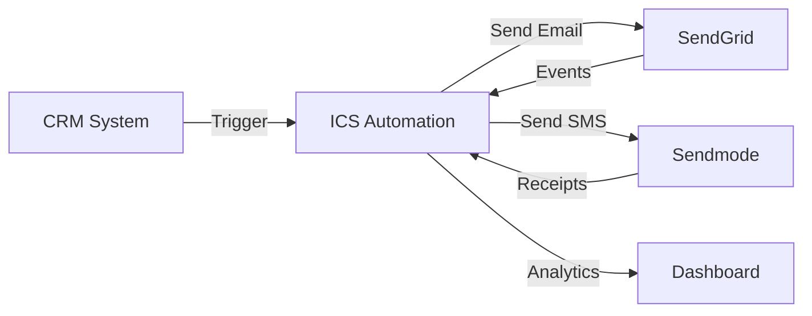

# ICS Automation Documentation

ICS Automation is an intelligent email and SMS marketing automation platform designed for legal firms. It enables businesses to create visual automation workflows that engage contacts through personalized email and SMS messages, track engagement in real-time, and dynamically adjust communication paths based on user behavior.

---

## Platform Overview



### What ICS Automation Does

| Capability | Description |
|-----------|-------------|
| **Visual Flow Builder** | Drag-and-drop automation workflows with Trigger, Email, SMS, Delay, and Condition nodes |
| **Email Marketing** | Send personalized emails via SendGrid with Unlayer visual template builder |
| **SMS Messaging** | Send SMS messages via Sendmode with credit tracking and delivery receipts |
| **Behavior Tracking** | Monitor email opens, clicks, bounces, and SMS delivery in real-time |
| **Conditional Logic** | Route contacts down different paths based on their engagement |
| **Contact Management** | Import contacts from CMS, organize into lists, and track automation history |
| **CRM Integration** | External CRM systems trigger automation flows via API |

---

## Technology Stack

### Frontend

| Technology | Purpose |
|-----------|---------|
| React 19 + TypeScript | UI framework with type safety |
| Vite 5 | Build tool and development server |
| React Router 7 | Client-side routing |
| Redux Toolkit 2 | Global state management |
| @xyflow/react 12 | Visual flow builder (React Flow) |
| react-email-editor (Unlayer) | Drag-and-drop email template designer |
| Tailwind CSS 4 + shadcn/ui | Styling and component library |

### Backend

| Technology | Purpose |
|-----------|---------|
| Laravel 12 | PHP framework and API server |
| MySQL 8.0 | Relational database |
| Laravel Queues | Asynchronous job processing |
| SendGrid API v3 | Email delivery and event tracking |
| Sendmode HTTP API | SMS delivery and receipt tracking |

---

## Documentation Structure

This documentation is organized into four main sections:

### How to Use

Step-by-step guides for end users who want to create and run automations:

- Creating templates
- Building contact lists
- Designing automation flows
- Understanding node types
- Running and monitoring automations

### Frontend Guide

Technical documentation for developers working on the React application:

- Project architecture and structure
- Component organization
- Routing and layout system
- State management with Redux Toolkit
- API integration patterns
- Individual page documentation (Flow Builder, Template Builder, etc.)

### Backend Guide

Technical documentation for developers working on the Laravel API:

- System architecture and design
- Installation and configuration
- Complete database schema
- API endpoint reference
- Automation engine and job queue system
- Flow execution algorithm
- Security, deployment, and troubleshooting

---

## Quick Start

### For End Users

1. Read the [How to Use](./how_to_use) guide to learn the basics
2. Start by creating email and SMS templates
3. Build a contact list and import your contacts
4. Create your first automation flow
5. Trigger the flow from your CRM system

### For Frontend Developers

1. Follow the [Frontend Installation](./Frontend/installation) guide
2. Read the [Frontend Overview](./Frontend/overview) for architecture
3. Explore the [Project Structure](./Frontend/structure) documentation
4. Dive into specific pages like the [Flow Builder](./Frontend/pages/flow-builder)

### For Backend Developers

1. Follow the [Backend Installation](./Backend/installation-&-setup) guide
2. Read the [Backend Overview](./Backend/overview) for system understanding
3. Study the [Architecture](./Backend/architecture) and [Database](./Backend/database) docs
4. Understand the [Jobs & Queues](./Backend/jobs-queues) system that powers automation

---

## Repository

The source code is available at:

```
https://github.com/dev-techics/ics-automation
```

The repository contains both the frontend (React) and backend (Laravel) in a single codebase.
